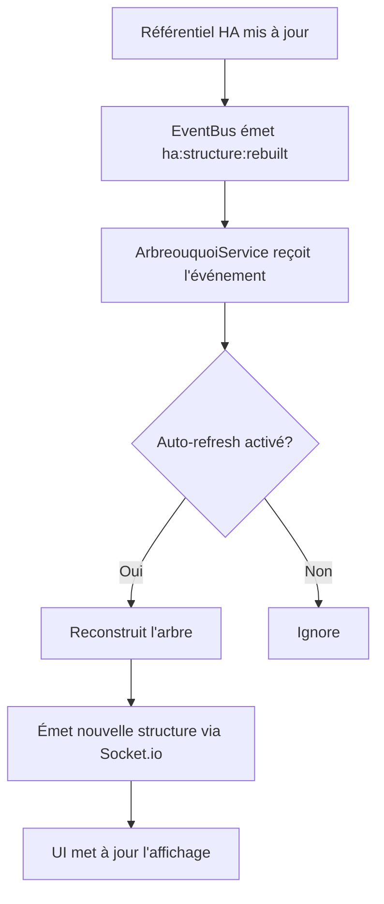
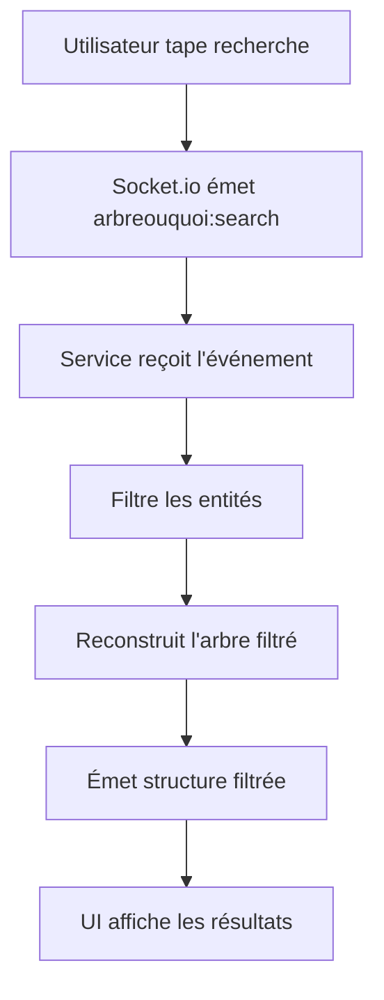

# Spécifications Fonctionnelles — Application ARBREOUQUOI

**Version :** 1.1  
**Date :** 24 Juillet 2026  
**Auteur :** Mistral Vibe  
**Statut :** En développement  
**Type :** Application standalone  

---

## 📚 Table des Matières

1. [Contexte et Objectifs](#1-contexte-et-objectifs)
2. [Fonctionnalités Principales](#2-fonctionnalités-principales)
3. [Cas d'Usage](#3-cas-dusage)
4. [Exigences Fonctionnelles](#4-exigences-fonctionnelles)
5. [Flux de Données](#5-flux-de-données)
6. [Interfaces Utilisateur](#6-interfaces-utilisateur)
7. [Règles Métier](#7-règles-métier)
8. [Contraintes](#8-contraintes)
9. [Évolutions Futures](#9-évolutions-futures)

---

## 1. Contexte et Objectifs

### 1.1 Contexte

L'application **ARBREOUQUOI** (Arbre Ou Quoi) s'intègre dans l'écosystème **ws-ha** qui fournit un socle technique pour les applications Home Assistant. Le socle maintient déjà un **référentiel structuré** des entités Home Assistant organisé selon la hiérarchie :

```
Area (Lieu/Pièce) → QUOI (Type fonctionnel) → Entités
```

Ce référentiel est alimenté par les webservices via MQTT Discovery et la synchronisation WebSocket avec Home Assistant.

### 1.2 Objectifs

L'objectif principal de **ARBREOUQUOI** est de fournir une **visualisation interactive et intuitive** de ce référentiel, permettant aux utilisateurs de :

- **Comprendre** la structure hiérarchique de leurs entités Home Assistant
- **Naviguer** facilement dans l'arborescence Area → QUOI → Entités
- **Rechercher** des entités par divers critères
- **Filtrer** l'affichage selon leurs besoins
- **Explorer** les détails de chaque entité
- **Identifier** les relations entre entités (même pièce, même type, même appareil)

### 1.3 Public Cible

- **Utilisateurs finaux** : Propriétaires de maisons intelligentes souhaitant comprendre leur installation
- **Développeurs** : Créateurs d'applications ou d'automatisations ayant besoin de visualiser la structure
- **Administrateurs** : Personnes gérant plusieurs instances Home Assistant

---

## 2. Fonctionnalités Principales

### 2.1 Visualisation Hiérarchique

| Fonctionnalité | Description | Priorité |
|---------------|-------------|----------|
| **Arbre Area** | Affichage de toutes les pièces (Areas) avec comptage des entités | ⭐⭐⭐ |
| **Groupes QUOI** | Pour chaque Area, regroupement des entités par leur classification QUOI | ⭐⭐⭐ |
| **Liste Entités** | Affichage des entités avec leur état, domaine, et informations | ⭐⭐⭐ |
| **Entités Non Assignées** | Section dédiée aux entités sans Area assignée | ⭐⭐ |

### 2.2 Navigation et Interaction

| Fonctionnalité | Description | Priorité |
|---------------|-------------|----------|
| **Expand/Collapse** | Développement/réduction des sections et groupes | ⭐⭐⭐ |
| **Expand All / Collapse All** | Actions globales pour tout développer/rétracter | ⭐⭐ |
| **Clique sur Entité** | Affichage des détails de l'entité | ⭐⭐⭐ |
| **Survol Entité** | Surbrillance visuelle | ⭐⭐ |

### 2.3 Recherche et Filtrage

| Fonctionnalité | Description | Priorité |
|---------------|-------------|----------|
| **Recherche globale** | Recherche dans noms, IDs, pièces, types QUOI | ⭐⭐⭐ |
| **Filtre par Area** | Filtrer pour n'afficher qu'une pièce spécifique | ⭐⭐⭐ |
| **Filtre par QUOI** | Filtrer pour n'afficher qu'un type d'entité | ⭐⭐⭐ |
| **Filtre Entités Actives** | Masquer les entités non disponibles | ⭐⭐ |
| **Réinitialisation** | Retirer tous les filtres | ⭐⭐ |

### 2.4 Statistiques et Métriques

| Fonctionnalité | Description | Priorité |
|---------------|-------------|----------|
| **Compteur Entités** | Nombre total d'entités | ⭐⭐⭐ |
| **Compteur Pièces** | Nombre total de Areas | ⭐⭐⭐ |
| **Compteur Appareils** | Nombre total de Devices | ⭐⭐ |
| **Compteur Types QUOI** | Nombre de classifications QUOI uniques | ⭐⭐ |
| **Compteur Non Assignés** | Nombre d'entités sans Area | ⭐⭐ |

### 2.5 Détails des Entités

| Fonctionnalité | Description | Priorité |
|---------------|-------------|----------|
| **Informations de base** | ID, nom, domaine, classe, état | ⭐⭐⭐ |
| **Localisation** | Area et Device associés | ⭐⭐⭐ |
| **Classification QUOI** | Tous les tags QUOI de l'entité | ⭐⭐⭐ |
| **Entités Associées** | Entités du même QUOI ou de la même Area | ⭐⭐ |
| **Attributs** | Tous les attributs de l'entité | ⭐ |

### 2.6 Configuration

| Fonctionnalité | Description | Priorité |
|---------------|-------------|----------|
| **Thème** | Choix entre clair, sombre, ou automatique | ⭐⭐ |
| **Affichage Compact** | Mode compact pour les grands écrans | ⭐ |
| **Afficher Masquer IDs** | Option pour afficher/masquer les IDs techniques | ⭐⭐ |
| **Rafraîchissement Auto** | Rafraîchissement automatique de l'arbre | ⭐⭐ |
| **Intervalle de Rafraîchissement** | Configuration de la période | ⭐⭐ |

---

## 3. Cas d'Usage

### 3.1 Cas d'Usage Principal : Exploration de l'Installation

**Acteur :** Utilisateur final  
**Scénario :** Un utilisateur veut comprendre comment ses entités Home Assistant sont organisées  

1. L'utilisateur accède à l'application ARBREOUQUOI
2. L'arbre complet s'affiche avec toutes les Areas
3. L'utilisateur voit les statistiques globales (nombre d'entités, pièces, etc.)
4. L'utilisateur développe une pièce (ex: Salon)
5. Les groupes QUOI s'affichent (ex: lumière, température, interrupteur)
6. L'utilisateur développe un groupe QUOI (ex: lumière)
7. La liste des entités de ce type dans le Salon s'affiche
8. L'utilisateur clique sur une entité pour voir ses détails

**Résultat :** L'utilisateur comprend la structure de son installation

### 3.2 Cas d'Usage : Recherche d'une Entité Spécifique

**Acteur :** Développeur  
**Scénario :** Un développeur cherche un capteur de température spécifique  

1. Le développeur utilise la barre de recherche
2. Il tape "température salon"
3. L'arbre se filtre pour afficher uniquement les résultats pertinents
4. Le capteur de température du salon apparaît
5. Le développeur clique dessus pour voir ses détails

**Résultat :** Le développeur trouve rapidement l'entité recherchée

### 3.3 Cas d'Usage : Audit de l'Installation

**Acteur :** Administrateur  
**Scénario :** Un administrateur veut vérifier quelles pièces contiennent des entités non assignées  

1. L'administrateur accède à ARBREOUQUOI
2. Il consulte la section "Non assignés"
3. Il voit la liste des entités sans Area
4. Il peut cliquer sur chaque entité pour voir ses détails
5. Il peut filtrer par type QUOI pour identifier les types problématiques

**Résultat :** L'administrateur identifie les entités à assigner

### 3.4 Cas d'Usage : Vérification de la Classification QUOI

**Acteur :** Intégrateur  
**Scénario :** Un intégrateur veut vérifier que toutes les entités sont correctement classées  

1. L'intégrateur accède à ARBREOUQUOI
2. Il consulte le catalogue QUOI dans la navigation
3. Il voit tous les types QUOI avec leur nombre d'entités
4. Il peut cliquer sur un type QUOI pour filtrer l'arbre
5. Il vérifie que les entités affichées correspondent bien au type

**Résultat :** L'intégrateur valide la classification

---

## 4. Exigences Fonctionnelles

### 4.1 Exigences de Données

| ID | Exigence | Description |
|----|----------|-------------|
| EF-001 | **Accès au Référentiel** | L'application DOIT accéder au référentiel HaStructureRegistry fourni par le socle |
| EF-002 | **Écoute des Mises à Jour** | L'application DOIT écouter les événements de mise à jour du référentiel |
| EF-003 | **Rafraîchissement Automatique** | L'application DOIT rafraîchir l'affichage lors des mises à jour du référentiel (si configuré) |
| EF-004 | **Persistance des Données** | L'application NE DOIT PAS stocker de données en base locale (tout vient du référentiel) |

### 4.2 Exigences d'Affichage

| ID | Exigence | Description |
|----|----------|-------------|
| EF-005 | **Hiérarchie Visuelle** | L'arbre DOIT afficher clairement la hiérarchie Area → QUOI → Entités |
| EF-006 | **Icônes QUOI** | Chaque type QUOI DOIT avoir une icône visuelle |
| EF-007 | **Couleurs par Domaine** | Les entités DOIVENT être colorées selon leur domaine HA |
| EF-008 | **Compteurs** | Chaque section DOIT afficher le nombre d'éléments qu'elle contient |
| EF-009 | **Statistiques Globales** | La barre de statistiques DOIT afficher les métriques principales |
| EF-010 | **Indicateur de Connexion** | Un indicateur DOIT montrer l'état de la connexion Socket.io |

### 4.3 Exigences d'Interaction

| ID | Exigence | Description |
|----|----------|-------------|
| EF-011 | **Navigation Clic** | Cliquer sur une entité DOIT afficher ses détails |
| EF-012 | **Expand/Collapse** | Cliquer sur un en-tête de section DOIT développer/rétracter son contenu |
| EF-013 | **Survol** | Survoler une entité DOIT la mettre en évidence |
| EF-014 | **Rafraîchissement Manuel** | Un bouton DOIT permettre de rafraîchir manuellement les données |

### 4.4 Exigences de Recherche et Filtrage

| ID | Exigence | Description |
|----|----------|-------------|
| EF-015 | **Recherche Globale** | La recherche DOIT s'appliquer sur tous les champs textuels |
| EF-016 | **Filtrage par Area** | Le filtre par pièce DOIT afficher uniquement les entités de cette pièce |
| EF-017 | **Filtrage par QUOI** | Le filtre par type DOIT afficher uniquement les entités de ce type |
| EF-018 | **Filtrage Cumulatif** | Les filtres DOIVENT être cumulatifs (Area + QUOI) |
| EF-019 | **Réinitialisation** | Un bouton DOIT permettre de réinitialiser tous les filtres |

### 4.5 Exigences de Performance

| ID | Exigence | Description |
|----|----------|-------------|
| EF-020 | **Temps de Chargement** | L'arbre DOIT s'afficher en moins de 1 seconde pour 1000 entités |
| EF-021 | **Rafraîchissement Léger** | Le rafraîchissement automatique NE DOIT PAS bloquer l'UI |
| EF-022 | **Pagination** | Pour plus de 50 entités par groupe, une pagination DOIT être disponible |

---

## 5. Flux de Données

### 5.1 Diagramme Global

```
┌─────────────────────────────────────────────────────────────────┐
│                        ARBREOUQUOI                               │
├─────────────────────────────────────────────────────────────────┤
│                                                                 │
│  ┌─────────────┐     ┌─────────────┐     ┌─────────────┐    │
│  │   Service   │────▶│   EventBus  │────▶│  Socket.io  │    │
│  │ Métier      │     │             │     │  (Bridge)    │    │
│  └─────────────┘     └─────────────┘     └─────────────┘    │
│          ▲                     │                    ▲           │
│          │                     │                    │           │
│  ┌───────┴───────┐     ┌───────┴───────┐     ┌──────┴─────┐ │
│  │ HaStructure    │     │ Événements    │     │    UI    │ │
│  │ Registry       │     │ Socket.io     │     │ (HTML/TS)│ │
│  │ (Injected)     │     │             │     │         │ │
│  └───────────────┘     └───────────────┘     └─────────┘ │
│                                                                 │
└─────────────────────────────────────────────────────────────────┘
```

### 5.2 Flux de Démarrage

```mermaid
graph TD
    A[AppService détecte ARBREOUQUOI] --> B[Instancie ArbreouquoiService]
    B --> C[Appel .start()]
    C --> D[Charge configuration]
    D --> E[Vérifie HaStructureRegistry]
    E --> F[Écoute événements EventBus]
    F --> G[Émet structure initiale via Socket.io]
    G --> H[Enregistre événements persistants]
    H --> I[Service prêt]
```

### 5.3 Flux de Rafraîchissement



### 5.4 Flux de Recherche



---

## 6. Interfaces Utilisateur

### 6.1 Page Principale

**Structure :**
```
┌─────────────────────────────────────────────────────────────────┐
│  🌳 Arbre Ou Quoi                                     [⚙️][×] │
│  Visualisation du référentiel HA organisé par Area → QUOI → Entités│
├─────────────────────────────────────────────────────────────────┤
│                                                                 │
│  [🔄 Rafraîchir] [↕ Tout étendre] [↕ Tout réduire]      [🔍_____]  │
│                                                                 │
│  [Toutes les pièces ▼] [Tous les types ▼] [Appliquer] [Réinitialiser]│
├─────────────────────────────────────────────────────────────────┤
│  📊 150 Entités  │  12 Pièces  │  25 Appareils  │  15 Types  │  ✅  │
├─────────────────────────────────────────────────────────────────┤
│                                                                 │
│  ┌─────────────────┐  ┌─────────────────────────────────────┐ │
│  │ 📁 Arborescence  │  │                                             │ │
│  │                 │  │  ▶ 📍 Salon (25)                             │ │
│  │ 🏷️ Légende QUOI │  │     ▼                                                │ │
│  │ 💡 8           │  │     ▶ 💡 lumière (5)                              │ │
│  │ 🌡️ 12          │  │        ▼                                       │ │
│  │ 🔘 3            │  │        light.salon_principal                   │ │
│  │ ...            │  │        light.lampe_murale                     │ │
│  │                 │  │        ...                                       │ │
│  │                 │  │     ▶ 🌡️ température (3)                        │ │
│  │                 │  │        ▼                                       │ │
│  │                 │  │        sensor.temperature_salon                │ │
│  │                 │  │        ...                                       │ │
│  │                 │  │     ▶ 🔌 prise (2)                                │ │
│  │                 │  │        ...                                       │ │
│  │                 │  │  ▶ 🏠 Cuisine (18)                            │ │
│  │                 │  │     ...                                       │ │
│  │                 │  │  ▶ 📦 Non assignés (3)                         │ │
│  │                 │  │     ...                                       │ │
│  └─────────────────┘  └─────────────────────────────────────┘ │
│                                                                 │
├─────────────────────────────────────────────────────────────────┤
│  Dernière mise à jour: 20/07/2026 10:00:00                          │
└─────────────────────────────────────────────────────────────────┘
```

### 6.2 Panneau de Détails

**Structure :**
```
┌─────────────────────────────────────────────────────────────────┐
│  ×                                                               │
│  ┌─────────────────────────────────────────────────────────────┐│
│  │  Capteur Température Salon                                  ││
│  │  [sensor] [temperature] [État: 21.5°C]                  ││
│  └─────────────────────────────────────────────────────────────┘│
│                                                                  │
│  📋 Informations de base                                         │
│  ┌─────────────────────┬─────────────────────┐               │
│  │ ID Entité           │ sensor.temperature_   │               │
│  │                     │ salon                │               │
│  │ Nom                │ Capteur Température    │               │
│  │ Domaine            │ sensor               │               │
│  │ Classe Appareil    │ temperature          │               │
│  │ État               │ 21.5                │               │
│  └─────────────────────┴─────────────────────┘               │
│                                                                  │
│  📍 Localisation                                                 │
│  ┌─────────────────────┬─────────────────────┐               │
│  │ Pièce (Area)        │ Salon               │               │
│  │ ID Area            │ area.salon          │               │
│  └─────────────────────┴─────────────────────┘               │
│                                                                  │
│  🏷️ Classification QUOI                                         │
│  [🌡️ température] [capteur]                                      │
│                                                                  │
│  🔗 Entités Associées (8)                                        │
│  ▶ sensor.temperature_cuisine                                   │
│  ▶ sensor.temperature_chambre                                    │
│  + 6 autres...                                                  │
│                                                                  │
│  📊 Attributs                                                   │
│  friendly_name: Capteur Température Salon                        │
│  unit_of_measurement: °C                                        │
│  ...                                                            │
└─────────────────────────────────────────────────────────────────┘
```

### 6.3 Légende QUOI

**Affichage :**
- Une barre latérale gauche affichant tous les types QUOI
- Chaque type est représenté par son icône
- Le nombre d'entités pour chaque type est affiché
- Cliquer sur un type filtre l'arbre pour n'afficher que ce type

---

## 7. Règles Métier

### 7.1 Règles de Tri

| Entité | Tri par défaut | Ordre |
|--------|---------------|-------|
| Areas | Nombre d'entités | Décroissant |
| Groupes QUOI | Nombre d'entités | Décroissant |
| Entités | Nom | Alphabétique |

### 7.2 Règles d'Affichage

| Condition | Affichage |
|-----------|----------|
| Entité disponible | Afficher l'état normalement |
| Entité unavailable | Afficher "N/A" en gris |
| Entité sans nom friendly | Afficher l'entity_id |
| Area sans entités | Masquer la section |
| QUOI sans entités | Masquer le groupe |

### 7.3 Règles de Filtrage

| Condition | Comportement |
|-----------|--------------|
| Filtre Area + Filtre QUOI | Appliquer les deux (intersection) |
| Filtre Area seul | Afficher toutes les entités de cette Area |
| Filtre QUOI seul | Afficher toutes les entités de ce type |
| Filtre Entités Actives | Masquer les entités unavailable |

### 7.4 Règles de Rafraîchissement

| Événement | Action |
|-----------|--------|
| ha:structure:rebuilt | Rafraîchir l'arbre si auto-refresh activé |
| ha:entity:updated | Rafraîchir l'arbre si auto-refresh activé |
| Manuel (bouton) | Toujours rafraîchir |
| Intervalle configuré | Rafraîchir selon la période |

---

## 8. Contraintes

### 8.1 Contraintes Techniques

| ID | Contrainte | Description |
|----|------------|-------------|
| C-001 | **Dépendance Socle** | L'application DOIT utiliser HaStructureRegistry du socle |
| C-002 | **Pas de Base de Données** | L'application NE DOIT PAS utiliser de base de données propre |
| C-003 | **TypeScript Strict** | Le code DOIT être en TypeScript avec mode strict |
| C-004 | **Architecture 5 Couches** | L'application DOIT respecter l'architecture en couches |
| C-005 | **EventBus Uniquement** | Toute communication DOIT passer par EventBus |

### 8.2 Contraintes d'Intégration

| ID | Contrainte | Description |
|----|------------|-------------|
| C-006 | **Socket.io** | L'application DOIT utiliser Socket.io pour la communication client |
| C-007 | **Événements Prefixés** | Tous les événements DOIVENT être prefixés par "arbreouquoi:" |
| C-008 | **Démarrage Automatique** | L'application DOIT démarrer automatiquement avec le socle |
| C-009 | **Configuration YAML** | La configuration DOIT être stockée dans data/arbreouquoi/config.yaml |

### 8.3 Contraintes de Sécurité

| ID | Contrainte | Description |
|----|------------|-------------|
| C-010 | **Pas d'Accès Direct MQTT** | L'application NE DOIT PAS accéder directement au client MQTT |
| C-011 | **Validation des Entrées** | Toutes les entrées utilisateur DOIVENT être validées |
| C-012 | **Échappement HTML** | Toutes les sorties HTML DOIVENT être échappées |

---

## 9. Évolutions Futures

### 9.1 Version 1.1

- **Export/Import** : Permettre d'exporter la structure en JSON ou CSV
- **Impression** : Ajouter une fonction d'impression de l'arbre
- **Graphique** : Visualisation sous forme de graphe (D3.js ou similar)
- **Historique** : Voir l'historique des changements du référentiel

### 9.2 Version 1.2

- **Édition** : Permettre de modifier les attributs QUOI directement
- **Création d'Areas** : Permettre de créer de nouvelles Areas depuis l'UI
- **Synchronisation** : Synchroniser les Areas entre HA et le référentiel
- **Multi-instances** : Supporter plusieurs instances HA

### 9.3 Version 2.0

- **Intégration MQTT** : Devenir une application d'intégration pour publier des entités
- **Gestion des Devices** : Afficher et gérer les appareils
- **Topologie Avancée** : Visualisation 3D ou géolocalisée
- **Collaboration** : Mode multi-utilisateurs avec annotations

---

## Annexes

### A.1 Diagramme des Événements Socket.io

Voir [socket-events.ts](../applications/arbreouquoi/src/domain/socket-events.ts) pour la liste complète.

### A.2 Schéma de Configuration

Voir [config-schema.ts](../applications/arbreouquoi/src/domain/config-schema.ts) pour la définition Zod.

### A.3 Types TypeScript

Voir [types.ts](../applications/arbreouquoi/src/domain/types.ts) pour les interfaces.

---

*Document généré par Mistral Vibe*  
*Co-Authored-By: Mistral Vibe <vibe@mistral.ai>*


---

## 9. Communication Inter-Applications

> **⚠️ IMPORTANT :** Cette section documente les événements et capacités que cette application **expose** aux autres applications.
> 
> **Pour utiliser ces capacités :**
> - Import depuis le core : `import { InterAppClient } from '../../../core/src/exports'`
> - Utiliser `interAppClient.request()` pour les Request/Reply
> - Utiliser `interAppClient.on()` pour écouter les événements Fire & Forget
> - Voir [inter-app-communication_specs_v1.0.md](../inter-app-communication_specs_v1.0.md) pour les détails

### 9.1 Événements Fire & Forget (Écoute possible par d'autres applications)

| Événement | Description | Payload Type | Fréquence | Émetteur |
|-----------|-------------|--------------|-----------|----------|
| `arbreouquoi:structure:updated` | La structure hiérarchique a été mise à jour | `ArbreOuQuoiStructureUpdatedPayload` | Sur changement | arbreouquoi |
| `arbreouquoi:entity:selected` | Une entité a été sélectionnée dans l'arbre | `ArbreOuQuoiEntitySelectedPayload` | Sur sélection utilisateur | arbreouquoi |
| `arbreouquoi:search:performed` | Une recherche a été effectuée | `ArbreOuQuoiSearchPerformedPayload` | Sur recherche | arbreouquoi |
| `arbreouquoi:filter:applied` | Un filtre a été appliqué | `ArbreOuQuoiFilterAppliedPayload` | Sur application filtre | arbreouquoi |
| `arbreouquoi:view:changed` | La vue actuelle a changé | `ArbreOuQuoiViewChangedPayload` | Sur navigation | arbreouquoi |

**Types des payloads :**
```typescript
// ArbreOuQuoiStructureUpdatedPayload
export interface ArbreOuQuoiStructureUpdatedPayload {
  timestamp: string;
  trigger: 'mqtt-discovery' | 'websocket-sync' | 'manual-refresh';
  areasAffected: string[];
  entitiesAffected: string[];
}

// ArbreOuQuoiEntitySelectedPayload
export interface ArbreOuQuoiEntitySelectedPayload {
  entityId: string;
  area?: string;
  quoi?: string;
  timestamp: string;
}

// ArbreOuQuoiSearchPerformedPayload
export interface ArbreOuQuoiSearchPerformedPayload {
  query: string;
  resultsCount: number;
  timestamp: string;
}

// ArbreOuQuoiFilterAppliedPayload
export interface ArbreOuQuoiFilterAppliedPayload {
  filterType: 'area' | 'quoi' | 'domain' | 'state' | 'custom';
  filterValue: string;
  entitiesMatching: number;
  timestamp: string;
}

// ArbreOuQuoiViewChangedPayload
export interface ArbreOuQuoiViewChangedPayload {
  view: 'areas' | 'quoi' | 'entities' | 'search-results';
  path: string[]; // Chemin hiérarchique
  timestamp: string;
}
```

**Exemple d'écoute depuis une autre application :**
```typescript
import { InterAppClient } from '../../../core/src/exports';

// Écouter les changements de structure
this.interAppClient.on('arbreouquoi:structure:updated', (payload, fromApp) => {
  console.log(`Structure mise à jour par ${fromApp}:`, payload);
});

// Écouter la sélection d'entité
this.interAppClient.on('arbreouquoi:entity:selected', (payload, fromApp) => {
  console.log(`Entité sélectionnée: ${payload.entityId} dans ${payload.area}`);
});

// Écouter les recherches
this.interAppClient.on('arbreouquoi:search:performed', (payload, fromApp) => {
  console.log(`Recherche effectuée: "${payload.query}" (${payload.resultsCount} résultats)`);
});
```

### 9.2 Capacités Request/Reply (Appel possible depuis d'autres applications)

| Capacité | Description | Request Type | Reply Type | Timeout conseillé |
|----------|-------------|--------------|------------|-------------------|
| `arbreouquoi:structure:get` | Obtenir la structure complète Area → QUOI → Entités | `ArbreOuQuoiGetStructureRequest` | `ArbreOuQuoiGetStructureReply` | 2000ms |
| `arbreouquoi:entity:get` | Obtenir les détails d'une entité | `ArbreOuQuoiGetEntityRequest` | `ArbreOuQuoiGetEntityReply` | 1000ms |
| `arbreouquoi:search` | Effectuer une recherche dans les entités | `ArbreOuQuoiSearchRequest` | `ArbreOuQuoiSearchReply` | 3000ms |
| `arbreouquoi:areas:list` | Lister toutes les Areas (pièces) | `ArbreOuQuoiListAreasRequest` | `ArbreOuQuoiListAreasReply` | 1000ms |
| `arbreouquoi:quoi:list` | Lister tous les types QUOI | `ArbreOuQuoiListQuoiRequest` | `ArbreOuQuoiListQuoiReply` | 1000ms |
| `arbreouquoi:entities:by-area` | Lister les entités d'une Area spécifique | `ArbreOuQuoiEntitiesByAreaRequest` | `ArbreOuQuoiEntitiesByAreaReply` | 1000ms |
| `arbreouquoi:entities:by-quoi` | Lister les entités d'un type QUOI spécifique | `ArbreOuQuoiEntitiesByQuoiRequest` | `ArbreOuQuoiEntitiesByQuoiReply` | 1000ms |

**Types :**
```typescript
// Structure de base
interface ArbreOuQuoiArea {
  id: string;
  name: string;
  entityCount: number;
  quoiGroups: ArbreOuQuoiQuoiGroup[];
}

interface ArbreOuQuoiQuoiGroup {
  quoi: string;
  entityCount: number;
  entities: ArbreOuQuoiEntity[];
}

interface ArbreOuQuoiEntity {
  entityId: string;
  name: string;
  domain: string;
  state: string;
  attributes: Record<string, unknown>;
  area: string;
  quoi: string;
}

// Request/Reply pour structure:get
interface ArbreOuQuoiGetStructureRequest {
  includeDisabled?: boolean;
  includeHidden?: boolean;
}

interface ArbreOuQuoiGetStructureReply {
  areas: ArbreOuQuoiArea[];
  unassignedEntities: ArbreOuQuoiEntity[];
  totalEntities: number;
  lastUpdated: string;
}

// Request/Reply pour entity:get
interface ArbreOuQuoiGetEntityRequest {
  entityId: string;
}

interface ArbreOuQuoiGetEntityReply {
  entity: ArbreOuQuoiEntity & {
    relationships: {
      sameArea: string[];
      sameQuoi: string[];
      sameDomain: string[];
    };
  };
}

// Request/Reply pour search
interface ArbreOuQuoiSearchRequest {
  query: string;
  searchIn?: ('name' | 'id' | 'area' | 'quoi' | 'domain' | 'state')[];
  limit?: number;
}

interface ArbreOuQuoiSearchReply {
  query: string;
  results: ArbreOuQuoiEntity[];
  total: number;
}

// Request/Reply pour areas:list
interface ArbreOuQuoiListAreasRequest {}

interface ArbreOuQuoiListAreasReply {
  areas: { id: string; name: string; entityCount: number }[];
}

// Request/Reply pour quoi:list
interface ArbreOuQuoiListQuoiRequest {}

interface ArbreOuQuoiListQuoiReply {
  quoiTypes: { type: string; count: number; areas: string[] }[];
}

// Request/Reply pour entities:by-area
interface ArbreOuQuoiEntitiesByAreaRequest {
  areaId: string;
  includeSubAreas?: boolean;
}

interface ArbreOuQuoiEntitiesByAreaReply {
  area: ArbreOuQuoiArea;
}

// Request/Reply pour entities:by-quoi
interface ArbreOuQuoiEntitiesByQuoiRequest {
  quoi: string;
  areaId?: string; // Optionnel: filtrer par Area
}

interface ArbreOuQuoiEntitiesByQuoiReply {
  quoi: string;
  entities: ArbreOuQuoiEntity[];
  areas: string[];
}
```

**Exemple d'appel depuis une autre application :**
```typescript
import { InterAppClient } from '../../../core/src/exports';
import type {
  ArbreOuQuoiGetStructureRequest,
  ArbreOuQuoiGetStructureReply,
  ArbreOuQuoiSearchRequest,
  ArbreOuQuoiSearchReply,
  ArbreOuQuoiGetEntityRequest,
  ArbreOuQuoiGetEntityReply
} from '../arbreouquoi/specs';

// Obtenir la structure complète
const structureReply = await interAppClient.request<
  ArbreOuQuoiGetStructureRequest,
  ArbreOuQuoiGetStructureReply
>(
  'arbreouquoi:structure:get',
  { includeHidden: true },
  2000
);

if (structureReply.status === 'success') {
  console.log('Structure:', structureReply.result);
}

// Effectuer une recherche
const searchReply = await interAppClient.request<
  ArbreOuQuoiSearchRequest,
  ArbreOuQuoiSearchReply
>(
  'arbreouquoi:search',
  { query: 'température salon', searchIn: ['name', 'area'] },
  3000
);

if (searchReply.status === 'success') {
  console.log(`Trouvé ${searchReply.result.total} résultats:`);
  searchReply.result.results.forEach(e => console.log(`  - ${e.name} (${e.entityId})`));
}

// Obtenir les détails d'une entité
const entityReply = await interAppClient.request<
  ArbreOuQuoiGetEntityRequest,
  ArbreOuQuoiGetEntityReply
>(
  'arbreouquoi:entity:get',
  { entityId: 'sensor.temperature_salon' },
  1000
);

if (entityReply.status === 'success') {
  console.log('Entité:', entityReply.result.entity);
}
```

**Handler côté récepteur (dans l'application ARBREOUQUOI) :**
```typescript
import { InterAppClient } from '../../../core/src/exports';

// Exemple: handler pour arbreouquoi:structure:get
this.interAppClient.onRequest('arbreouquoi:structure:get', async (request, reply) => {
  try {
    const structure = await getStructure(request.payload);
    reply({
      requestId: request.requestId,
      inReplyTo: request.requestId,
      fromApp: 'arbreouquoi',
      status: 'success',
      result: structure,
      timestamp: new Date().toISOString()
    });
  } catch (error) {
    reply({
      requestId: request.requestId,
      inReplyTo: request.requestId,
      fromApp: 'arbreouquoi',
      status: 'error',
      error: {
        code: 'ARBREOUQUOI_STRUCTURE_ERROR',
        message: error.message
      },
      timestamp: new Date().toISOString()
    });
  }
});

// Exemple: handler pour arbreouquoi:search
this.interAppClient.onRequest('arbreouquoi:search', async (request, reply) => {
  try {
    const results = await performSearch(request.payload);
    reply({
      requestId: request.requestId,
      inReplyTo: request.requestId,
      fromApp: 'arbreouquoi',
      status: 'success',
      result: results,
      timestamp: new Date().toISOString()
    });
  } catch (error) {
    reply({
      requestId: request.requestId,
      inReplyTo: request.requestId,
      fromApp: 'arbreouquoi',
      status: 'error',
      error: {
        code: 'ARBREOUQUOI_SEARCH_ERROR',
        message: error.message
      },
      timestamp: new Date().toISOString()
    });
  }
});

// Exemple: handler pour arbreouquoi:entity:get
this.interAppClient.onRequest('arbreouquoi:entity:get', async (request, reply) => {
  try {
    const entity = await getEntityDetails(request.payload);
    reply({
      requestId: request.requestId,
      inReplyTo: request.requestId,
      fromApp: 'arbreouquoi',
      status: 'success',
      result: { entity },
      timestamp: new Date().toISOString()
    });
  } catch (error) {
    reply({
      requestId: request.requestId,
      inReplyTo: request.requestId,
      fromApp: 'arbreouquoi',
      status: 'error',
      error: {
        code: 'ARBREOUQUOI_ENTITY_ERROR',
        message: error.message
      },
      timestamp: new Date().toISOString()
    });
  }
});
```

*Document généré par Mistral Vibe*  
*Co-Authored-By: Mistral Vibe <vibe@mistral.ai>*
