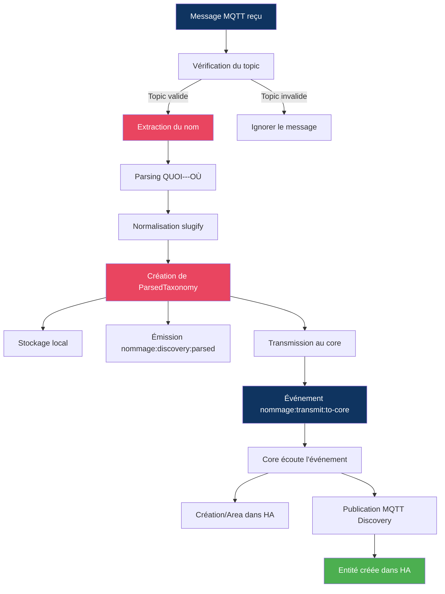

# Spécifications Fonctionnelles - Application NOMMAGE

**Version :** 1.0.0  
**Date :** 19 Juillet 2026  
**Auteur :** Mistral Vibe  
**Statut :** Document de référence pour l'application NOMMAGE  
**Document parent :** [PROMPT_PROJET.md](../PROMPT_PROJET.md)

---

## 📚 Table des Matières

1. [Introduction](#1-introduction)
2. [Contexte et Objectifs](#2-contexte-et-objectifs)
3. [Fonctionnalités Principales](#3-fonctionnalités-principales)
4. [Format des Données](#4-format-des-données)
5. [Flux de Traitement](#5-flux-de-traitement)
6. [Intégration avec Home Assistant](#6-intégration-avec-home-assistant)
7. [Configuration](#7-configuration)
8. [Gestion des Erreurs](#8-gestion-des-erreurs)
9. [Exemples d'Utilisation](#9-exemples-dutilisation)
10. [Évolutions Futures](#10-évolutions-futures)

---

## 1. Introduction

### 1.1 Présentation

L'application **NOMMAGE** est un module d'intégration conçu pour **normaliser et structurer** les noms des entités Home Assistant en utilisant le **protocole de nommage unifié** défini dans [nommage_specs_v1.0.md](./nommage_specs_v1.0.md).

Elle agit comme un **intermédiaire** entre les applications tierces (RFXCOM, Zigbee2MQTT, etc.) qui émettent des messages de découverte MQTT et Home Assistant, en assurant que toutes les entités suivent une **taxonomie cohérente**.

### 1.2 Public Cible

- Développeurs d'applications Home Assistant
- Intégrateurs de systèmes IoT
- Administrateurs de systèmes domotiques

### 1.3 Portée

Cette spécification couvre :
- ✅ Le parsing des noms selon le format QUOI---OÙ
- ✅ La création de structures taxonomiques
- ✅ La transmission vers Home Assistant
- ✅ La configuration MQTT et HA
- ❌ **Hors portée** : La modification du core (doit être fait séparément)

---

## 2. Contexte et Objectifs

### 2.1 Problématique

Dans un écosystème Home Assistant avec de multiples applications (RFXCOM, Zigbee2MQTT, etc.), chaque application utilise ses propres **conventions de nommage** pour les entités. Cela entraîne :

- **Incohérence** dans l'interface utilisateur
- **Difficulté** de filtrage et de regroupement des entités
- **Complexité** de maintenance et d'automatisation

### 2.2 Solution

L'application NOMMAGE **intercepte les messages de découverte MQTT** et applique une **normalisation systématique** basée sur :

1. **Séparation** du QUOI (type de l'entité) et des OÙ (hiérarchie géographique)
2. **Normalisation** des chaînes (slugify) pour la compatibilité HA
3. **Structuration** en Areas, Devices et Entités
4. **Transmission** des informations taxonomiques à HA

### 2.3 Objectifs Fonctionnels

| ID | Objectif | Critère de Succès |
|----|----------|-------------------|
| OF-1 | Écouter les messages de découverte MQTT | Messages reçus et validés |
| OF-2 | Parser les noms selon QUOI---OÙ | Structure taxonomique correcte |
| OF-3 | Normaliser les chaînes (slugify) | Pas de caractères spéciaux |
| OF-4 | Transmettre à Home Assistant | Entités créées avec attributs taxonomie |
| OF-5 | Gérer la configuration | Paramètres MQTT et HA configurables |
| OF-6 | Afficher le statut | UI avec indicateurs de connexion |

---

## 3. Fonctionnalités Principales

### 3.1 Écoute MQTT

**Description :** NOMMAGE écoute les messages de découverte MQTT émis par d'autres applications.

**Fonctionnalités :**
- Abonnement à des **topics configurables** (par défaut : `ha/+/+/config`, `homeassistant/+/+/config`)
- Support des **wildcards** MQTT (`+`, `#`)
- Gestion de la **reconnexion automatique**
- **Validation** du format des messages

**Entrées :**
- Configuration MQTT (host, port, topics, credentials)
- Messages MQTT au format JSON

**Sorties :**
- Événement interne `nommage:discovery:raw` sur EventBus

### 3.2 Parsing QUOI/OÙ

**Description :** Analyse et segmentation des noms selon le protocole de nommage unifié.

**Algorithme :**
1. **Séparer** le QUOI des OÙ via le délimiteur `---`
2. **Extraire** les niveaux géographiques via le délimiteur `--`
3. **Distribuer** selon la matrice de [nommage_specs_v1.0.md](./nommage_specs_v1.0.md) §3.3
4. **Normaliser** chaque segment (slugify)

**Matrice de Distribution :**

| N (segments) | Lieu Précis | Lieu (Area) | Lieu Père (Floor) | Lieu Grand-Père |
|--------------|-------------|-------------|------------------|-----------------|
| 0 | ❌ | ❌ | ❌ | ❌ |
| 1 | ❌ | Segment 0 | ❌ | ❌ |
| 2 | Segment 0 | Segment 1 | ❌ | ❌ |
| 3 | Segment 0 | Segment 1 | Segment 2 | ❌ |
| ≥4 | Segment 0 | Segment 1 | Segment 2 | Segment 3 |

**Exemple :**
```
Entrée : "Sèche-serviette---Détecteur Douche--Salle de Bain--Rez-de-Chaussée--Maison"
Sortie :
  QUOI: "Sèche-serviette" → slug: "seche_serviette"
  Lieu Précis: "Détecteur Douche" → slug: "detecteur_douche"
  Lieu: "Salle de Bain" → slug: "salle_de_bain" ⭐
  Lieu Père: "Rez-de-Chaussée" → slug: "rez_de_chaussee"
  Lieu Grand-Père: "Maison" → slug: "maison"
```

### 3.3 Génération des Attributs HA

**Description :** Création des attributs compatibles avec Home Assistant.

**Attributs Générés :**
```yaml
attributs_taxonomie:
  quoi: "Sèche-serviette"
  slug_quoi: "seche_serviette"
  lieu_precis: "Détecteur Douche"
  slug_precis: "detecteur_douche"
  lieu_principal: "Salle de Bain" ⭐
  slug_lieu: "salle_de_bain" ⭐
  lieu_pere: "Rez-de-Chaussée"
  slug_pere: "rez_de_chaussee"
  lieu_grand_pere: "Maison"
  slug_grand_pere: "maison"
```

**Règles :**
- **`lieu_principal`** (NOMMAGE: `nom_lieu`) est **obligatoire** et utilisé pour créer l'Area HA
- Les autres niveaux sont **optionnels** et stockés en attributs
- Les attributs sont **injectés** dans les entités HA via MQTT Discovery

### 3.4 Transmission vers Home Assistant

**Description :** Envoi des structures taxonomiques à Home Assistant.

**Méthode :**
1. Émission de l'événement `nommage:transmit:to-core` sur EventBus
2. Le **core** écoute cet événement et envoie à HA via WebSocket ou MQTT
3. Création des **Areas** si `autoCreateAreas = true`
4. Publication des entités avec les **attributs de taxonomie**

**Événement transmis :**
```typescript
{
  type: 'nommage:discovery:parsed',
  discoveryMessage: {
    rawName: string,
    topic: string,
    payload: Record<string, unknown>
  },
  parsedTaxonomy: {
    quoi: { raw: string; slug: string },
    ou: {
      lieu?: { raw: string; slug: string },  // ⭐ OBLIGATOIRE
      precis?: { raw: string; slug: string },
      pere?: { raw: string; slug: string },
      grandPere?: { raw: string; slug: string }
    },
    haEntityId: string,  // Ex: sensor.nommage_temperature_salon
    haAttributes: {
      attributs_taxonomie: { ... }
    }
  },
  timestamp: Date
}
```

### 3.5 Interface Utilisateur

**Description :** UI minimale pour visualiser le statut et les activités.

**Fonctionnalités :**
- Affichage du **statut de connexion** (Application + MQTT)
- Liste des **topics de découverte** configurés
- Compteur des **messages parsés**
- Date du **dernier parsing**
- Boutons pour **rafraîchir** et **tester**

**URL :** `/applications/nommage/presentation/index.html`

### 3.6 Configuration

**Description :** Gestion des paramètres de l'application.

**Sections :**
1. **MQTT** : Connexion au broker
2. **Home Assistant** : Paramètres de transmission
3. **Logging** : Niveau de logs et débogage

**Méthodes :**
- Configuration via **UI** (Paramètres Techniques)
- Configuration via **fichier** (`data/config.yaml`)
- **Validation** avec Zod
- **Rechargement à chaud** (redémarrage automatique)

---

## 4. Format des Données

### 4.1 Message MQTT Entrant

**Format attendu :** JSON avec un champ `name` ou `raw_name`

```json
{
  "name": "Sèche-serviette---Détecteur Douche--Salle de Bain",
  "device_class": "temperature",
  "unique_id": "rfxcom_temperature_001",
  "state_topic": "homeassistant/sensor/rfxcom_temperature_001/state",
  "unit_of_measurement": "°C"
}
```

**Champs reconnus (par ordre de priorité) :**
1. `name` → Nom à parser
2. `raw_name` → Nom à parser
3. `device.name` → Nom à parser
4. Le payload entier est traité comme une chaîne

### 4.2 Structure Parsée (ParsedTaxonomy)

```typescript
{
  // QUOI (Type de l'entité)
  quoi: {
    raw: "Sèche-serviette",
    slug: "seche_serviette"
  },
  
  // OÙ (Hiérarchie géographique)
  ou: {
    precis?: { raw: "Détecteur Douche", slug: "detecteur_douche" },
    lieu?: { raw: "Salle de Bain", slug: "salle_de_bain" },  // ⭐ OBLIGATOIRE
    pere?: { raw: "Rez-de-Chaussée", slug: "rez_de_chaussee" },
    grandPere?: { raw: "Maison", slug: "maison" }
  },
  
  // Pour Home Assistant
  haAreaId?: "salle_de_bain",
  haAreaName?: "Salle de Bain",
  haEntityId?: "sensor.nommage_seche_serviette_salle_de_bain",
  haDeviceClass?: "temperature",
  
  // Attributs à injecter dans HA
  haAttributes: {
    attributs_taxonomie: {
      quoi: "Sèche-serviette",
      slug_quoi: "seche_serviette",
      lieu_precis: "Détecteur Douche",
      slug_precis: "detecteur_douche",
      lieu_principal: "Salle de Bain",
      slug_lieu: "salle_de_bain",
      lieu_pere: "Rez-de-Chaussée",
      slug_pere: "rez_de_chaussee",
      lieu_grand_pere: "Maison",
      slug_grand_pere: "maison"
    },
    // Autres attributs du message original
    device_class: "temperature",
    unit_of_measurement: "°C"
  },
  
  // Métadonnées
  sourceTopic: "ha/sensor/temperature/config",
  sourcePayload: { ... }
}
```

### 4.3 Configuration (NommageConfig)

```typescript
{
  enabled: boolean;  // default: true
  
  mqtt: {
    host: string;           // default: "localhost"
    port: number;           // default: 1883, min: 1, max: 65535
    username?: string;
    password?: string;
    clientId: string;       // default: "nommage-app"
    keepalive: number;     // default: 60, min: 0, max: 300
    reconnectPeriod: number; // default: 5000, min: 1000, max: 300000
    cleanSession: boolean;  // default: true
    discoveryTopics: string[]; // default: ["ha/+/+/config", ...]
    topicPrefix: string;    // default: "ha/"
    qos: 0 | 1 | 2;         // default: 1
    retain: boolean;        // default: true
    useTls: boolean;        // default: false
    rejectUnauthorized: boolean; // default: true
  },
  
  ha: {
    autoTransmit: boolean;   // default: true
    defaultComponent: string; // default: "sensor"
    defaultDomain: string;    // default: "sensor"
    objectIdPrefix: string;   // default: "nommage_"
    autoCreateAreas: boolean; // default: true
    injectTaxonomyAttributes: boolean; // default: true
  },
  
  logging: {
    level: 'debug' | 'info' | 'warn' | 'error'; // default: "info"
    showRawMessages: boolean;  // default: false
    showParsedMessages: boolean; // default: false
  }
}
```

---

## 5. Flux de Traitement



**Détail des étapes :**

1. **Réception MQTT** : `NommageMqttIntegrationService` reçoit un message
2. **Validation du topic** : Vérifie que le topic correspond aux patterns configurés
3. **Extraction du nom** : Récupère `name`, `raw_name` ou `device.name` du payload
4. **Parsing** : Séparation QUOI/OÙ et distribution des niveaux géographiques
5. **Normalisation** : Application de slugify sur chaque segment
6. **Création de la structure** : Génération de `ParsedTaxonomy`
7. **Stockage** : Mise en mémoire des structures pour l'UI
8. **Émission EventBus** : Diffusion aux écouteurs internes
9. **Transmission au core** : Événement pour envoi à HA
10. **Traitement par le core** : Création des Areas et entités dans HA

---

## 6. Intégration avec Home Assistant

### 6.1 Création des Areas

**Condition :** `ha.autoCreateAreas = true` (par défaut)

**Processus :**
1. NOMMAGE extrait `nom_lieu` (Lieu principal)
2. Le core reçoit l'événement `nommage:transmit:to-core`
3. Le core vérifie si l'Area existe déjà dans HA
4. Si non, le core crée l'Area via l'API WebSocket HA

**Exemple :**
```typescript
// Dans le core
if (parsed.ou.lieu && config.ha.autoCreateAreas) {
  await haWsClient.createArea({
    name: parsed.ou.lieu.raw,
    // autres propriétés...
  });
}
```

### 6.2 Publication MQTT Discovery

**Condition :** `ha.autoTransmit = true` (par défaut)

**Processus :**
1. Le core reçoit la structure parsée
2. Il construit le payload de découverte HA
3. Il publie sur le topic MQTT HA : `homeassistant/{component}/{object_id}/config`

**Payload de découverte :**
```json
{
  "name": "Sèche-serviette",
  "unique_id": "nommage_seche_serviette_salle_de_bain",
  "device_class": "temperature",
  "state_topic": "homeassistant/sensor/nommage_seche_serviette_salle_de_bain/state",
  "unit_of_measurement": "°C",
  "device": {
    "identifiers": ["nommage_001"],
    "name": "NOMMAGE Device",
    "manufacturer": "NOMMAGE",
    "model": "Taxonomy Normalizer"
  },
  "attributs_taxonomie": {
    "quoi": "Sèche-serviette",
    "slug_quoi": "seche_serviette",
    "lieu_principal": "Salle de Bain",
    "slug_lieu": "salle_de_bain",
    "lieu_precis": "Détecteur Douche",
    "slug_precis": "detecteur_douche"
  }
}
```

### 6.3 Synchronisation avec le Référentiel HA

**Objectif :** Intégrer les entités NOMMAGE dans le référentiel structuré du core.

**Processus :**
1. Le core écoute `nommage:transmit:to-core`
2. Il parse la structure et crée/update les entités dans `HaStructureRegistry`
3. Les entités sont associées à leurs Areas via `area_id`
4. Les QUOI sont utilisés pour la classification (`HaClassifier`)

**Exemple d'intégration :**
```typescript
// Dans HaStructureRegistry
this.eventBus.on('nommage:transmit:to-core', (data) => {
  const entity: HaStructuredEntity = {
    entity_id: data.parsedTaxonomy.haEntityId,
    domain: data.parsedTaxonomy.haAttributes.device_class || 'sensor',
    device_class: data.parsedTaxonomy.haAttributes.device_class,
    state: 'unknown',
    attributes: {
      ...data.parsedTaxonomy.haAttributes,
      friendly_name: data.parsedTaxonomy.quoi.raw
    },
    area_id: data.parsedTaxonomy.haAreaId,
    quoi_ids: [data.parsedTaxonomy.quoi.slug],
    last_updated: new Date()
  };
  
  this.addOrUpdateEntity(entity);
});
```

---

## 7. Configuration

### 7.1 Configuration de Base

**Fichier :** `data/config.yaml`

```yaml
nommage:
  enabled: true
  
  mqtt:
    host: "192.168.1.100"
    port: 1883
    username: "user"
    password: "password"
    clientId: "nommage-app"
    discoveryTopics:
      - "ha/+/+/config"
      - "homeassistant/+/+/config"
    topicPrefix: "ha/"
    qos: 1
    retain: true
    
  ha:
    autoTransmit: true
    defaultComponent: "sensor"
    defaultDomain: "sensor"
    objectIdPrefix: "nommage_"
    autoCreateAreas: true
    injectTaxonomyAttributes: true
    
  logging:
    level: "info"
    showRawMessages: false
    showParsedMessages: false
```

### 7.2 Configuration via UI

**Accès :** Paramètres Techniques > Gestion des Applications > NOMMAGE > Configurer

**Champs configurables :**
- **MQTT** : Host, Port, Credentials, Topics, QoS, TLS
- **Home Assistant** : Auto-transmission, Composant/Domaine par défaut, Préfixe
- **Logging** : Niveau, Afficher messages bruts/parsés

### 7.3 Validation

Toute configuration est **validée avec Zod** avant application.

**Règles de validation :**
- `mqtt.host` : string non vide
- `mqtt.port` : 1-65535
- `mqtt.qos` : 0, 1 ou 2
- `ha.defaultComponent` : string non vide
- `logging.level` : 'debug' | 'info' | 'warn' | 'error'

---

## 8. Gestion des Erreurs

### 8.1 Erreurs de Connexion MQTT

| Erreur | Action | Log | Notification UI |
|--------|--------|-----|-----------------|
| Broker inaccessible | Reconnexion automatique | ERROR | ⚠️ Déconnecté |
| Authentification échouée | Arrêt de la reconnexion | ERROR | ⚠️ Erreur d'auth |
| Timeout de connexion | Nouvelle tentative | WARN | ⚠️ Timeout |

### 8.2 Erreurs de Parsing

| Erreur | Action | Log | Notification UI |
|--------|--------|-----|-----------------|
| Format invalide (pas de `---`) | Ignorer le message | WARN | - |
| JSON invalide | Ignorer le message | WARN | - |
| Champ name manquant | Utiliser payload comme string | DEBUG | - |
| Erreur de slugify | Valeur par défaut | ERROR | ⚠️ Erreur de parsing |

### 8.3 Erreurs de Transmission

| Erreur | Action | Log | Notification UI |
|--------|--------|-----|-----------------|
| Core non connecté | Retry après délai | WARN | ⚠️ Transmission en attente |
| Erreur HA API | Ignorer | ERROR | ⚠️ Erreur HA |

---

## 9. Exemples d'Utilisation

### 9.1 Exemple 1 : Message Simple

**Message MQTT :**
```json
{
  "name": "Température---Salon",
  "unique_id": "temp_salon_001",
  "device_class": "temperature",
  "state_topic": "homeassistant/sensor/temp_salon_001/state",
  "unit_of_measurement": "°C"
}
```

**Parsing :**
```typescript
{
  quoi: { raw: "Température", slug: "temperature" },
  ou: {
    lieu: { raw: "Salon", slug: "salon" }  // ⭐ N=1 : seul LIEU
  },
  haEntityId: "sensor.nommage_temperature_salon",
  haAttributes: {
    attributs_taxonomie: {
      quoi: "Température",
      slug_quoi: "temperature",
      lieu_principal: "Salon",
      slug_lieu: "salon"
    },
    device_class: "temperature",
    unit_of_measurement: "°C"
  }
}
```

**Résultat dans HA :**
- Area créée : **Salon**
- Entité créée : **sensor.nommage_temperature_salon**
- Attributs : `attributs_taxonomie.quoi = "Température"`

---

### 9.2 Exemple 2 : Message Complet (N=4)

**Message MQTT :**
```json
{
  "name": "Sèche-serviette---Détecteur Douche--Salle de Bain--Rez-de-Chaussée--Maison Principale",
  "device_class": "humidity",
  "unique_id": "rfxcom_humidity_001"
}
```

**Parsing :**
```typescript
{
  quoi: { raw: "Sèche-serviette", slug: "seche_serviette" },
  ou: {
    precis: { raw: "Détecteur Douche", slug: "detecteur_douche" },
    lieu: { raw: "Salle de Bain", slug: "salle_de_bain" },  // ⭐ Area HA
    pere: { raw: "Rez-de-Chaussée", slug: "rez_de_chaussee" },
    grandPere: { raw: "Maison Principale", slug: "maison_principale" }
  },
  haEntityId: "sensor.nommage_seche_serviette_salle_de_bain",
  haAttributes: {
    attributs_taxonomie: {
      quoi: "Sèche-serviette",
      slug_quoi: "seche_serviette",
      lieu_precis: "Détecteur Douche",
      slug_precis: "detecteur_douche",
      lieu_principal: "Salle de Bain",
      slug_lieu: "salle_de_bain",
      lieu_pere: "Rez-de-Chaussée",
      slug_pere: "rez_de_chaussee",
      lieu_grand_pere: "Maison Principale",
      slug_grand_pere: "maison_principale"
    },
    device_class: "humidity"
  }
}
```

**Résultat dans HA :**
- Areas créées : **Maison Principale**, **Rez-de-Chaussée**, **Salle de Bain**
- Entité créée : **sensor.nommage_seche_serviette_salle_de_bain**
- Attributs : Tous les niveaux de taxonomie disponibles

---

### 9.3 Exemple 3 : Message sans Sépérateur `---`

**Message MQTT :**
```json
{
  "name": "Température Salon",
  "unique_id": "temp_salon_simple"
}
```

**Parsing :**
```typescript
{
  quoi: { raw: "Température Salon", slug: "temperature_salon" },
  ou: {}  // ❌ Aucun OÙ détecté
}
```

**Résultat :**
- **Aucune Area créée** (pas de `nom_lieu`)
- Entité créée avec `quoi` uniquement
- **Warning log** : "Format de nom non valide ou incomplet"

---

## 10. Évolutions Futures

### 10.1 Améliorations Prévues

| ID | Amélioration | Priorité | Version |
|----|--------------|----------|---------|
| EA-1 | Support des patterns de topics plus complexes | Moyenne | v1.1 |
| EA-2 | Validation avancée des noms (regex) | Faible | v1.1 |
| EA-3 | Historique des messages parsés | Moyenne | v1.2 |
| EA-4 | Filtrage des messages par type | Faible | v1.2 |
| EA-5 | Export des structures au format YAML | Faible | v1.2 |
| EA-6 | Intégration avec Zigbee2MQTT | Moyenne | v1.3 |
| EA-7 | Support des templates Jinja2 pour HA | Élevée | v1.3 |

### 10.2 Compatibilité

**Version HA :** 2024.6+ (recommandé)

**Broker MQTT :** Mosquitto 2.0+, EMQX, HiveMQ

**Node.js :** 20 LTS+

---

## 📚 Références

- [nommage_specs_v1.0.md](./nommage_specs_v1.0.md) - Protocole de nommage QUOI/OÙ
- [techniques-socle-ha-mqtt_specs_v4.6.md](./techniques-socle-ha-mqtt_specs_v4.6.md) - Socle technique
- [guide-nouvelle-application_specs_v1.0.md](./guide-nouvelle-application_specs_v1.0.md) - Guide de création
- [PROMPT_PROJET.md](../PROMPT_PROJET.md) - Règles de développement

---

## 📅 Historique des Versions

| Version | Date | Auteur | Changements |
|---------|------|--------|-------------|
| **1.0.0** | 19/07/2026 | Mistral Vibe | Version initiale : Parsing QUOI/OÙ, transmission au core |

---

*Document généré par Mistral Vibe*
*Co-Authored-By: Mistral Vibe <vibe@mistral.ai>*
