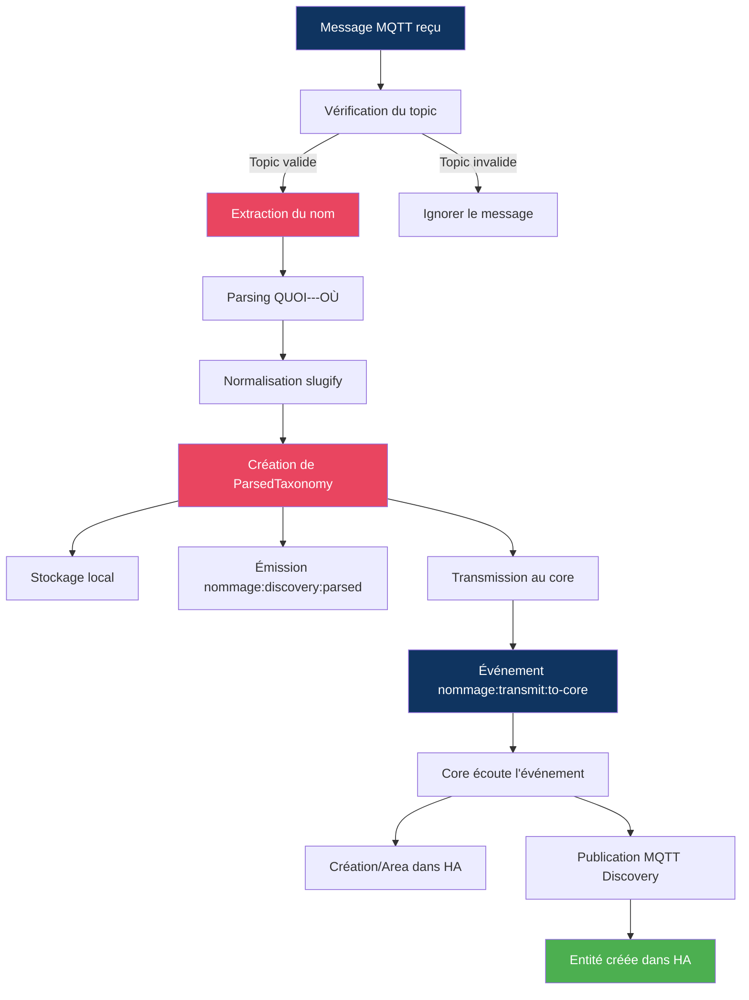

# Spécifications Fonctionnelles - Application NOMMAGE

**Version :** 1.3  
**Date :** 24 Juillet 2026  
**Auteur :** Mistral Vibe / Claude  
**Statut :** Document de référence pour l'application NOMMAGE  
**Document parent :** [PROMPT_PROJET.md](../PROMPT_PROJET.md)

> **v1.2** : Le code ne traitait en réalité que la **première entrée** de `couples`/`sources`
> malgré la description v1.1 — corrigé (§3.1). **Tableau de bord enrichi** (§3.5) : affichage du
> **statut par connexion** (nom de la source + connectée/déconnectée) et du **nombre d'entrées
> traitées par jour sur une fenêtre glissante de 5 jours** (§4.2). Correction des chemins statiques
> des pages de présentation (`presentation/` fait partie de l'URL, voir
> `guide-nouvelle-application_specs` §3.8/v1.6).

> **v1.1** : **Sources MQTT multiples traitées simultanément** (§3.1, §4.3) — `mqtt` (objet unique)
> remplacé par `sources[]` (tableau), toutes connectées et écoutées en parallèle, ce qui n'était
> pas décrit en v1.0. **Transmission via le Passthrough MQTT du socle** (§3.4, §6) — remplace
> l'ancien mécanisme `nommage:transmit:to-core` qui restait vague ; NOMMAGE relaie désormais le
> message source enrichi (au lieu de reconstruire un message HA de toutes pièces et d'appeler
> l'API WebSocket pour les Areas). Cas d'usage Zigbee2MQTT (EA-6) résolu par cette conception.
> **Clarification (§6.2)** : NOMMAGE ne dépend que de `ha.mqtt_enable`, jamais de `ha.ws_enable` —
> le référentiel structuré (`HaStructureRegistry`) n'est jamais mis à jour à partir de messages
> MQTT, il est alimenté nativement par HA via WS et peut ne pas exister du tout.

---

## 📚 Table des Matières

1. [Introduction](#1-introduction)
2. [Contexte et Objectifs](#2-contexte-et-objectifs)
3. [Fonctionnalités Principales](#3-fonctionnalités-principales)
4. [Format des Données](#4-format-des-données)
5. [Flux de Traitement](#5-flux-de-traitement)
6. [Intégration avec Home Assistant](#6-intégration-avec-home-assistant)
7. [Configuration](#7-configuration)
8. [Gestion des Erreurs](#8-gestion-des-erreurs)
9. [Exemples d'Utilisation](#9-exemples-dutilisation)
10. [Évolutions Futures](#10-évolutions-futures)

---

## 1. Introduction

### 1.1 Présentation

L'application **NOMMAGE** est un module d'intégration conçu pour **normaliser et structurer** les noms des entités Home Assistant en utilisant le **protocole de nommage unifié** défini dans [nommage_specs_v1.0.md](./nommage_specs_v1.0.md).

Elle agit comme un **intermédiaire** entre les applications tierces (RFXCOM, Zigbee2MQTT, etc.) qui émettent des messages de découverte MQTT et Home Assistant, en assurant que toutes les entités suivent une **taxonomie cohérente**.

### 1.2 Public Cible

- Développeurs d'applications Home Assistant
- Intégrateurs de systèmes IoT
- Administrateurs de systèmes domotiques

### 1.3 Portée

Cette spécification couvre :
- ✅ Le parsing des noms selon le format QUOI---OÙ
- ✅ La création de structures taxonomiques
- ✅ La transmission vers Home Assistant
- ✅ La configuration MQTT et HA
- ❌ **Hors portée** : La modification du core (doit être fait séparément)

---

## 2. Contexte et Objectifs

### 2.1 Problématique

Dans un écosystème Home Assistant avec de multiples applications (RFXCOM, Zigbee2MQTT, etc.), chaque application utilise ses propres **conventions de nommage** pour les entités. Cela entraîne :

- **Incohérence** dans l'interface utilisateur
- **Difficulté** de filtrage et de regroupement des entités
- **Complexité** de maintenance et d'automatisation

### 2.2 Solution

L'application NOMMAGE **intercepte les messages de découverte MQTT** et applique une **normalisation systématique** basée sur :

1. **Séparation** du QUOI (type de l'entité) et des OÙ (hiérarchie géographique)
2. **Normalisation** des chaînes (slugify) pour la compatibilité HA
3. **Structuration** en Areas, Devices et Entités
4. **Transmission** des informations taxonomiques à HA

### 2.3 Objectifs Fonctionnels

| ID | Objectif | Critère de Succès |
|----|----------|-------------------|
| OF-1 | Écouter les messages de découverte MQTT | Messages reçus et validés |
| OF-2 | Parser les noms selon QUOI---OÙ | Structure taxonomique correcte |
| OF-3 | Normaliser les chaînes (slugify) | Pas de caractères spéciaux |
| OF-4 | Transmettre à Home Assistant | Entités créées avec attributs taxonomie |
| OF-5 | Gérer la configuration | Paramètres MQTT et HA configurables |
| OF-6 | Afficher le statut | UI avec indicateurs de connexion |

---

## 3. Fonctionnalités Principales

### 3.1 Écoute MQTT — Sources Multiples Simultanées

> **⭐ v1.1** : NOMMAGE peut lire depuis **plusieurs sources MQTT indépendantes**, traitées
> **simultanément** (pas seulement configurées — voir §4.3). Une source = une connexion à un
> broker MQTT (potentiellement distinct du broker HA) avec ses propres topics de découverte.
>
> **⚠️ v1.2** : Cette description v1.1 n'était pas implémentée — le code ne connectait et ne
> traitait en réalité que `couples[0]` (la première entrée), quel que soit le nombre d'entrées
> configurées. Corrigé : `NommageMqttIntegrationService` gère désormais une connexion MQTT
> (`mqtt.MqttClient`) par source dans une `Map<sourceId, MqttClient>`, toutes connectées en
> parallèle via `Promise.allSettled` (voir implementation-nommage_specs §4.1).

**Description :** NOMMAGE écoute les messages de découverte MQTT émis par d'autres applications ou
systèmes, sur **une ou plusieurs sources en parallèle**. Chaque source dispose de sa propre
connexion MQTT, de ses propres identifiants, et de ses propres topics de découverte.

**Cas d'usage type — sources multiples :**
- Une application locale (ex: RFXCOM) publie sa découverte sur le broker HA lui-même, préfixée
  `ha/...` (topics par défaut)
- Zigbee2MQTT, sur ce **même broker** que HA, publie volontairement sa découverte sur un préfixe
  **différent** de `homeassistant/` (ex: `homeassist/...`) pour ne pas être auto-découvert
  directement — NOMMAGE doit lire ce flux séparément, l'enrichir, et le relayer (voir §3.4)
- Un système tiers pourrait être sur un **broker MQTT complètement différent**
- Ces trois cas sont représentés par **trois sources distinctes**, connectées et traitées
  **en même temps**, pas l'une après l'autre

**Fonctionnalités (par source) :**
- Connexion indépendante (host, port, credentials propres à la source)
- Abonnement à des **topics configurables** (par défaut : `ha/+/+/config`, `homeassistant/+/+/config`)
- Support des **wildcards** MQTT (`+`, `#`)
- Gestion de la **reconnexion automatique**, indépendante des autres sources (la perte d'une
  source n'affecte pas le traitement des autres)
- **Validation** du format des messages

**Entrées :**
- Configuration MQTT **par source** (host, port, topics, credentials) — voir §4.3 `sources[]`
- Messages MQTT au format JSON, sur chacune des sources actives

**Sorties :**
- Événement interne `nommage:discovery:raw` sur EventBus, avec l'**identifiant de la source**
  d'origine dans le payload (`sourceId`) — voir §4.2

### 3.2 Parsing QUOI/OÙ

**Description :** Analyse et segmentation des noms selon le protocole de nommage unifié.

**Algorithme :**
1. **Séparer** le QUOI des OÙ via le délimiteur `---`
2. **Extraire** les niveaux géographiques via le délimiteur `--`
3. **Distribuer** selon la matrice de [nommage_specs_v1.0.md](./nommage_specs_v1.0.md) §3.3
4. **Normaliser** chaque segment (slugify)

**Matrice de Distribution :**

| N (segments) | Lieu Précis | Lieu (Area) | Lieu Père (Floor) | Lieu Grand-Père |
|--------------|-------------|-------------|------------------|-----------------|
| 0 | ❌ | ❌ | ❌ | ❌ |
| 1 | ❌ | Segment 0 | ❌ | ❌ |
| 2 | Segment 0 | Segment 1 | ❌ | ❌ |
| 3 | Segment 0 | Segment 1 | Segment 2 | ❌ |
| ≥4 | Segment 0 | Segment 1 | Segment 2 | Segment 3 |

**Exemple :**
```
Entrée : "Sèche-serviette---Détecteur Douche--Salle de Bain--Rez-de-Chaussée--Maison"
Sortie :
  QUOI: "Sèche-serviette" → slug: "seche_serviette"
  Lieu Précis: "Détecteur Douche" → slug: "detecteur_douche"
  Lieu: "Salle de Bain" → slug: "salle_de_bain" ⭐
  Lieu Père: "Rez-de-Chaussée" → slug: "rez_de_chaussee"
  Lieu Grand-Père: "Maison" → slug: "maison"
```

### 3.3 Génération des Attributs HA

**Description :** Création des attributs compatibles avec Home Assistant.

**Attributs Générés :**
```yaml
attributs_taxonomie:
  quoi: "Sèche-serviette"
  slug_quoi: "seche_serviette"
  lieu_precis: "Détecteur Douche"
  slug_precis: "detecteur_douche"
  lieu_principal: "Salle de Bain" ⭐
  slug_lieu: "salle_de_bain" ⭐
  lieu_pere: "Rez-de-Chaussée"
  slug_pere: "rez_de_chaussee"
  lieu_grand_pere: "Maison"
  slug_grand_pere: "maison"
```

**Règles :**
- **`lieu_principal`** (NOMMAGE: `nom_lieu`) est **obligatoire** et utilisé pour créer l'Area HA
- Les autres niveaux sont **optionnels** et stockés en attributs
- Les attributs sont **injectés** dans les entités HA via MQTT Discovery

### 3.4 Transmission vers Home Assistant — Passthrough MQTT

> **⭐ v1.1** : Le mécanisme de transmission repose désormais sur le **Passthrough MQTT** du socle
> ([`techniques-socle-ha-mqtt_specs` §8.5.6](techniques-socle-ha-mqtt_specs_v4.12.md#856-passthrough-mqtt)),
> et **remplace** l'ancien mécanisme `nommage:transmit:to-core` (qui restait vague sur "WebSocket ou MQTT").

**Description :** Le message de découverte d'origine (lu sur une source, §3.1) est **enrichi** avec
les attributs de taxonomie puis **relayé tel quel** vers le broker HA unique du socle, via le mode
**Découverte** du Passthrough MQTT — NOMMAGE ne reconstruit pas un message HA de toutes pièces,
elle republie le message source enrichi, avec réécriture du préfixe du topic.

**Méthode :**
1. NOMMAGE injecte `attributs_taxonomie` (voir §3.3) dans le payload JSON d'origine
2. NOMMAGE émet `integration:nommage:passthrough:discovery` sur l'EventBus, avec :
   - `sourceTopic` = le topic **d'origine** du message (ex: `ha/sensor/temp_cuisine/config` ou
     `homeassist/sensor/temp_salon/config`) — préfixe **non modifié** par NOMMAGE
   - `payload` = le message JSON source, enrichi des attributs de taxonomie
3. Le socle (`HaMqttIntegrationService`) remplace le **premier segment** de `sourceTopic` par
   `homeassistant` et publie le résultat (QoS 1, retain `true`)

**Événement émis (`integration:nommage:passthrough:discovery`) :**
```typescript
{
  sourceTopic: string,   // Ex: "homeassist/sensor/temp_salon/config" (préfixe source, inchangé)
  payload: {
    // Payload JSON d'origine du message de découverte, enrichi :
    ...payloadOriginal,
    attributs_taxonomie: {
      quoi: string,
      slug_quoi: string,
      lieu_precis?: string,
      slug_precis?: string,
      lieu_principal: string,   // ⭐ OBLIGATOIRE (voir §3.2)
      slug_lieu: string,
      lieu_pere?: string,
      slug_pere?: string,
      lieu_grand_pere?: string,
      slug_grand_pere?: string
    }
  }
}
```

**Événement interne conservé pour l'UI/le suivi (`nommage:discovery:parsed`) :**
```typescript
{
  type: 'nommage:discovery:parsed',
  sourceId: string,          // ⭐ Identifiant de la source d'origine (§4.3)
  discoveryMessage: {
    rawName: string,
    topic: string,            // Topic source (préfixe non modifié)
    payload: Record<string, unknown>
  },
  parsedTaxonomy: {
    quoi: { raw: string; slug: string },
    ou: {
      lieu?: { raw: string; slug: string },  // ⭐ OBLIGATOIRE
      precis?: { raw: string; slug: string },
      pere?: { raw: string; slug: string },
      grandPere?: { raw: string; slug: string }
    }
  },
  timestamp: Date
}
```

### 3.5 Interface Utilisateur

**Description :** UI minimale pour visualiser le statut et les activités.

**Fonctionnalités :**
- Affichage du **statut de connexion** (Application + MQTT)
- ⭐ **v1.2** — **Statut par connexion** : une ligne par source configurée, affichant son
  identifiant (`sources[].id`) et son état (connectée/déconnectée). Contrairement au statut MQTT
  global (qui indique "au moins une source connectée"), cette liste permet de voir précisément
  quelle source a un problème.
- ⭐ **v1.2** — **Entrées traitées par jour, sur 5 jours glissants** : un tableau affichant, pour
  chacun des 5 derniers jours (aujourd'hui compris), le nombre de messages de découverte parsés
  avec succès ce jour-là. Toujours 5 colonnes, avec 0 pour les jours sans activité. Ce compteur est
  **en mémoire** (comme le compteur global `parsedMessagesCount`) : il repart à zéro à chaque
  redémarrage de l'application, il ne s'agit pas d'un historique persistant.
- Liste des **topics de découverte** configurés (agrégés de toutes les sources)
- Compteur des **messages parsés**
- Date du **dernier parsing**
- Boutons pour **rafraîchir** et **tester**

**URL :** `/applications/nommage/presentation/index.html`

> **⚠️ v1.2** : Le segment `presentation/` fait partie intégrante de cette URL (routage confirmé
> par `ModuleContainer.ts` du core) — ne pas le retirer des chemins des scripts/styles de la page,
> erreur constatée en pratique qui empêchait le chargement du script (voir
> `guide-nouvelle-application_specs` §3.8/v1.6).

### 3.6 Configuration

**Description :** Gestion des paramètres de l'application.

**Sections :**
1. **MQTT** : Connexion au broker
2. **Home Assistant** : Paramètres de transmission
3. **Logging** : Niveau de logs et débogage

**Méthodes :**
- Configuration via **UI** (Paramètres Techniques)
- Configuration via **fichier** (`data/nommage/config.yaml`)
- **Validation** avec Zod
- **Rechargement à chaud** (redémarrage automatique)

---

## 4. Format des Données

### 4.1 Message MQTT Entrant

**Format attendu :** JSON avec un champ `name` ou `raw_name`

```json
{
  "name": "Sèche-serviette---Détecteur Douche--Salle de Bain",
  "device_class": "temperature",
  "unique_id": "rfxcom_temperature_001",
  "state_topic": "homeassistant/sensor/rfxcom_temperature_001/state",
  "unit_of_measurement": "°C"
}
```

**Champs reconnus (par ordre de priorité) :**
1. `name` → Nom à parser
2. `raw_name` → Nom à parser
3. `device.name` → Nom à parser
4. Le payload entier est traité comme une chaîne

### 4.2 Structure Parsée (ParsedTaxonomy)

```typescript
{
  // QUOI (Type de l'entité)
  quoi: {
    raw: "Sèche-serviette",
    slug: "seche_serviette"
  },
  
  // OÙ (Hiérarchie géographique)
  ou: {
    precis?: { raw: "Détecteur Douche", slug: "detecteur_douche" },
    lieu?: { raw: "Salle de Bain", slug: "salle_de_bain" },  // ⭐ OBLIGATOIRE
    pere?: { raw: "Rez-de-Chaussée", slug: "rez_de_chaussee" },
    grandPere?: { raw: "Maison", slug: "maison" }
  },
  
  // Pour Home Assistant
  haAreaId?: "salle_de_bain",
  haAreaName?: "Salle de Bain",
  haEntityId?: "sensor.nommage_seche_serviette_salle_de_bain",
  haDeviceClass?: "temperature",
  
  // Attributs à injecter dans HA
  haAttributes: {
    attributs_taxonomie: {
      quoi: "Sèche-serviette",
      slug_quoi: "seche_serviette",
      lieu_precis: "Détecteur Douche",
      slug_precis: "detecteur_douche",
      lieu_principal: "Salle de Bain",
      slug_lieu: "salle_de_bain",
      lieu_pere: "Rez-de-Chaussée",
      slug_pere: "rez_de_chaussee",
      lieu_grand_pere: "Maison",
      slug_grand_pere: "maison"
    },
    // Autres attributs du message original
    device_class: "temperature",
    unit_of_measurement: "°C"
  },
  
  // Métadonnées
  sourceTopic: "ha/sensor/temperature/config",
  sourcePayload: { ... }
}
```

### 4.3 Configuration (NommageConfig)

> **⭐ v1.1** : `mqtt` (objet unique) est **remplacé** par `sources` (tableau). **Toutes les
> sources du tableau sont connectées et traitées simultanément** — ce n'est pas une liste dont
> seule la première entrée serait active.

```typescript
{
  enabled: boolean;  // default: true
  
  // ⭐ v1.1 — Une ou plusieurs sources MQTT, toutes actives en parallèle (voir §3.1)
  sources: NommageSourceConfig[];  // default: une seule source sur le broker HA (voir §7.1)
  
  // Transmission vers HA — commune à toutes les sources (voir §3.4, Passthrough MQTT du socle)
  ha: {
    injectTaxonomyAttributes: boolean; // default: true
  },
  
  logging: {
    level: 'debug' | 'info' | 'warn' | 'error'; // default: "info"
    showRawMessages: boolean;  // default: false
    showParsedMessages: boolean; // default: false
  }
}
```

**`NommageSourceConfig` (un élément de `sources[]`) :**
```typescript
{
  id: string;              // ⭐ Identifiant unique de la source (ex: "ha-broker", "zigbee2mqtt")
                            //    Utilisé dans les logs, l'UI, et le champ sourceId des événements
  
  mqtt: {
    host: string;           // default: "localhost"
    port: number;           // default: 1883, min: 1, max: 65535
    username?: string;
    password?: string;
    clientId: string;       // ⭐ Doit être unique par source (default: "nommage-{id}")
    keepalive: number;     // default: 60, min: 0, max: 300
    reconnectPeriod: number; // default: 5000, min: 1000, max: 300000
    cleanSession: boolean;  // default: true
    discoveryTopics: string[]; // default: ["ha/+/+/config", "homeassistant/+/+/config"]
    topicPrefix: string;    // default: "ha/" — préfixe attendu des topics de cette source
    qos: 0 | 1 | 2;         // default: 1
    retain: boolean;        // default: true
    useTls: boolean;        // default: false
    rejectUnauthorized: boolean; // default: true
  }
}
```

**Règles :**
- `sources` **DOIT** contenir au moins un élément
- Chaque `id` de source **DOIT** être unique dans le tableau
- Chaque `clientId` MQTT **DOIT** être unique (deux sources sur le même broker avec le même
  `clientId` provoqueraient une déconnexion mutuelle)
- La perte de connexion d'une source **ne doit pas** interrompre le traitement des autres sources
  (reconnexion indépendante, voir §3.1 et §8.1)

### 4.4 Statut (NommageStatus) — ⭐ NOUVEAU v1.2

Structure émise sur l'événement persistant `nommage:status` (reçu automatiquement par tout nouveau
client Socket.io, voir §7 `guide-nouvelle-application_specs`) :

```typescript
{
  connected: boolean;             // Statut de l'application
  mqttConnected: boolean;         // true si AU MOINS UNE source est connectée
  discoveryTopics: string[];      // Topics agrégés de toutes les sources
  parsedMessagesCount: number;    // Compteur global depuis le démarrage
  lastParsedAt?: Date;
  error?: string;

  // ⭐ v1.2 — Statut détaillé par connexion, une entrée par source configurée
  sources: {
    id: string;                   // sources[].id
    connected: boolean;
  }[];

  // ⭐ v1.2 — Entrées traitées par jour, 5 derniers jours (plus ancien → plus récent).
  // Toujours 5 éléments, 0 pour les jours sans entrée traitée. En mémoire (non persisté).
  dailyCounts: {
    date: string;                 // Format "AAAA-MM-JJ"
    count: number;
  }[];
}
```

---

## 5. Flux de Traitement



**Détail des étapes :**

1. **Réception MQTT** : `NommageMqttIntegrationService` reçoit un message
2. **Validation du topic** : Vérifie que le topic correspond aux patterns configurés
3. **Extraction du nom** : Récupère `name`, `raw_name` ou `device.name` du payload
4. **Parsing** : Séparation QUOI/OÙ et distribution des niveaux géographiques
5. **Normalisation** : Application de slugify sur chaque segment
6. **Création de la structure** : Génération de `ParsedTaxonomy`
7. **Stockage** : Mise en mémoire des structures pour l'UI
8. **Émission EventBus** : Diffusion aux écouteurs internes
9. **Transmission au core** : Événement pour envoi à HA
10. **Traitement par le core** : Création des Areas et entités dans HA

---

## 6. Intégration avec Home Assistant

> **⭐ v1.1** : Cette section est réécrite pour refléter le mécanisme de **Passthrough MQTT**
> (§3.4). L'ancienne approche (le core reconstruit un message HA complet et appelle l'API
> WebSocket pour créer les Areas) est **abandonnée** : NOMMAGE relaie le message source enrichi,
> et c'est **Home Assistant lui-même** qui crée les Areas à partir du champ `suggested_area` /
> des attributs de taxonomie, via ses propres automatisations MQTT (voir `nommage_specs` §6).

### 6.1 Répartition des responsabilités

| Responsabilité | Qui |
|---|---|
| Lire les sources MQTT, parser QUOI/OÙ, enrichir le payload | **NOMMAGE** (domaine métier) |
| Réécrire le préfixe du topic et publier sur le broker HA | **Socle** (`HaMqttIntegrationService`, Passthrough MQTT §3.4) |
| Créer les Areas, associer les entités | **Home Assistant** (via ses automatisations MQTT natives, voir `nommage_specs`) |

NOMMAGE ne construit **jamais** elle-même un message de découverte HA complet, et n'appelle
**jamais** l'API WebSocket HA — voir §3.4 pour le détail du flux de transmission.

### 6.2 Indépendance vis-à-vis du Référentiel HA (`HaStructureRegistry`)

> ⚠️ **Point important, à ne pas confondre :**

- Le référentiel structuré (`HaStructureRegistry`) **n'est jamais mis à jour à partir des
  messages MQTT** — ni la découverte, ni le passthrough de NOMMAGE ne le modifient directement.
  Il est alimenté **exclusivement** par la connexion **HA WebSocket** (Mode A) : c'est HA
  lui-même qui **notifie par WS** (`state_changed`, `entity_registry_updated`, etc.) quand une
  entité est créée ou modifiée — y compris une entité créée à la suite d'une découverte MQTT que
  NOMMAGE aurait relayée. C'est cette notification WS, native à HA, qui met à jour le référentiel.
- Le référentiel **peut ne pas exister du tout** : il n'est initialisé que si `ha.ws_enable = true`
  (voir `techniques-socle-ha-mqtt_specs` §8.1).
- **NOMMAGE ne nécessite que `ha.mqtt_enable`** — elle n'a **aucune dépendance** sur
  `ha.ws_enable` ni sur `HaStructureRegistry` pour fonctionner (`requiredHaWs: false`, cohérent
  avec `implementation-nommage_specs`). Si le WS est désactivé, NOMMAGE continue de fonctionner
  normalement (lecture des sources, enrichissement, passthrough) ; seul le référentiel structuré
  (utilisé par d'autres applications comme ARBREOUQUOI) sera absent — indépendamment de NOMMAGE.

---

## 7. Configuration

### 7.1 Configuration de Base

**Fichier :** `data/nommage/config.yaml` (objet nu, ex-section `nommage` de l'ancien fichier
unique — voir `techniques-socle-ha-mqtt_specs` §7)

```yaml
enabled: true

# ⭐ v1.1 — Tableau de sources, toutes connectées et traitées simultanément (voir §3.1)
sources:
  - id: "ha-broker"
    mqtt:
      host: "192.168.1.100"     # Broker HA lui-même
      port: 1883
      username: "user"
      password: "password"
      clientId: "nommage-ha-broker"
      discoveryTopics:
        - "ha/+/+/config"
      topicPrefix: "ha/"
      qos: 1
      retain: true

  - id: "zigbee2mqtt"
    mqtt:
      host: "192.168.1.100"     # Même broker que HA...
      port: 1883
      username: "user"
      password: "password"
      clientId: "nommage-zigbee2mqtt"
      discoveryTopics:
        - "homeassist/+/+/config"  # ...mais préfixe différent (volontaire, voir §3.1)
      topicPrefix: "homeassist/"
      qos: 1
      retain: true

ha:
  injectTaxonomyAttributes: true

logging:
  level: "info"
  showRawMessages: false
  showParsedMessages: false
```

### 7.2 Configuration via UI

**Accès :** Paramètres Techniques > Gestion des Applications > NOMMAGE > Configurer

**Champs configurables :**
- **Sources MQTT** (une ou plusieurs, ajout/suppression dynamique) : ID, Host, Port, Credentials, Topics, QoS, TLS
- **Home Assistant** : Injection des attributs de taxonomie
- **Logging** : Niveau, Afficher messages bruts/parsés

### 7.3 Validation

Toute configuration est **validée avec Zod** avant application.

**Règles de validation :**
- `sources` : tableau non vide (au moins une source)
- `sources[].id` : string non vide, unique dans le tableau
- `sources[].mqtt.host` : string non vide
- `sources[].mqtt.port` : 1-65535
- `sources[].mqtt.qos` : 0, 1 ou 2
- `sources[].mqtt.clientId` : string non vide, unique entre toutes les sources
- `logging.level` : 'debug' | 'info' | 'warn' | 'error'

---

## 8. Gestion des Erreurs

### 8.1 Erreurs de Connexion MQTT

| Erreur | Action | Log | Notification UI |
|--------|--------|-----|-----------------|
| Broker inaccessible | Reconnexion automatique | ERROR | ⚠️ Déconnecté |
| Authentification échouée | Arrêt de la reconnexion | ERROR | ⚠️ Erreur d'auth |
| Timeout de connexion | Nouvelle tentative | WARN | ⚠️ Timeout |

### 8.2 Erreurs de Parsing

| Erreur | Action | Log | Notification UI |
|--------|--------|-----|-----------------|
| Format invalide (pas de `---`) | Ignorer le message | WARN | - |
| JSON invalide | Ignorer le message | WARN | - |
| Champ name manquant | Utiliser payload comme string | DEBUG | - |
| Erreur de slugify | Valeur par défaut | ERROR | ⚠️ Erreur de parsing |

### 8.3 Erreurs de Transmission

| Erreur | Action | Log | Notification UI |
|--------|--------|-----|-----------------|
| Core non connecté | Retry après délai | WARN | ⚠️ Transmission en attente |
| Erreur HA API | Ignorer | ERROR | ⚠️ Erreur HA |

---

## 9. Exemples d'Utilisation

### 9.1 Exemple 1 : Message Simple

**Message MQTT :**
```json
{
  "name": "Température---Salon",
  "unique_id": "temp_salon_001",
  "device_class": "temperature",
  "state_topic": "homeassistant/sensor/temp_salon_001/state",
  "unit_of_measurement": "°C"
}
```

**Parsing :**
```typescript
{
  quoi: { raw: "Température", slug: "temperature" },
  ou: {
    lieu: { raw: "Salon", slug: "salon" }  // ⭐ N=1 : seul LIEU
  },
  haEntityId: "sensor.nommage_temperature_salon",
  haAttributes: {
    attributs_taxonomie: {
      quoi: "Température",
      slug_quoi: "temperature",
      lieu_principal: "Salon",
      slug_lieu: "salon"
    },
    device_class: "temperature",
    unit_of_measurement: "°C"
  }
}
```

**Résultat dans HA :**
- Area créée : **Salon**
- Entité créée : **sensor.nommage_temperature_salon**
- Attributs : `attributs_taxonomie.quoi = "Température"`

---

### 9.2 Exemple 2 : Message Complet (N=4)

**Message MQTT :**
```json
{
  "name": "Sèche-serviette---Détecteur Douche--Salle de Bain--Rez-de-Chaussée--Maison Principale",
  "device_class": "humidity",
  "unique_id": "rfxcom_humidity_001"
}
```

**Parsing :**
```typescript
{
  quoi: { raw: "Sèche-serviette", slug: "seche_serviette" },
  ou: {
    precis: { raw: "Détecteur Douche", slug: "detecteur_douche" },
    lieu: { raw: "Salle de Bain", slug: "salle_de_bain" },  // ⭐ Area HA
    pere: { raw: "Rez-de-Chaussée", slug: "rez_de_chaussee" },
    grandPere: { raw: "Maison Principale", slug: "maison_principale" }
  },
  haEntityId: "sensor.nommage_seche_serviette_salle_de_bain",
  haAttributes: {
    attributs_taxonomie: {
      quoi: "Sèche-serviette",
      slug_quoi: "seche_serviette",
      lieu_precis: "Détecteur Douche",
      slug_precis: "detecteur_douche",
      lieu_principal: "Salle de Bain",
      slug_lieu: "salle_de_bain",
      lieu_pere: "Rez-de-Chaussée",
      slug_pere: "rez_de_chaussee",
      lieu_grand_pere: "Maison Principale",
      slug_grand_pere: "maison_principale"
    },
    device_class: "humidity"
  }
}
```

**Résultat dans HA :**
- Areas créées : **Maison Principale**, **Rez-de-Chaussée**, **Salle de Bain**
- Entité créée : **sensor.nommage_seche_serviette_salle_de_bain**
- Attributs : Tous les niveaux de taxonomie disponibles

---

### 9.3 Exemple 3 : Message sans Sépérateur `---`

**Message MQTT :**
```json
{
  "name": "Température Salon",
  "unique_id": "temp_salon_simple"
}
```

**Parsing :**
```typescript
{
  quoi: { raw: "Température Salon", slug: "temperature_salon" },
  ou: {}  // ❌ Aucun OÙ détecté
}
```

**Résultat :**
- **Aucune Area créée** (pas de `nom_lieu`)
- Entité créée avec `quoi` uniquement
- **Warning log** : "Format de nom non valide ou incomplet"

---

## 10. Évolutions Futures

### 10.1 Améliorations Prévues

| ID | Amélioration | Priorité | Version |
|----|--------------|----------|---------|
| EA-1 | Support des patterns de topics plus complexes | Moyenne | v1.1 |
| EA-2 | Validation avancée des noms (regex) | Faible | v1.1 |
| EA-3 | Historique des messages parsés | Moyenne | v1.2 |
| EA-4 | Filtrage des messages par type | Faible | v1.2 |
| EA-5 | Export des structures au format YAML | Faible | v1.2 |
| ~~EA-6~~ | ~~Intégration avec Zigbee2MQTT~~ → **Rendue possible par les sources multiples + Passthrough MQTT (§3.1, §3.4)** | — | **v1.1** ✅ |
| EA-7 | Support des templates Jinja2 pour HA | Élevée | v1.3 |

### 10.2 Compatibilité

**Version HA :** 2024.6+ (recommandé)

**Broker MQTT :** Mosquitto 2.0+, EMQX, HiveMQ

**Node.js :** 20 LTS+

---

## 📚 Références

- [nommage_specs_v1.0.md](./nommage_specs_v1.0.md) - Protocole de nommage QUOI/OÙ
- [techniques-socle-ha-mqtt_specs_v4.12.md](./techniques-socle-ha-mqtt_specs_v4.12.md) - Socle technique
- [guide-nouvelle-application_specs_v1.6.md](./guide-nouvelle-application_specs_v1.6.md) - Guide de création
- [PROMPT_PROJET.md](../PROMPT_PROJET.md) - Règles de développement

---

## 📅 Historique des Versions

| Version | Date | Auteur | Changements |
|---------|------|--------|-------------|
| **1.2** | 21/07/2026 | Claude | **Correction** : le code ne traitait en réalité que `couples[0]`/la première source malgré la description v1.1 — corrigé (§3.1, `NommageMqttIntegrationService` gère désormais une `Map<sourceId, MqttClient>`). **Tableau de bord enrichi** (§3.5, §4.4) : statut par connexion (nom + connecté/déconnecté) et entrées traitées par jour sur 5 jours glissants (`NommageStatus.sources[]`/`.dailyCounts[]`). Correction des chemins statiques des pages (`presentation/` fait partie de l'URL). |
| **1.1** | 21/07/2026 | Claude | Sources MQTT multiples traitées simultanément (`sources[]` remplace `mqtt`), transmission via Passthrough MQTT du socle (remplace `nommage:transmit:to-core`), cas d'usage Zigbee2MQTT résolu, clarification §6.2 : NOMMAGE ne dépend que de `ha.mqtt_enable` (jamais `ha.ws_enable`), le référentiel HA n'est jamais mis à jour depuis MQTT |
| **1.0** | 19/07/2026 | Mistral Vibe | Version initiale : Parsing QUOI/OÙ, transmission au core |

---

*Document généré par Mistral Vibe*
*Co-Authored-By: Mistral Vibe <vibe@mistral.ai>*


---

## 9. Communication Inter-Applications

> **⚠️ IMPORTANT :** Cette section documente les événements et capacités que cette application **expose** aux autres applications.
> 
> **Pour utiliser ces capacités :**
> - Import depuis le core : `import { InterAppClient } from '../../../core/src/exports'`
> - Utiliser `interAppClient.request()` pour les Request/Reply
> - Utiliser `interAppClient.on()` pour écouter les événements Fire & Forget
> - Voir [inter-app-communication_specs_v1.0.md](../inter-app-communication_specs_v1.0.md) pour les détails

### 9.1 Événements Fire & Forget (Écoute possible par d'autres applications)

| Événement | Description | Payload Type | Fréquence | Émetteur |
|-----------|-------------|--------------|-----------|----------|
| `nommage:entity:normalized` | Une entité a été normalisée avec succès | `NommageEntityNormalizedPayload` | Selon traitement | nommage |
| `nommage:entity:renamed` | Une entité a été renommée | `NommageEntityRenamedPayload` | Sur renommage | nommage |
| `nommage:validation:passed` | Validation de nom réussie | `NommageValidationPassedPayload` | Sur validation | nommage |
| `nommage:validation:failed` | Validation de nom échouée | `NommageValidationFailedPayload` | Sur validation échouée | nommage |
| `nommage:rules:loaded` | Les règles de nommage ont été chargées | `NommageRulesLoadedPayload` | Au démarrage | nommage |
| `nommage:rules:updated` | Les règles de nommage ont été mises à jour | `NommageRulesUpdatedPayload` | Sur mise à jour | nommage |

**Types des payloads :**
```typescript
// NommageEntityNormalizedPayload
export interface NommageEntityNormalizedPayload {
  originalName: string;
  normalizedName: string;
  entityId: string;
  quoi: string;
  ou: string;
  components: {
    quoi: string;
    ou: string;
    separators: { major: string; minor: string };
  };
  timestamp: string;
}

// NommageEntityRenamedPayload
export interface NommageEntityRenamedPayload {
  entityId: string;
  oldName: string;
  newName: string;
  oldQuoi: string;
  oldOu: string;
  newQuoi: string;
  newOu: string;
  timestamp: string;
}

// NommageValidationPassedPayload
export interface NommageValidationPassedPayload {
  name: string;
  entityId: string;
  validationRules: string[];
  timestamp: string;
}

// NommageValidationFailedPayload
export interface NommageValidationFailedPayload {
  name: string;
  entityId: string;
  errors: {
    rule: string;
    message: string;
    expected: string;
    actual: string;
  }[];
  timestamp: string;
}

// NommageRulesLoadedPayload
export interface NommageRulesLoadedPayload {
  rulesCount: number;
  ruleFiles: string[];
  timestamp: string;
}

// NommageRulesUpdatedPayload
export interface NommageRulesUpdatedPayload {
  updatedRules: string[];
  timestamp: string;
}
```

**Exemple d'écoute depuis une autre application :**
```typescript
import { InterAppClient } from '../../../core/src/exports';

// Écouter les normalisations
this.interAppClient.on('nommage:entity:normalized', (payload, fromApp) => {
  console.log(`Entité normalisée par ${fromApp}:`);
  console.log(`  ${payload.originalName} → ${payload.normalizedName}`);
  console.log(`  QUOI: ${payload.quoi}, OÙ: ${payload.ou}`);
});

// Écouter les échecs de validation
this.interAppClient.on('nommage:validation:failed', (payload, fromApp) => {
  console.log(`Validation échouée pour ${payload.name}:`);
  payload.errors.forEach(err => {
    console.log(`  - ${err.rule}: ${err.message}`);
  });
});

// Écouter les mises à jour de règles
this.interAppClient.on('nommage:rules:updated', (payload, fromApp) => {
  console.log(`Règles mises à jour: ${payload.updatedRules.join(', ')}`);
});
```

### 9.2 Capacités Request/Reply (Appel possible depuis d'autres applications)

| Capacité | Description | Request Type | Reply Type | Timeout conseillé |
|----------|-------------|--------------|------------|-------------------|
| `nommage:normalize` | Normaliser un nom d'entité | `NommageNormalizeRequest` | `NommageNormalizeReply` | 1000ms |
| `nommage:validate` | Valider un nom d'entité | `NommageValidateRequest` | `NommageValidateReply` | 1000ms |
| `nommage:parse` | Parser un nom existant | `NommageParseRequest` | `NommageParseReply` | 500ms |
| `nommage:generate` | Générer un nom à partir de composants | `NommageGenerateRequest` | `NommageGenerateReply` | 500ms |
| `nommage:rules:get` | Obtenir les règles de nommage actives | `NommageRulesGetRequest` | `NommageRulesGetReply` | 1000ms |
| `nommage:rules:set` | Mettre à jour les règles de nommage | `NommageRulesSetRequest` | `NommageRulesSetReply` | 2000ms |

**Types :**
```typescript
// Request/Reply pour normalize
interface NommageNormalizeRequest {
  name: string;
  entityId?: string;
  overrideQuoi?: string;
  overrideOu?: string;
}

interface NommageNormalizeReply {
  originalName: string;
  normalizedName: string;
  quoi: string;
  ou: string;
  changed: boolean;
}

// Request/Reply pour validate
interface NommageValidateRequest {
  name: string;
  entityId?: string;
  strict?: boolean; // Si true, échoue sur avertissement
}

interface NommageValidateReply {
  valid: boolean;
  name: string;
  warnings: string[];
  errors: string[];
}

// Request/Reply pour parse
interface NommageParseRequest {
  name: string;
}

interface NommageParseReply {
  name: string;
  quoi: string;
  ou: string;
  components: {
    quoi: string;
    ou: string;
    separators: { major: string; minor: string };
  };
  isValid: boolean;
}

// Request/Reply pour generate
interface NommageGenerateRequest {
  quoi: string;
  ou: string;
  prefix?: string;
  suffix?: string;
}

interface NommageGenerateReply {
  name: string;
  quoi: string;
  ou: string;
}

// Request/Reply pour rules:get
interface NommageRulesGetRequest {
  ruleType?: 'quoi' | 'ou' | 'format' | 'validation';
}

interface NommageRulesGetReply {
  rules: {
    type: string;
    name: string;
    pattern: string;
    description: string;
    enabled: boolean;
  }[];
}

// Request/Reply pour rules:set
interface NommageRulesSetRequest {
  ruleName: string;
  ruleConfig: Record<string, unknown>;
  enabled: boolean;
}

interface NommageRulesSetReply {
  success: boolean;
  ruleName: string;
  message?: string;
}
```

**Exemple d'appel depuis une autre application :**
```typescript
import { InterAppClient } from '../../../core/src/exports';
import type {
  NommageNormalizeRequest,
  NommageNormalizeReply,
  NommageValidateRequest,
  NommageValidateReply,
  NommageParseRequest,
  NommageParseReply,
  NommageGenerateRequest,
  NommageGenerateReply
} from '../nommage/specs';

// Normaliser un nom
const normalizeReply = await interAppClient.request<
  NommageNormalizeRequest,
  NommageNormalizeReply
>(
  'nommage:normalize',
  { name: 'température--salon--maison' },
  1000
);

if (normalizeReply.status === 'success') {
  console.log(`Nom normalisé: ${normalizeReply.result.normalizedName}`);
  console.log(`  QUOI: ${normalizeReply.result.quoi}, OÙ: ${normalizeReply.result.ou}`);
}

// Valider un nom
const validateReply = await interAppClient.request<
  NommageValidateRequest,
  NommageValidateReply
>(
  'nommage:validate',
  { name: 'température--salon--maison', strict: true },
  1000
);

if (validateReply.status === 'success') {
  if (validateReply.result.valid) {
    console.log('Nom valide ✓');
  } else {
    console.log('Nom invalide:', validateReply.result.errors);
  }
}

// Parser un nom
const parseReply = await interAppClient.request<
  NommageParseRequest,
  NommageParseReply
>(
  'nommage:parse',
  { name: 'température--salon--maison' },
  500
);

if (parseReply.status === 'success') {
  console.log('Parsing:', parseReply.result);
}

// Générer un nom
const generateReply = await interAppClient.request<
  NommageGenerateRequest,
  NommageGenerateReply
>(
  'nommage:generate',
  { quoi: 'température', ou: 'salon--maison' },
  500
);

if (generateReply.status === 'success') {
  console.log('Nom généré:', generateReply.result.name);
}
```

**Handler côté récepteur (dans l'application NOMMAGE) :**
```typescript
import { InterAppClient } from '../../../core/src/exports';

// Exemple: handler pour nommage:normalize
this.interAppClient.onRequest('nommage:normalize', async (request, reply) => {
  try {
    const result = await normalizeName(request.payload);
    reply({
      requestId: request.requestId,
      inReplyTo: request.requestId,
      fromApp: 'nommage',
      status: 'success',
      result,
      timestamp: new Date().toISOString()
    });
  } catch (error) {
    reply({
      requestId: request.requestId,
      inReplyTo: request.requestId,
      fromApp: 'nommage',
      status: 'error',
      error: {
        code: 'NOMMAGE_NORMALIZE_ERROR',
        message: error.message
      },
      timestamp: new Date().toISOString()
    });
  }
});

// Exemple: handler pour nommage:validate
this.interAppClient.onRequest('nommage:validate', async (request, reply) => {
  try {
    const result = await validateName(request.payload);
    reply({
      requestId: request.requestId,
      inReplyTo: request.requestId,
      fromApp: 'nommage',
      status: 'success',
      result,
      timestamp: new Date().toISOString()
    });
  } catch (error) {
    reply({
      requestId: request.requestId,
      inReplyTo: request.requestId,
      fromApp: 'nommage',
      status: 'error',
      error: {
        code: 'NOMMAGE_VALIDATE_ERROR',
        message: error.message
      },
      timestamp: new Date().toISOString()
    });
  }
});

// Exemple: handler pour nommage:parse
this.interAppClient.onRequest('nommage:parse', async (request, reply) => {
  try {
    const result = await parseName(request.payload);
    reply({
      requestId: request.requestId,
      inReplyTo: request.requestId,
      fromApp: 'nommage',
      status: 'success',
      result,
      timestamp: new Date().toISOString()
    });
  } catch (error) {
    reply({
      requestId: request.requestId,
      inReplyTo: request.requestId,
      fromApp: 'nommage',
      status: 'error',
      error: {
        code: 'NOMMAGE_PARSE_ERROR',
        message: error.message
      },
      timestamp: new Date().toISOString()
    });
  }
});

// Exemple: handler pour nommage:generate
this.interAppClient.onRequest('nommage:generate', async (request, reply) => {
  try {
    const result = await generateName(request.payload);
    reply({
      requestId: request.requestId,
      inReplyTo: request.requestId,
      fromApp: 'nommage',
      status: 'success',
      result,
      timestamp: new Date().toISOString()
    });
  } catch (error) {
    reply({
      requestId: request.requestId,
      inReplyTo: request.requestId,
      fromApp: 'nommage',
      status: 'error',
      error: {
        code: 'NOMMAGE_GENERATE_ERROR',
        message: error.message
      },
      timestamp: new Date().toISOString()
    });
  }
});
```

*Document généré par Mistral Vibe*  
*Co-Authored-By: Mistral Vibe <vibe@mistral.ai>*
