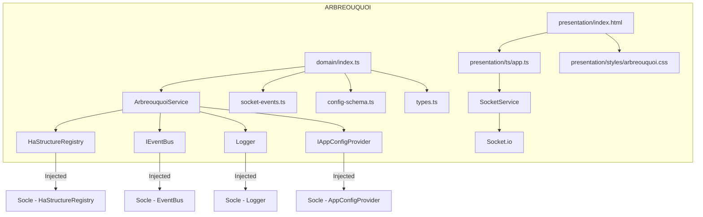
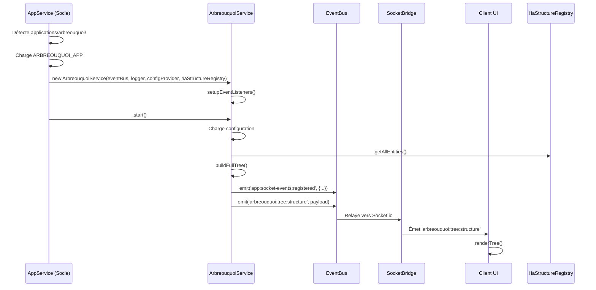
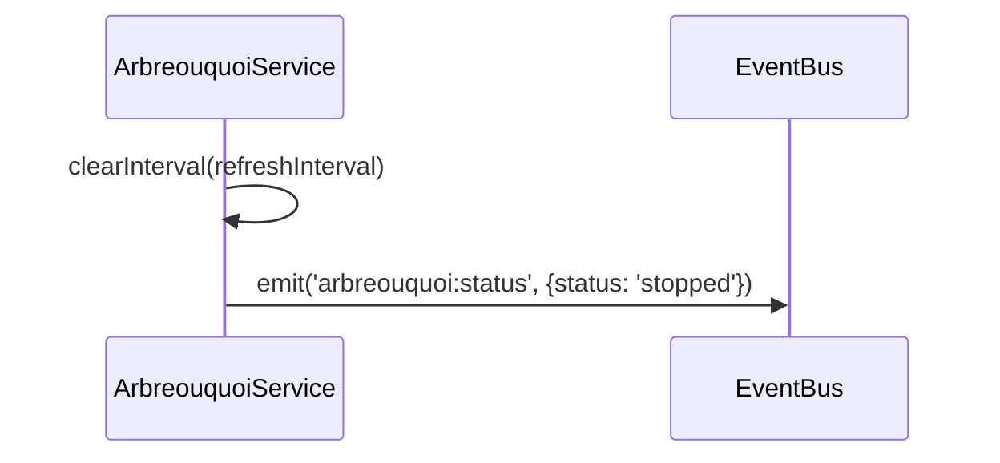
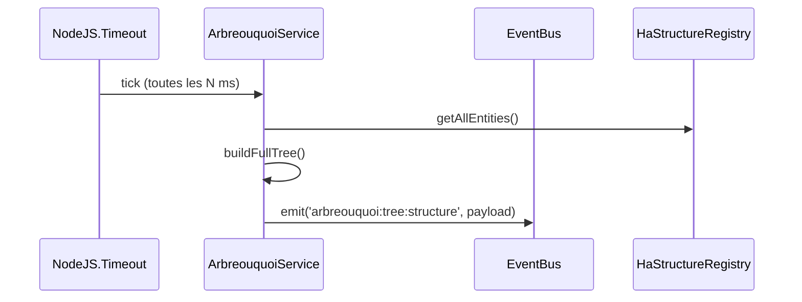

# Spécifications d'Implémentation — Application ARBREOUQUOI

**Version :** 1.0  
**Date :** 20 Juillet 2026  
**Auteur :** Mistral Vibe  
**Statut :** En développement  
**Type :** Application standalone  
**Dépend de :** techniques-socle-ha-mqtt_specs_v4.12.md, guide-nouvelle-application_specs_v1.6.md, nommage_specs_v1.0.md  

---

## 📚 Table des Matières

1. [Architecture de l'Application](#1-architecture-de-lapplication)
2. [Structure des Fichiers](#2-structure-des-fichiers)
3. [Détails des Composants](#3-détails-des-composants)
4. [Cycle de Vie](#4-cycle-de-vie)
5. [Communication](#5-communication)
6. [Gestion des Données](#6-gestion-des-données)
7. [Gestion des Erreurs](#7-gestion-des-erreurs)
8. [Configuration](#8-configuration)
9. [Build et Déploiement](#9-build-et-déploiement)
10. [Tests](#10-tests)

---

## 1. Architecture de l'Application

### 1.1 Conformité à l'Architecture 5 Couches

L'application **ARBREOUQUOI** respecte strictement l'architecture en 5 couches définie dans [techniques-socle-ha-mqtt_specs_v4.12.md](techniques-socle-ha-mqtt_specs_v4.12.md) :

```
┌─────────────────────────────────────────────────────────────────┐
│                    COUCHE PRÉSENTATION                             │
│  presentation/index.html                                          │
│  presentation/ts/app.ts                                           │
│  presentation/styles/arbreouquoi.css                             │
├─────────────────────────────────────────────────────────────────┤
│                    COUCHE APPLICATION                              │
│  → Gérée par le socle (AppService, EventBus, SocketBridge)       │
├─────────────────────────────────────────────────────────────────┤
│                    COUCHE MÉTIER                                  │
│  domain/ArbreouquoiService.ts                                     │
│  domain/index.ts (module + factory)                             │
│  domain/types.ts                                                 │
│  domain/socket-events.ts                                         │
│  domain/config-schema.ts                                        │
├─────────────────────────────────────────────────────────────────┤
│                     COUCHE HA                                     │
│  → Utilise HaStructureRegistry injecté par le socle             │
│  → Écoute les événements ha:structure:rebuilt, ha:entity:updated  │
├─────────────────────────────────────────────────────────────────┤
│               COUCHE INFRASTRUCTURE                              │
│  → Utilise IAppConfigProvider injecté par le socle              │
│  → Utilise Logger injecté par le socle                           │
└─────────────────────────────────────────────────────────────────┘
```

### 1.2 Diagramme de Composants



### 1.3 Injection de Dépendances

L'application utilise l'**injection de dépendances** via les factories :

```typescript
// Factory principale (recommandée)
export function createArbreouquoiService(
  eventBus: IEventBus,
  logger: Logger,
  configProvider: IAppConfigProvider<ArbreouquoiConfig>
): ArbreouquoiService {
  // HaStructureRegistry est injecté via AppService
  return new ArbreouquoiService(eventBus, logger, configProvider, haStructureRegistry);
}
```

**Flux d'injection :**
1. `AppService` détecte le module `arbreouquoi`
2. `AppService` charge `{NOM_APP}_APP` (ARBREOUQUOI_APP)
3. `AppService` recherche une factory `create{Arbreouquoi}Service`
4. `AppService` injecte : EventBus, Logger, IAppConfigProvider, HaStructureRegistry
5. `AppService` appelle `.start()` sur l'instance

---

## 2. Structure des Fichiers

### 2.1 Arborescence Complète

```bash
applications/
└── arbreouquoi/                    # ⭐ Répertoire de l'application
    ├── src/                        # ⭐ Source TypeScript
    │   ├── domain/                # Couche Métier
    │   │   ├── index.ts           # ⭐ OBLIGATOIRE : Déclaration du module + exports
    │   │   ├── ArbreouquoiService.ts   # ⭐ OBLIGATOIRE : Service métier
    │   │   ├── socket-events.ts    # Événements Socket.io spécifiques
    │   │   ├── config-schema.ts   # Schema de configuration (Zod)
    │   │   └── types.ts           # Types TypeScript spécifiques
    │   │
    │   └── presentation/           # Couche Présentation
    │       ├── index.html         # ⭐ OBLIGATOIRE : UI de l'application
    │       ├── ts/
    │       │   └── app.ts          # Logique frontend (TypeScript)
    │       └── styles/
    │           └── arbreouquoi.css # Styles spécifiques
    │
    └── dist/                       # ⭐ Répertoire de compilation (généré par tsc)
        ├── domain/
        │   ├── index.js
        │   ├── ArbreouquoiService.js
        │   └── ...
        └── presentation/
            └── ts/
                └── app.js
```

### 2.2 Fichiers et Rôles

| Fichier | Rôle | Obligatoire | Modifiable |
|---------|------|-------------|------------|
| `src/domain/index.ts` | Déclaration du module, métadonnées UI, exports | ✅ Oui | ❌ Non (structure) |
| `src/domain/ArbreouquoiService.ts` | Service métier principal | ✅ Oui | ✅ Oui |
| `src/domain/socket-events.ts` | Définition des événements Socket.io | ❌ Non | ✅ Oui |
| `src/domain/config-schema.ts` | Schema Zod pour la configuration | ❌ Non | ✅ Oui |
| `src/domain/types.ts` | Types TypeScript spécifiques | ❌ Non | ✅ Oui |
| `src/presentation/index.html` | Interface utilisateur principale | ✅ Oui | ✅ Oui |
| `src/presentation/ts/app.ts` | Logique client Socket.io | ❌ Non | ✅ Oui |
| `src/presentation/styles/arbreouquoi.css` | Styles CSS | ❌ Non | ✅ Oui |
| `dist/` | Répertoire de compilation (généré par tsc) | ❌ Non (généré) | ❌ Non |

---

## 3. Détails des Composants

### 3.1 domain/index.ts

**Rôle :** Point d'entrée du module, déclaration pour la détection automatique.

**Contenu obligatoire :**
- `ARBREOUQUOI_APP: ApplicationModule` — Métadonnées du module
- Export des composants : Service, socket-events, config-schema, types
- Factory : `createArbreouquoiService`

**Structure :**
```typescript
export const ARBREOUQUOI_APP: ApplicationModule = {
  id: 'arbreouquoi',           // ⚠️ Doit correspondre au nom du répertoire
  name: 'Arbre Ou Quoi',
  description: 'Visualisation du référentiel HA',
  icon: '🌳',
  type: 'standalone',           // 'integration' | 'standalone' | 'core'
  configurable: true,
  requiredMqtt: false,        // Pas besoin de MQTT direct (utilise EventBus)
  requiredHaWs: true,          // A besoin de la connexion HA WebSocket
  socketEvents: ARBREOUQUOI_SOCKET_EVENTS,
  configUi: ARBREOUQUOI_UI_METADATA,
  configSection: 'arbreouquoi' // Nom de la section dans config.yaml
};

export function createArbreouquoiService(eventBus, logger, configProvider) {
  return new ArbreouquoiService(eventBus, logger, configProvider, haStructureRegistry);
}

export * from './ArbreouquoiService';
export * from './socket-events';
export * from './config-schema';
export * from './types';
```

### 3.2 domain/ArbreouquoiService.ts

**Rôle :** Service métier principal qui gère la logique de l'application.

**Responsabilités :**
- Gestion du cycle de vie (start, stop)
- Construction de la structure d'arbre à partir du référentiel HA
- Émission des événements Socket.io
- Gestion des filtres et recherches
- Rafraîchissement automatique
- Gestion de la configuration

**Méthodes principales :**

| Méthode | Visibilité | Description |
|---------|------------|-------------|
| `start()` | public | ⭐ OBLIGATOIRE — Démarrage du service |
| `stop()` | public | OPTIONNEL — Arrêt propre du service |
| `setupEventListeners()` | private | Configuration des écouteurs EventBus |
| `buildFullTree()` | private | Construit la structure complète de l'arbre |
| `buildQuoiCatalog()` | private | Construit le catalogue QUOI avec compteurs |
| `emitFullTree()` | private | Émet la structure complète vers l'UI |
| `emitCatalog()` | private | Émet le catalogue QUOI vers l'UI |
| `emitStats()` | private | Émet les statistiques globales |
| `emitFilteredTree()` | private | Émet l'arbre filtré |
| `emitEntityDetails()` | private | Émet les détails d'une entité |
| `startAutoRefresh()` | private | Démarre le rafraîchissement automatique |

**Injections de dépendances :**
- `IEventBus` — Pour communiquer avec Socket.io via EventBus
- `Logger` — Pour le logging
- `IAppConfigProvider<ArbreouquoiConfig>` — Pour accéder à la configuration spécifique
- `HaStructureRegistry` — **Injection principale** — Pour accéder au référentiel HA

### 3.3 domain/socket-events.ts

**Rôle :** Définition centralisée de tous les événements Socket.io de l'application.

**Conventions :**
- Tous les événements DOIVENT être prefixés par `arbreouquoi:`
- Séparation Server → Client et Client → Server
- Utilisation de `as const` pour le typage TypeScript

**Événements définis :**

**Server → Client :**
- `arbreouquoi:tree:structure` — Structure complète de l'arbre
- `arbreouquoi:tree:updated` — Mise à jour de l'arbre
- `arbreouquoi:quoi:catalog` — Catalogue QUOI avec compteurs
- `arbreouquoi:areas:list` — Liste des Areas
- `arbreouquoi:devices:list` — Liste des Devices
- `arbreouquoi:entity:details` — Détails d'une entité
- `arbreouquoi:entities:by-area` — Entités filtrées par Area
- `arbreouquoi:entities:by-quoi` — Entités filtrées par QUOI
- `arbreouquoi:stats` — Statistiques globales
- `arbreouquoi:status` — Statut de l'application
- `arbreouquoi:error` — Erreur

**Client → Server :**
- `arbreouquoi:tree:get` — Demande la structure initiale
- `arbreouquoi:catalog:get` — Demande le catalogue QUOI
- `arbreouquoi:entity:get` — Demande les détails d'une entité
- `arbreouquoi:search` — Recherche globale
- `arbreouquoi:filter:set` — Applique des filtres
- `arbreouquoi:filter:reset` — Réinitialise les filtres
- `arbreouquoi:refresh` — Rafraîchissement manuel
- `arbreouquoi:config:get` — Demande la configuration
- `arbreouquoi:config:save` — Sauvegarde la configuration

### 3.4 domain/config-schema.ts

**Rôle :** Définition du schema de configuration avec Zod.

**Structure :**
```typescript
import { z } from 'zod';

export const arbreouquoiConfigSchema = z.object({
  enabled: z.boolean().default(true),
  display: z.object({
    expandAll: z.boolean().default(false),
    showEntityIds: z.boolean().default(true),
    showDeviceInfo: z.boolean().default(true),
    showQuoiIcons: z.boolean().default(true),
    theme: z.enum(['light', 'dark', 'auto']).default('auto'),
    compactMode: z.boolean().default(false)
  }).default({}),
  filters: z.object({
    defaultAreaId: z.string().optional(),
    defaultQuoiId: z.string().optional(),
    showOnlyActive: z.boolean().default(true)
  }).default({}),
  refresh: z.object({
    autoRefreshEnabled: z.boolean().default(true),
    autoRefreshInterval: z.number().min(1000).max(300000).default(30000),
    refreshOnHaUpdate: z.boolean().default(true)
  }).default({}),
  advanced: z.object({
    maxDepth: z.number().min(1).max(10).default(5),
    showUnassigned: z.boolean().default(true),
    groupByDevice: z.boolean().default(false),
    enableSearch: z.boolean().default(true)
  }).default({})
});

export type ArbreouquoiConfig = z.infer<typeof arbreouquoiConfigSchema>;
```

### 3.5 domain/types.ts

**Rôle :** Définition des types TypeScript spécifiques à l'application.

**Interfaces principales :**

```typescript
// Structure de l'arbre
interface AreaTreeNode {
  area: HaArea;
  children: QuoiGroup[];
  entityCount: number;
}

interface QuoiGroup {
  quoi: HaQuoiDefinition;
  entities: HaStructuredEntity[];
  count: number;
}

interface FullTreeStructure {
  areas: AreaTreeNode[];
  unassigned: EntityTreeNode[];
  totalEntities: number;
  totalAreas: number;
  totalQuoiTypes: number;
}

// Catalogue avec compteurs
interface QuoiCatalogWithCounts {
  quoi: HaQuoiDefinition;
  entityCount: number;
  areas: string[];
}

// Filtrage
interface FilterOptions {
  areaId?: string;
  quoiId?: string;
  showOnlyActive?: boolean;
  sortBy?: 'name' | 'entityCount' | 'quoi';
  sortOrder?: 'asc' | 'desc';
}

// Payloads Socket.io
interface ArbreOuQuoiTreePayload {
  tree: FullTreeStructure;
  catalog: QuoiCatalogWithCounts[];
  areas: HaArea[];
  timestamp: string;
}
```

### 3.6 presentation/index.html

**Rôle :** Interface utilisateur principale de l'application.

**Structure :**
```html
<!DOCTYPE html>
<html>
<head>
  <meta charset="UTF-8">
  <title>Arbre Ou Quoi</title>
  <link rel="stylesheet" href="/styles/main.css">
  <link rel="stylesheet" href="/applications/arbreouquoi/styles/arbreouquoi.css">
  <!-- Derniere modification: AAAA-MM-JJ HH:MM:SS - Description -->
</head>
<body>
  <div class="app-container">
    <!-- Header -->
    <header class="app-header">...</header>
    
    <!-- Toolbar -->
    <div class="app-toolbar">...</div>
    
    <!-- Stats Bar -->
    <div class="stats-bar">...</div>
    
    <!-- Loading -->
    <div class="loading-indicator">...</div>
    
    <!-- Error -->
    <div class="error-message">...</div>
    
    <!-- Main Content -->
    <div class="main-content">
      <div class="tree-container">...
      </div>
      <div class="details-panel">...</div>
    </div>
    
    <!-- Footer -->
    <div class="app-footer">...</div>
  </div>
  
  <script src="/applications/arbreouquoi/ts/app.js"></script>
</body>
</html>
```

**Sections principales :**
1. **Header** — Titre et description
2. **Toolbar** — Boutons d'action, recherche, filtres
3. **Stats Bar** — Statistiques globales et statut de connexion
4. **Main Content** — Arborescence et panneaux
5. **Footer** — Information de dernière mise à jour

### 3.7 presentation/ts/app.ts

**Rôle :** Logique client Socket.io pour l'interface utilisateur.

**Responsabilités :**
- Connexion à Socket.io via `SocketService`
- Écoutes des événements serveur
- Gestion de l'état local
- Manipulation du DOM pour l'affichage
- Émission des événements utilisateur vers le serveur

**Fonctions principales :**

| Fonction | Rôle |
|----------|------|
| `initEventListeners()` | Configuration des écouteurs Socket.io et UI |
| `initUI()` | Initialisation de l'interface |
| `updateConnectionStatus()` | Met à jour l'indicateur de connexion |
| `showLoading()` / `hideLoading()` | Affiche/masque l'indicateur de chargement |
| `showError()` / `hideError()` | Gestion des messages d'erreur |
| `renderTree()` | Rend l'arbre complet |
| `renderUnassignedEntities()` | Rend les entités non assignées |
| `renderQuoiGroups()` | Rend les groupes QUOI |
| `renderEntity()` | Rend une entité individuelle |
| `renderQuoiCatalog()` | Rend le catalogue QUOI |
| `renderEntityDetails()` | Rend les détails d'une entité |
| `populateFilters()` | Remplit les menus déroulants de filtres |
| `updateStats()` | Met à jour les statistiques |

**État global :**
```typescript
let state = {
  tree: null as FullTreeStructure | null,
  catalog: [] as QuoiCatalogWithCounts[],
  areas: [] as HaArea[],
  isConnected: false,
  isLoading: true,
  error: null as string | null,
  filters: {
    areaId: '',
    quoiId: '',
    showOnlyActive: true
  },
  displayConfig: {
    expandAll: false,
    showEntityIds: true,
    showDeviceInfo: true,
    showQuoiIcons: true
  }
};
```

### 3.8 presentation/styles/arbreouquoi.css

**Rôle :** Styles CSS spécifiques à l'application.

**Organisation :**
- Variables CSS pour la thématisation
- Styles par composant (header, toolbar, stats, tree, etc.)
- Styles responsive pour mobile/tablette
- Support du thème sombre

**Classes principales :**
- `.app-container` — Conteneur principal
- `.app-header` — En-tête
- `.app-toolbar` — Barre d'outils
- `.stats-bar` — Barre de statistiques
- `.tree-container` — Conteneur de l'arbre
- `.tree-navigation` — Navigation latérale
- `.tree-content` — Contenu de l'arbre
- `.tree-section` — Section de l'arbre (Area)
- `.section-header` — En-tête de section
- `.section-content` — Contenu de section
- `.quoi-group` — Groupe QUOI
- `.quoi-header` — En-tête de groupe QUOI
- `.entity-item` — Éléments d'entité
- `.details-panel` — Panneau de détails
- `.error-message` — Message d'erreur

---

## 4. Cycle de Vie

### 4.1 Démarrage

**Séquence :**



### 4.2 Arrêt

**Séquence :**



### 4.3 Rafraîchissement Automatique

**Séquence :**



---

## 5. Communication

### 5.1 Événements Socket.io

Voir [socket-events.ts](../applications/arbreouquoi/domain/socket-events.ts) pour la liste complète.

**Événements Persistants :**
Les événements suivants sont enregistrés comme persistants et envoyés automatiquement aux nouveaux clients :
- `arbreouquoi:tree:structure`
- `arbreouquoi:quoi:catalog`
- `arbreouquoi:areas:list`
- `arbreouquoi:stats`
- `arbreouquoi:status`

**Avantage :** Les nouveaux clients reçoivent immédiatement l'état actuel sans avoir à le demander.

### 5.2 Événements EventBus

**Écoutés par ArbreouquoiService :**

| Événement | Source | Action |
|-----------|--------|--------|
| `ha:structure:rebuilt` | Socle | Rafraîchit l'arbre (si configuré) |
| `ha:entity:updated` | Socle | Rafraîchit l'arbre (si configuré) |
| `ha:area:updated` | Socle | Met à jour les Areas |
| `arbreouquoi:tree:get` | Client | Émet la structure actuelle |
| `arbreouquoi:catalog:get` | Client | Émet le catalogue QUOI |
| `arbreouquoi:refresh` | Client | Rafraîchit toutes les données |
| `arbreouquoi:filter:set` | Client | Applique les filtres et émet l'arbre filtré |
| `arbreouquoi:filter:reset` | Client | Réinitialise les filtres |
| `arbreouquoi:search` | Client | Effectue une recherche |
| `arbreouquoi:entity:get` | Client | Émet les détails d'une entité |
| `arbreouquoi:config:get` | Client | Émet la configuration actuelle |
| `arbreouquoi:config:save` | Client | Sauvegarde la configuration |

**Émis par ArbreouquoiService :**

| Événement | Destination | Données |
|-----------|-------------|--------|
| `arbreouquoi:tree:structure` | Client | Structure complète de l'arbre |
| `arbreouquoi:tree:updated` | Client | Structure mise à jour |
| `arbreouquoi:quoi:catalog` | Client | Catalogue QUOI |
| `arbreouquoi:areas:list` | Client | Liste des Areas |
| `arbreouquoi:stats` | Client | Statistiques globales |
| `arbreouquoi:status` | Client | Statut de l'application |
| `arbreouquoi:error` | Client | Message d'erreur |
| `arbreouquoi:entity:details` | Client | Détails d'une entité |
| `app:socket-events:registered` | SocketBridge | Enregistrement des événements persistants |

### 5.3 Communication avec le Socle

L'application **n'accède pas directement** à :
- `ConfigService` — Utilise `IAppConfigProvider` injecté
- `HaMqttIntegrationService` — Utilise EventBus pour les commandes MQTT
- `HaWsClient` — Utilise EventBus pour les commandes HA
- `fs` (filesystem) — Pas d'accès direct aux fichiers

Toute la communication avec le socle passe par :
- **EventBus** — Pour les événements internes
- **IAppConfigProvider** — Pour la configuration
- **Logger** — Pour le logging
- **HaStructureRegistry** — Pour le référentiel HA

---

## 6. Gestion des Données

### 6.1 Source de Données

**Source unique :** `HaStructureRegistry` (injecté par le socle)

**Méthodes utilisées :**

| Méthode | Retourne | Utilisation |
|---------|----------|-------------|
| `getAllEntities()` | `HaStructuredEntity[]` | Récupère toutes les entités |
| `getEntity(entityId)` | `HaStructuredEntity \| undefined` | Récupère une entité spécifique |
| `getAreas()` | `Map<string, HaArea>` | Récupère toutes les Areas |
| `getArea(areaId)` | `HaArea \| undefined` | Récupère une Area spécifique |
| `getDevices()` | `Map<string, HaDevice>` | Récupère tous les Devices |
| `getDevice(deviceId)` | `HaDevice \| undefined` | Récupère un Device spécifique |
| `getQuoiCatalog()` | `HaQuoiDefinition[]` | Récupère le catalogue QUOI |
| `getEntitiesByArea(areaId)` | `HaStructuredEntity[]` | Entités d'une Area |
| `getEntitiesByQuoi(quoiId)` | `HaStructuredEntity[]` | Entités d'un type QUOI |
| `getEntitiesByAreaAndQuoi(areaId, quoiId)` | `HaStructuredEntity[]` | Entités d'une Area ET d'un type QUOI |

### 6.2 Transformation des Données

**De HaStructureRegistry → FullTreeStructure :**

```typescript
// 1. Récupérer toutes les données
const areasMap = haStructureRegistry.getAreas();
const allEntities = haStructureRegistry.getAllEntities();
const catalog = haStructureRegistry.getQuoiCatalog();

// 2. Construire les nœuds Area
const areaNodes = Array.from(areasMap.values()).map(area => {
  const areaEntities = allEntities.filter(e => e.area?.area_id === area.area_id);
  
  // 3. Grouper par QUOI
  const quoiGroupsMap = new Map<string, HaStructuredEntity[]>();
  for (const entity of areaEntities) {
    for (const quoiId of entity.quoi_ids) {
      if (!quoiGroupsMap.has(quoiId)) {
        quoiGroupsMap.set(quoiId, []);
      }
      quoiGroupsMap.get(quoiId)!.push(entity);
    }
  }
  
  // 4. Convertir en QuiGroup[]
  const quoiGroups = Array.from(quoiGroupsMap.entries()).map(([quoiId, entities]) => {
    const quoiDef = catalog.find(q => q.id === quoiId);
    return {
      quoi: quoiDef || { id: quoiId, name: quoiId, icon: '❓' },
      entities,
      count: entities.length
    };
  });
  
  return { area, children: quoiGroups, entityCount: areaEntities.length };
});

// 5. Trier et retourner
areaNodes.sort((a, b) => b.entityCount - a.entityCount);
```

### 6.3 Cache

Aucun cache local n'est utilisé. Toutes les données sont :
- **Lues** depuis HaStructureRegistry à chaque requête
- **Transformées** à la volée
- **Envoyées** vers le client via Socket.io

Le client conserve un cache local dans son état (`state.tree`, `state.catalog`, etc.) pour une navigation fluide.

---

## 7. Gestion des Erreurs

### 7.1 Stratégie Globale

**Principe :** Ne jamais bloquer l'application, toujours fournir un feedback à l'utilisateur.

**Niveaux de gravité :**

| Niveau | Comportement | Logging | Notification Utilisateur |
|--------|--------------|---------|----------------------|
| Debug | Log pour développement | `logger.debug()` | ❌ Non |
| Info | Information normale | `logger.info()` | ❌ Non |
| Warning | Problème non bloquant | `logger.warn()` | ⚠️ Optionnel |
| Error | Erreur bloquante | `logger.error()` | ✅ Oui |

### 7.2 Gestion des Erreurs dans ArbreouquoiService

```typescript
// Dans start()
try {
  await this.initialize();
  this.emitStatus('ready', 'Service démarré');
} catch (error) {
  this.logger.error('ArbreouquoiService', `Erreur de démarrage: ${error}`);
  this.emitStatus('error', `Erreur de démarrage: ${error}`);
  throw error; // Permet à AppService de gérer l'erreur
}

// Dans les méthodes de traitement
try {
  const result = this.processData();
  this.emitResult(result);
} catch (error) {
  this.logger.error('ArbreouquoiService', `Erreur: ${error}`);
  this.eventBus.emit(ARBREOUQUOI_SOCKET_EVENTS.ERROR, {
    message: `Erreur: ${error}`
  });
}
```

### 7.3 Gestion des Erreurs côté Client

```typescript
// Connexion Socket.io
socket.on('connect_error', (error) => {
  showError(`Erreur de connexion: ${error.message}`);
  updateConnectionStatus('error');
});

socket.on('disconnect', () => {
  showError('Déconnecté. Reconnexion en cours...');
  updateConnectionStatus('disconnected');
});

// Erreurs de l'application
socket.on('arbreouquoi:error', (error) => {
  showError(error.message);
});
```

### 7.4 Scénarios d'Erreur

| Scénario | Cause | Gestion |
|----------|-------|---------|
| Référentiel HA vide | HA non connecté ou en cours de sync | Afficher message "Chargement en cours..." |
| Entité non trouvée | ID d'entité invalide | Émettre erreur vers client |
| Erreur de configuration | Schema Zod invalide | Logger.error + message utilisateur |
| Déconnexion Socket.io | Problème réseau | Afficher indicateur de déconnexion |
| Erreur EventBus | Channel inexistant | Logger.error (ne pas bloquer) |

---

## 8. Configuration

### 8.1 Structure de Configuration

**Fichier :** `data/config.yaml`

```yaml
# Configuration du socle (existante)
ha:
  ws:
    host: ha2.local
    port: 8123
    token: "..."

mqtt:
  host: localhost
  port: 1883

# Configuration de ARBREOUQUOI
arbreouquoi:
  enabled: true
  
  # Options d'affichage
  display:
    expandAll: false
    showEntityIds: true
    showDeviceInfo: true
    showQuoiIcons: true
    theme: auto  # light | dark | auto
    compactMode: false
  
  # Filtres par défaut
  filters:
    defaultAreaId: ""  # Optionnel
    defaultQuoiId: ""  # Optionnel
    showOnlyActive: true
  
  # Options de rafraîchissement
  refresh:
    autoRefreshEnabled: true
    autoRefreshInterval: 30000  # 30 secondes
    refreshOnHaUpdate: true
  
  # Options avancées
  advanced:
    maxDepth: 5
    showUnassigned: true
    groupByDevice: false
    enableSearch: true
```

### 8.2 Chargement de la Configuration

```typescript
// Dans ArbreouquoiService.start()
const config = this.configService.getAppConfig();

// Accès aux valeurs
config.display.theme;           // 'auto'
config.refresh.autoRefreshInterval; // 30000
config.filters.showOnlyActive;    // true
```

### 8.3 Sauvegarde de la Configuration

```typescript
// Depuis le client
socket.emit('arbreouquoi:config:save', {
  display: { theme: 'dark' },
  refresh: { autoRefreshInterval: 60000 }
});

// Dans ArbreouquoiService
this.configService.savePartialConfig({
  display: { theme: 'dark' }
});

// Cela déclenche automatiquement :
// 1. Sauvegarde dans data/config.yaml
// 2. Émission de 'app:module:config:saved' sur EventBus
// 3. Redémarrage automatique du service (si nécessaire)
```

---

## 9. Build et Déploiement

### 9.1 Prérequis

- Node.js 20+ (LTS)
- TypeScript 5.x
- pnpm (recommandé)
- Docker (pour le déploiement)

### 9.2 Installation

```bash
# Depuis la racine du projet
cd /chemin/vers/ws-ha

# Installer les dépendances (si nécessaire)
pnpm install

# Builder l'application
npm run build

# Le build générera :
# - applications/arbreouquoi/dist/ (TypeScript compilé - à côté de src/)
# - applications/arbreouquoi/dist/domain/*.js (fichiers métier compilés)
# - applications/arbreouquoi/dist/presentation/ts/app.js (frontend compilé)
```

### 9.3 Déploiement

**Mode 1 : Développement**
```bash
npm run dev
# Accès : http://localhost:3000/applications/arbreouquoi/src/presentation/index.html
```

**Mode 2 : Production avec Docker**
```bash
# Construire l'image
docker-compose build

# Démarrer
docker-compose up -d

# Accès : http://<host>:3000/applications/arbreouquoi/src/presentation/index.html
```

### 9.4 Activation/Désactivation

**Activation :**
```bash
# Manuel
mv applications_desactivees/arbreouquoi applications/

# Ou via l'UI
# Paramètres Techniques > Gestion des applications > Activer ARBREOUQUOI

# Puis redémarrer
npm restart  # ou docker restart
```

**Désactivation :**
```bash
# Manuel
mv applications/arbreouquoi applications_desactivees/

# Puis redémarrer
npm restart
```

---

## 10. Tests

### 10.1 Checklist de Validation

**Avant déploiement :**

- [ ] `npm run build` passe sans erreur
- [ ] `npx tsc --noEmit` passe sans erreur TypeScript
- [ ] Le module apparaît dans les logs de démarrage d'AppService
- [ ] Le service démarre sans erreur (vérifier les logs)
- [ ] L'UI est accessible via `/applications/arbreouquoi/presentation/index.html`
- [ ] La structure de l'arbre s'affiche correctement
- [ ] Les statistiques sont mises à jour
- [ ] Le catalogue QUOI s'affiche
- [ ] Les filtres fonctionnent
- [ ] La recherche fonctionne
- [ ] Le clic sur une entité affiche ses détails
- [ ] Le rafraîchissement automatique fonctionne (si activé)
- [ ] La déconnexion/reconnexion Socket.io est gérée correctement
- [ ] Les erreurs sont affichées correctement

### 10.2 Tests Unitaires

**Fichier :** `applications/arbreouquoi/tests/ArbreouquoiService.test.ts`

```typescript
import { describe, it, expect, vi, beforeEach } from 'vitest';
import { ArbreouquoiService } from '../domain/ArbreouquoiService';
import type { IEventBus } from '../../../../application/IEventBus';
import type { Logger } from '../../../../infrastructure/logger/index';
import type { IAppConfigProvider } from '../../../../infrastructure/config/IAppConfigProvider';
import type { HaStructureRegistry } from '../../../../ha/types/ha-structure';

// Mock des dépendances
const mockEventBus = {
  on: vi.fn(),
  emit: vi.fn(),
  onGeneric: vi.fn()
} as unknown as IEventBus;

const mockLogger = {
  info: vi.fn(),
  error: vi.fn(),
  debug: vi.fn(),
  warn: vi.fn()
} as unknown as Logger;

const mockConfigProvider = {
  getAppConfig: vi.fn().mockReturnValue({
    enabled: true,
    display: {},
    filters: {},
    refresh: { autoRefreshEnabled: false },
    advanced: {}
  })
} as unknown as IAppConfigProvider;

const mockHaStructureRegistry = {
  getAllEntities: vi.fn().mockReturnValue([]),
  getAreas: vi.fn().mockReturnValue(new Map()),
  getDevices: vi.fn().mockReturnValue(new Map()),
  getQuoiCatalog: vi.fn().mockReturnValue([]),
  getEntity: vi.fn(),
  getEntitiesByArea: vi.fn(),
  getEntitiesByQuoi: vi.fn()
} as unknown as HaStructureRegistry;

describe('ArbreouquoiService', () => {
  let service: ArbreouquoiService;

  beforeEach(() => {
    service = new ArbreouquoiService(
      mockEventBus,
      mockLogger,
      mockConfigProvider,
      mockHaStructureRegistry
    );
    vi.clearAllMocks();
  });

  describe('start()', () => {
    it('should log startup message', async () => {
      await service.start();
      expect(mockLogger.info).toHaveBeenCalledWith(
        'ArbreouquoiService',
        expect.stringContaining('Démarrage')
      );
    });

    it('should emit status ready on success', async () => {
      await service.start();
      expect(mockEventBus.emit).toHaveBeenCalledWith(
        'arbreouquoi:status',
        expect.objectContaining({ status: 'ready' })
      );
    });
  });

  describe('buildFullTree()', () => {
    it('should handle empty registry', () => {
      mockHaStructureRegistry.getAllEntities.mockReturnValue([]);
      mockHaStructureRegistry.getAreas.mockReturnValue(new Map());
      
      const tree = service.buildFullTree();
      
      expect(tree.areas).toHaveLength(0);
      expect(tree.unassigned).toHaveLength(0);
      expect(tree.totalEntities).toBe(0);
    });
  });
});
```

### 10.3 Tests d'Intégration

**À tester :**
1. Communication Socket.io entre client et serveur
2. Intégration avec HaStructureRegistry
3. Gestion des événements EventBus
4. Persistance de la configuration
5. Détection automatique par AppService

### 10.4 Outils de Test

- **Vitest** — Tests unitaires TypeScript
- **Socket.io Client** — Test de la communication Socket.io
- **Postman** — Test manuel des événements (si API REST disponible)
- **Navigateur** — Test manuel de l'UI

---

## Annexes

### A.1 Conventions de Nommage

Voir [nommage_specs_v1.0.md](nommage_specs_v1.0.md) pour les règles complètes.

**Rappel pour ARBREOUQUOI :**
- **Répertoire :** `arbreouquoi` (minuscules, sans espaces, sans caractères spéciaux)
- **Fichiers :** `ArbreouquoiService.ts` (PascalCase pour les classes)
- **Variables :** `arbreouquoiConfigSchema` (camelCase)
- **Constantes :** `ARBREOUQUOI_SOCKET_EVENTS` (UPPER_CASE)
- **Événements :** `arbreouquoi:tree:structure` (minuscules avec séparateurs :)

### A.2 Bonnes Pratiques

1. **Respecter l'architecture 5 couches** — Ne jamais mélanger les couches
2. **Utiliser les interfaces** — Toujours typer les données
3. **Logger systématiquement** — Info pour les actions, Error pour les erreurs
4. **Valider les entrées** — Utiliser Zod pour la configuration
5. **Échapper les sorties HTML** — Éviter XSS
6. **Gérer les erreurs** — Ne jamais laisser une erreur non gérée
7. **Documenter le code** — Commentaires JSDoc pour les fonctions publiques
8. **Respecter les conventions** — Voir PROMPT.md et PROMPT_PROJET.md

### A.3 Ressources

- [PROMPT.md](../../PROMPT.md) — Instructions pour Vibe
- [PROMPT_PROJET.md](../../PROMPT_PROJET.md) — Règles de développement
- [techniques-socle-ha-mqtt_specs_v4.12.md](techniques-socle-ha-mqtt_specs_v4.12.md) — Spécifications techniques socle
- [guide-nouvelle-application_specs_v1.6.md](guide-nouvelle-application_specs_v1.6.md) — Guide de création
- [nommage_specs_v1.0.md](nommage_specs_v1.0.md) — Conventions de nommage

---

*Document généré par Mistral Vibe*  
*Co-Authored-By: Mistral Vibe <vibe@mistral.ai>*


---

## 9. Communication Inter-Applications

> **⚠️ IMPORTANT :** Cette section documente les événements et capacités que cette application **expose** aux autres applications.
> 
> **Pour utiliser ces capacités :**
> - Import depuis le core : `import { InterAppClient } from '../../../core/src/exports'`
> - Utiliser `interAppClient.request()` pour les Request/Reply
> - Utiliser `interAppClient.on()` pour écouter les événements Fire & Forget
> - Voir [inter-app-communication_specs_v1.0.md](../inter-app-communication_specs_v1.0.md) pour les détails

### 9.1 Événements Fire & Forget (Écoute possible par d'autres applications)

| Événement | Description | Payload Type | Fréquence | Émetteur |
|-----------|-------------|--------------|-----------|----------|
| `arbreouquoi:ha:sync:started` | Synchronisation HA démarrée | `ArbreOuQuoiSyncStartedPayload` | Au démarrage | arbreouquoi |
| `arbreouquoi:ha:sync:completed` | Synchronisation HA terminée | `ArbreOuQuoiSyncCompletedPayload` | À la fin de la sync | arbreouquoi |
| `arbreouquoi:ha:entity:updated` | Entité HA mise à jour dans le référentiel | `ArbreOuQuoiHaEntityUpdatedPayload` | Selon changements HA | arbreouquoi |
| `arbreouquoi:ha:structure:rebuilt` | Structure HA reconstruite | `ArbreOuQuoiStructureRebuiltPayload` | Sur rebuild | arbreouquoi |
| `arbreouquoi:ui:tree:expanded` | Noeud de l'arbre développé | `ArbreOuQuoiTreeExpandedPayload` | Sur interaction UI | arbreouquoi |
| `arbreouquoi:ui:tree:collapsed` | Noeud de l'arbre réduit | `ArbreOuQuoiTreeCollapsedPayload` | Sur interaction UI | arbreouquoi |

**Types des payloads :**
```typescript
// ArbreOuQuoiSyncStartedPayload
export interface ArbreOuQuoiSyncStartedPayload {
  timestamp: string;
  haWsConnected: boolean;
  mqttConnected: boolean;
}

// ArbreOuQuoiSyncCompletedPayload
export interface ArbreOuQuoiSyncCompletedPayload {
  timestamp: string;
  durationMs: number;
  areasLoaded: number;
  entitiesLoaded: number;
  errors: string[];
}

// ArbreOuQuoiHaEntityUpdatedPayload
export interface ArbreOuQuoiHaEntityUpdatedPayload {
  entityId: string;
  oldState: string;
  newState: string;
  changedAttributes: string[];
  timestamp: string;
}

// ArbreOuQuoiStructureRebuiltPayload
export interface ArbreOuQuoiStructureRebuiltPayload {
  timestamp: string;
  trigger: 'mqtt-discovery' | 'websocket-full-sync' | 'manual';
  areasCount: number;
  entitiesCount: number;
}

// ArbreOuQuoiTreeExpandedPayload
export interface ArbreOuQuoiTreeExpandedPayload {
  nodeType: 'area' | 'quoi' | 'entity';
  nodeId: string;
  timestamp: string;
}

// ArbreOuQuoiTreeCollapsedPayload
export interface ArbreOuQuoiTreeCollapsedPayload {
  nodeType: 'area' | 'quoi' | 'entity';
  nodeId: string;
  timestamp: string;
}
```

**Exemple d'écoute depuis une autre application :**
```typescript
import { InterAppClient } from '../../../core/src/exports';

// Écouter la fin de synchronisation
this.interAppClient.on('arbreouquoi:ha:sync:completed', (payload, fromApp) => {
  console.log(`Sync HA terminée par ${fromApp}: ${payload.entitiesLoaded} entités chargées`);
});

// Écouter les mises à jour d'entités
this.interAppClient.on('arbreouquoi:ha:entity:updated', (payload, fromApp) => {
  console.log(`Entité ${payload.entityId} mise à jour: ${payload.oldState} → ${payload.newState}`);
});

// Écouter les rebuilds de structure
this.interAppClient.on('arbreouquoi:ha:structure:rebuilt', (payload, fromApp) => {
  console.log(`Structure reconstruite: ${payload.entitiesCount} entités dans ${payload.areasCount} areas`);
});
```

### 9.2 Capacités Request/Reply (Appel possible depuis d'autres applications)

| Capacité | Description | Request Type | Reply Type | Timeout conseillé |
|----------|-------------|--------------|------------|-------------------|
| `arbreouquoi:ha:refresh` | Forcer le rafraîchissement des données HA | `ArbreOuQuoiRefreshRequest` | `ArbreOuQuoiRefreshReply` | 10000ms |
| `arbreouquoi:ha:entity:details` | Obtenir les détails complets d'une entité HA | `ArbreOuQuoiEntityDetailsRequest` | `ArbreOuQuoiEntityDetailsReply` | 2000ms |
| `arbreouquoi:ha:area:entities` | Obtenir toutes les entités d'une Area | `ArbreOuQuoiAreaEntitiesRequest` | `ArbreOuQuoiAreaEntitiesReply` | 1000ms |
| `arbreouquoi:ui:expand` | Développer un noeud dans l'UI | `ArbreOuQuoiUiExpandRequest` | `ArbreOuQuoiUiExpandReply` | 500ms |
| `arbreouquoi:ui:collapse` | Réduire un noeud dans l'UI | `ArbreOuQuoiUiCollapseRequest` | `ArbreOuQuoiUiCollapseReply` | 500ms |
| `arbreouquoi:config:get` | Obtenir la configuration UI actuelle | `ArbreOuQuoiConfigGetRequest` | `ArbreOuQuoiConfigGetReply` | 500ms |

**Types :**
```typescript
// Request/Reply pour ha:refresh
interface ArbreOuQuoiRefreshRequest {
  forceFullSync?: boolean;
}

interface ArbreOuQuoiRefreshReply {
  success: boolean;
  areasLoaded: number;
  entitiesLoaded: number;
  durationMs: number;
  errors: string[];
}

// Request/Reply pour ha:entity:details
interface ArbreOuQuoiEntityDetailsRequest {
  entityId: string;
}

interface ArbreOuQuoiEntityDetailsReply {
  entityId: string;
  name: string;
  domain: string;
  state: string;
  attributes: Record<string, unknown>;
  area: string;
  quoi: string;
  device?: {
    id: string;
    name: string;
    manufacturer: string;
    model: string;
  };
  relationships: {
    sameArea: string[];
    sameQuoi: string[];
    sameDomain: string[];
    sameDevice: string[];
  };
}

// Request/Reply pour ha:area:entities
interface ArbreOuQuoiAreaEntitiesRequest {
  areaId: string;
  includeNested?: boolean;
}

interface ArbreOuQuoiAreaEntitiesReply {
  areaId: string;
  areaName: string;
  entities: ArbreOuQuoiEntityDetailsReply[];
  total: number;
}

// Request/Reply pour ui:expand
interface ArbreOuQuoiUiExpandRequest {
  nodeType: 'area' | 'quoi' | 'entity';
  nodeId: string;
  recursive?: boolean;
}

interface ArbreOuQuoiUiExpandReply {
  success: boolean;
  nodeType: string;
  nodeId: string;
  childrenCount: number;
}

// Request/Reply pour ui:collapse
interface ArbreOuQuoiUiCollapseRequest {
  nodeType: 'area' | 'quoi' | 'entity';
  nodeId: string;
  recursive?: boolean;
}

interface ArbreOuQuoiUiCollapseReply {
  success: boolean;
  nodeType: string;
  nodeId: string;
}

// Request/Reply pour config:get
interface ArbreOuQuoiConfigGetRequest {}

interface ArbreOuQuoiConfigGetReply {
  showHiddenEntities: boolean;
  showDisabledEntities: boolean;
  defaultExpandLevel: number;
  theme: 'light' | 'dark' | 'system';
  language: string;
}
```

**Exemple d'appel depuis une autre application :**
```typescript
import { InterAppClient } from '../../../core/src/exports';
import type {
  ArbreOuQuoiRefreshRequest,
  ArbreOuQuoiRefreshReply,
  ArbreOuQuoiEntityDetailsRequest,
  ArbreOuQuoiEntityDetailsReply,
  ArbreOuQuoiAreaEntitiesRequest,
  ArbreOuQuoiAreaEntitiesReply
} from '../arbreouquoi/specs';

// Forcer le rafraîchissement des données HA
const refreshReply = await interAppClient.request<
  ArbreOuQuoiRefreshRequest,
  ArbreOuQuoiRefreshReply
>(
  'arbreouquoi:ha:refresh',
  { forceFullSync: true },
  10000
);

if (refreshReply.status === 'success') {
  console.log(`Rafraîchi: ${refreshReply.result.entitiesLoaded} entités`);
}

// Obtenir les détails d'une entité
const detailsReply = await interAppClient.request<
  ArbreOuQuoiEntityDetailsRequest,
  ArbreOuQuoiEntityDetailsReply
>(
  'arbreouquoi:ha:entity:details',
  { entityId: 'sensor.temperature_salon' },
  2000
);

if (detailsReply.status === 'success') {
  console.log('Détails entité:', detailsReply.result);
}

// Obtenir toutes les entités d'une Area
const areaReply = await interAppClient.request<
  ArbreOuQuoiAreaEntitiesRequest,
  ArbreOuQuoiAreaEntitiesReply
>(
  'arbreouquoi:ha:area:entities',
  { areaId: 'salon', includeNested: true },
  1000
);

if (areaReply.status === 'success') {
  console.log(`Area "${areaReply.result.areaName}" a ${areaReply.result.total} entités`);
}
```

**Handler côté récepteur (dans l'application ARBREOUQUOI) :**
```typescript
import { InterAppClient } from '../../../core/src/exports';

// Exemple: handler pour arbreouquoi:ha:refresh
this.interAppClient.onRequest('arbreouquoi:ha:refresh', async (request, reply) => {
  try {
    const result = await performHaRefresh(request.payload);
    reply({
      requestId: request.requestId,
      inReplyTo: request.requestId,
      fromApp: 'arbreouquoi',
      status: 'success',
      result,
      timestamp: new Date().toISOString()
    });
  } catch (error) {
    reply({
      requestId: request.requestId,
      inReplyTo: request.requestId,
      fromApp: 'arbreouquoi',
      status: 'error',
      error: {
        code: 'ARBREOUQUOI_REFRESH_ERROR',
        message: error.message
      },
      timestamp: new Date().toISOString()
    });
  }
});

// Exemple: handler pour arbreouquoi:ha:entity:details
this.interAppClient.onRequest('arbreouquoi:ha:entity:details', async (request, reply) => {
  try {
    const entityDetails = await getEntityDetails(request.payload);
    reply({
      requestId: request.requestId,
      inReplyTo: request.requestId,
      fromApp: 'arbreouquoi',
      status: 'success',
      result: entityDetails,
      timestamp: new Date().toISOString()
    });
  } catch (error) {
    reply({
      requestId: request.requestId,
      inReplyTo: request.requestId,
      fromApp: 'arbreouquoi',
      status: 'error',
      error: {
        code: 'ARBREOUQUOI_ENTITY_DETAILS_ERROR',
        message: error.message
      },
      timestamp: new Date().toISOString()
    });
  }
});

// Exemple: handler pour arbreouquoi:ha:area:entities
this.interAppClient.onRequest('arbreouquoi:ha:area:entities', async (request, reply) => {
  try {
    const areaEntities = await getAreaEntities(request.payload);
    reply({
      requestId: request.requestId,
      inReplyTo: request.requestId,
      fromApp: 'arbreouquoi',
      status: 'success',
      result: areaEntities,
      timestamp: new Date().toISOString()
    });
  } catch (error) {
    reply({
      requestId: request.requestId,
      inReplyTo: request.requestId,
      fromApp: 'arbreouquoi',
      status: 'error',
      error: {
        code: 'ARBREOUQUOI_AREA_ENTITIES_ERROR',
        message: error.message
      },
      timestamp: new Date().toISOString()
    });
  }
});
```

*Document généré par Mistral Vibe*  
*Co-Authored-By: Mistral Vibe <vibe@mistral.ai>*
