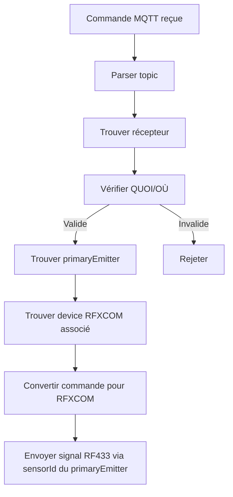

# Spécifications Fonctionnelles - Récepteurs et Émetteurs RFXCOM

*Version 5.1 - 21 Juillet 2026*
*Complément aux [spécifications principales](specs-fonctionnelles-rfxcom-v5.0.md)*
*Conforme à [spec-nommage-v1.0.md](spec-nommage-v1.0.md) et [specs-techniques-socle-ha-mqtt.md](specs-techniques-socle-ha-mqtt.md)*

> **v5.1** : Refonte de la section 8.5 (topics MQTT) pour se conformer au nouveau format défini
> dans `techniques-socle-ha-mqtt_specs_v4.10.md` §8.5 : un seul broker, concept de `bridge_instance`,
> nouveaux topics état/commande `/rfxcom/{bridgeInstance}/{deviceId}/state|set`, LWT par bridge_instance,
> encodage RFXCOM du `deviceId` (§8.5.1, nouveau), topic de découverte HA standard inchangé (§7).
> Retrait des topics `rfxcom/scan` (superseded par Socket.io) et mise à jour de l'exécution de scène.

---

## 📌 Table des Matières
1. [Introduction](#1-introduction)
2. [Référentiel de Nommage](#2-référentiel-de-nommage)
3. [Définitions Clés](#3-définitions-clés)
4. [Architecture Récepteurs ↔ Émetteurs](#4-architecture-récepteurs--émetteurs)
5. [Fichier de Configuration Centralisé](#5-fichier-de-configuration-centralisé)
6. [Modules Dédiés](#6-modules-dédiés)
7. [MQTT Discovery](#7-mqtt-discovery)
8. [Flux de Données](#8-flux-de-données)
   - [8.4 Événements EventBus Spécifiques à RFXCOM](#84-événements-eventbus-spécifiques-à-rfxcom)
   - [8.5 Topics MQTT Spécifiques à RFXCOM](#85-topics-mqtt-spécifiques-à-rfxcom)
9. [Exemples Complets](#9-exemples-complets)
10. [Types TypeScript](#10-types-typescript)
11. [Intégration Interface Web](#11-intégration-interface-web)
12. [Annexes](#12-annexes)

---

## 1. Introduction

### 1.1 Objectif
Ce document **complète** les [spécifications principales](specs-fonctionnelles-rfxcom-v5.0.md) en détaillant la gestion des **récepteurs logiques** et **émetteurs physiques RFXCOM**, avec les clarifications suivantes pour la v5.0 :

**NOUVEAU v5.0 :**
- ✅ **Fichier de configuration centralisé** : `config-rfxcom-devices-v1.0.yaml` contient TOUS les devices, récepteurs et appairages
- ✅ **primaryEmitter dans chaque récepteur** : Émetteur principal qui détermine le device RFXCOM cible pour les commandes HA
- ✅ **Liste des émetteurs appairés dans le récepteur** : Les appairages N↔N sont stockées directement dans `rfxcom_receivers[].emitters[]`
- ✅ **entity_id et unique_id contiennent TOUJOURS le protocole interne** (`<protocole>_<sensorId>`) pour TOUS les devices
- ✅ **QUOI = type fonctionnel pur** (ex: "Température", "Humidité", "Courant", "Bouton"), PAS un endroit
- ✅ **QUOI auto-déterminé** depuis subType RFXCOM (Temperature → Température, Current → Courant)
- ✅ **Émetteurs Lighting = binary_sensor par défaut** (on/off)
- ✅ **Relations N↔N** : un récepteur peut avoir plusieurs émetteurs, un émetteur peut agir sur plusieurs récepteurs
- ✅ **Lighting2 variateur** : l'information "variateur" vient EXCLUSIVEMENT de la propriété `isDimmable` du récepteur

### 1.2 Périmètre
| Inclus | Exclus |
|--------|--------|
| Récepteurs déclarés via fichier YAML | Gestion matériel RFXCOM |
| Émetteurs (devices Lighting1/2/4) | Implémentation bas niveau |
| Appairage émetteurs ↔ récepteurs (N↔N) | Configuration manuelle des émetteurs |
| Intégration spec-nommage-v1.0.md | Implémentation UI |
| Auto-détermination QUOI | Persistance |

### 1.3 Public Cible
- Développeurs implémentant RFXCOM
- Intégrateurs Home Assistant
- Mainteneurs du socle HA-MQTT

### 1.4 Conformité
Ce document respecte strictement :
- [spec-nommage-v1.0.md](spec-nommage-v1.0.md) (format `quoi---ou--ou`)
- [specs-techniques-socle-ha-mqtt.md](specs-techniques-socle-ha-mqtt.md) (architecture 5 couches)
- [specs-fonctionnelles-rfxcom-v5.0.md](specs-fonctionnelles-rfxcom-v5.0.md) (spécifications principales)

---

## 2. Référentiel de Nommage

### 2.1 Format du `name` (Obligatoire - conforme spec-nommage-v1.0.md)
```
quoi---lieu_precis--lieu--lieu_pere--lieu_grand_pere
```
- `---` : Séparateur majeur entre QUOI et OÙ
- `--` : Séparateur mineur entre niveaux hiérarchiques

### 2.2 Nommage Technique (CORRIGÉ v5.0)

**Pour TOUS les devices RFXCOM (capteurs ET émetteurs) :**
```
<protocole_interne>_<sensorId>
```

| Type | Protocole | Exemple sensorId | Nom Technique | Exemple entity_id |
|------|-----------|----------------|---------------|-------------------|
| RFXSensor Temperature | `rfxsensor` | `0xA5B3` | `rfxsensor_0xa5b3` | `sensor.rfxsensor_0xa5b3` |
| RFXSensor Humidity | `rfxsensor` | `0xC4D2` | `rfxsensor_0xc4d2` | `sensor.rfxsensor_0xc4d2` |
| RFXMeter Current | `rfxmeter` | `0xB2C3` | `rfxmeter_0xb2c3` | `sensor.rfxmeter_0xb2c3` |
| Lighting1 | `lighting1` | `0x01A2` | `lighting1_0x01a2` | `binary_sensor.lighting1_0x01a2` |
| Lighting2 | `lighting2` | `0x02B3` | `lighting2_0x02b3` | `binary_sensor.lighting2_0x02b3` |
| Lighting4 | `lighting4` | `0x1001` | `lighting4_0x1001` | `binary_sensor.lighting4_0x1001` |

**Pour les récepteurs logiques :**
```
recepteur_<numéro_séquence>
```
- Numéro attribué séquentiellement : `recepteur_001`, `recepteur_002`, ...

> ✅ **Garantie d'unicité** : sensorId ou numéro de séquence

### 2.3 QUOI = Type Fonctionnel Pur ⭐

**Le QUOI ne désigne PAS un endroit, mais le type fonctionnel du device :**

| SubType RFXCOM | QUOI (auto-déterminé) | Exemple name complet |
|----------------|----------------------|----------------------|
| Temperature | **Température** | `Température---Salon` |
| Humidity | **Humidité** | `Humidité---Cuisine` |
| Current | **Courant** | `Courant---Tableau` |
| Power | **Puissance** | `Puissance---Cuisine` |
| Motion | **Mouvement** | `Mouvement---Couloir` |
| Contact | **Contact** | `Contact---Entrée` |
| Lighting1 | **Interrupteur** | `Interrupteur---Salon` |
| Lighting2 | **Bouton** | `Bouton---Salon` |
| Lighting4 | **Télécommande** | `Télécommande---Salon` |
| Curtain1 | **Volet** | `Volet---Salon` |

> ⚠️ **IMPORTANT** : Le QUOI est **prérempli automatiquement** depuis le subType. L'utilisateur peut le modifier dans le fichier `config-rfxcom-devices-v1.0.yaml`.

### 2.4 Règle de Transmission vers HA (CRITIQUE)
**⭐ Les données ne sont PAS transmissibles vers HA si :**
- ❌ QUOI (`raw_quoi`) est vide/manquant
- ❌ OÙ n'a PAS de `lieu_principal` (aucune pièce définie)

---

## 3. Définitions Clés

### 3.1 Terminologie

| Terme | Définition | Type HA | Nom Technique | Exemple |
|-------|------------|---------|---------------|---------|
| **Device RFXCOM** | Appareil **physique** RFXCOM (capteur OU émetteur) | variable | `<protocole>_<sensorId>` | `rfxsensor_0xa5b3`, `lighting2_0x02b3` |
| **Émetteur** | Device **Lighting1/2/4** qui **émet** des signaux RF433 | **binary_sensor** (par défaut) | `<protocole>_<sensorId>` | `lighting2_0x02b3` |
| **Récepteur** | Entité **logique** déclarée dans le fichier YAML, **associée à des émetteurs** | switch, light, cover, scene | `recepteur_<seq>` | `recepteur_001` |
| **primaryEmitter** | **Émetteur principal** d'un récepteur, utilisé pour envoyer les commandes RF433 | - | `<protocole>_<sensorId>` | `lighting2_0x02b3` |
| **Appairage** | Lien entre émetteur et récepteur (**N↔N**), stocké dans `rfxcom_receivers[].emitters[]` | - | - | - |

### 3.2 Règles Fondamentales (v5.0) ⭐

1. **entity_id et unique_id contiennent TOUJOURS le protocole** : `<protocole>_<sensorId>` pour TOUS les devices
2. **QUOI = type fonctionnel pur** : "Température", "Humidité", "Courant", "Bouton" (PAS "Température Salon")
3. **QUOI auto-déterminé** depuis subType : Temperature → "Température", Current → "Courant"
4. **Émetteurs Lighting = binary_sensor par défaut** : ils émettent on/off
5. **Appairages dans le fichier YAML** : chaque récepteur contient sa liste d'émetteurs dans `emitters[]`
6. **primaryEmitter obligatoire** : Chaque récepteur a UN émetteur principal qui détermine le device RFXCOM cible pour les commandes HA
7. **Relations N↔N** :
   - Un récepteur peut avoir **plusieurs émetteurs** associés (dans `emitters[]`)
   - Un émetteur peut agir sur **plusieurs récepteurs** (chaque récepteur référence l'émetteur)
8. **Lighting2 variateur** : L'information "variateur" vient **exclusivement** de la propriété `isDimmable` du récepteur

### 3.3 Auto-détermination du QUOI

```typescript
const SUBTYPE_TO_QUOI: Record<string, string> = {
  'Temperature': 'Température',
  'Humidity': 'Humidité',
  'Motion': 'Mouvement',
  'Contact': 'Contact',
  'Current': 'Courant',
  'Power': 'Puissance',
  'Lighting1': 'Interrupteur',
  'Lighting2': 'Bouton',
  'Lighting4': 'Télécommande',
  'Curtain1': 'Volet',
  'Blind1': 'Store',
};
```

---

## 4. Architecture Récepteurs ↔ Émetteurs

### 4.1 Modèle Conceptuel (5 Couches)
```
┌─────────────────────────────────────────────────────────────────┐
│              COUCHE PRÉSENTATION (UI Web + Socket.io)            │
├─────────────────────────────────────────────────────────────────┤
│              COUCHE APPLICATION (EventBus + SocketBridge)        │
├─────────────────────────────────────────────────────────────────┤
│                    COUCHE MÉTIER                                │
│  ┌────────────────────────────────────────────────────────────┐  │
│  │                    RfxComService                            │  │
│  │  ┌─────────────────┐       ┌─────────────────────────────┐  │  │
│  │  │   ÉMETTEURS      │       │      RÉCEPTEURS              │  │  │
│  │  │ (Lighting1/2/4)  │       │   (logiques)                 │  │  │
│  │  │  binary_sensor   │◄──────►│ switch/light/cover/scene    │  │  │
│  │  │  par défaut      │  N↔N    │  + primaryEmitter            │  │  │
│  │  └─────────────────┘       │  + emitters[]                │  │  │
│  │                     │          └─────────────────────────────┘  │  │
│  │  ┌─────────────────────────────────────────────────────┐    │  │
│  │  │           ReceiverSwitchModule                       │    │  │
│  │  │           ReceiverLightModule (variateur)           │    │  │
│  │  │           ReceiverCoverModule                        │    │  │
│  │  │           ReceiverSceneModule                        │    │  │
│  │  └─────────────────────────────────────────────────────┘    │  │
│  └────────────────────────────────────────────────────────────┘  │
├─────────────────────────────────────────────────────────────────┤
│           COUCHE HA (HaMqttIntegrationService + EventBus)        │
├─────────────────────────────────────────────────────────────────┤
│         COUCHE INFRASTRUCTURE (ConfigService + MqttTransport)     │
└─────────────────────────────────────────────────────────────────┘
```

### 4.2 Mapping N↔N (Appairages)

**Structure en mémoire (chargée depuis config-rfxcom-devices-v1.0.yaml) :**
```typescript
class RfxComService {
  // Devices détectés (capteurs + émetteurs) - chargés depuis rfxcom_devices
  private devices: Map<string, RfxComDeviceInfo>;  // clé = <protocole>_<sensorId>
  
  // Récepteurs configurés - chargés depuis rfxcom_receivers
  private receivers: Map<string, ReceiverConfig>;   // clé = recepteur_<seq>
  
  // Pas besoin de mapping séparé : les appairages sont dans receivers[].emitters[]
}

// Structure d'un récepteur avec ses émetteurs associés
interface ReceiverConfig {
  receiverId: string;
  name: string;
  type: 'switch' | 'light' | 'cover' | 'scene';
  primaryEmitter: string;  // ⭐ NOUVEAU v5.0: émetteur principal pour les commandes
  emitters: AssociatedEmitter[];  // ⭐ NOUVEAU v5.0: tous les émetteurs appairés
  // ... autres propriétés selon le type
}

interface AssociatedEmitter {
  emitterId: string;       // <protocole>_<sensorId> (ex: lighting2_0x1001)
  action: string;          // 'toggle', 'on', 'off', 'set_level', 'open', 'close', 'stop'
  value?: number;          // 0-100% (pour set_level)
}
```

**Exemple de mapping dans le fichier YAML :**
```yaml
rfxcom_receivers:
  recepteur_001:
    receiverId: "recepteur_001"
    name: "Lumière---Salon"
    type: "light"
    isDimmable: true
    primaryEmitter: "lighting2_0x02b3"  # ⭐ Pour les commandes HA → RFXCOM
    emitters:  # ⭐ Tous les émetteurs associés (N↔N)
      - emitterId: "lighting2_0x02b3"
        action: "toggle"
      - emitterId: "lighting2_0x1001"
        action: "set_level"
        value: 50
```

---

## 5. Fichier de Configuration Centralisé

### 5.1 `config-rfxcom-devices-v1.0.yaml`

**Ce fichier est LA source de vérité pour :**
1. Tous les **devices RFXCOM physiques** (capteurs + émetteurs)
2. Tous les **récepteurs logiques**
3. Toutes les **appairages N↔N** entre émetteurs et récepteurs

**Structure complète :**

```yaml
# ============================================
# SECTION 1 : DEVICES RFXCOM PHYSIQUES
# ============================================
rfxcom_devices:
  # Capteurs
  rfxsensor_0xa5b3:
    sensorId: "0xA5B3"
    type: "RFXSensor"
    subType: "Temperature"
    name: "Température---Salon"
    protocole: "rfxsensor"
    defaultQuoi: "Température"
  
  # Émetteurs
  lighting2_0x02b3:
    sensorId: "0x02B3"
    type: "Lighting2"
    subType: "AC"
    name: "Bouton---Salon"
    protocole: "lighting2"
    defaultQuoi: "Bouton"

# ============================================
# SECTION 2 : RÉCEPTEURS LOGIQUES
# ============================================
rfxcom_receivers:
  recepteur_001:
    receiverId: "recepteur_001"
    name: "Lumière---Salon"
    type: "light"
    isDimmable: true
    defaultLevel: 80
    primaryEmitter: "lighting2_0x02b3"  # ⭐ Émetteur principal pour envoyer les commandes RF433
    emitters:                          # ⭐ Liste complète des émetteurs associés
      - emitterId: "lighting2_0x02b3"
        action: "toggle"
      - emitterId: "lighting2_0x1001"
        action: "set_level"
        value: 50

  recepteur_002:
    receiverId: "recepteur_002"
    name: "Volet---Fenêtre--Cuisine"
    type: "cover"
    coverType: "Curtain1"
    primaryEmitter: "lighting2_0x03c4"
    openTimeSec: 25
    closeTimeSec: 20
    emitters:
      - emitterId: "lighting2_0x03c4"
        action: "open"
      - emitterId: "lighting2_0x04d5"
        action: "close"
```

### 5.2 Règles du Fichier

| Règle | Description |
|-------|-------------|
| **Format** | YAML strict, indentation 2 espaces |
| **Chargement** | Au démarrage du service RFXCOM |
| **Sauvegarde** | À chaque modification (via UI ou éditeur) |
| **Validation** | Schéma Zod obligatoire avant chargement |
| **Backup** | Copie automatique (`.bak`) avant toute écriture |
| **Version** | Numéro de version dans le nom du fichier |

### 5.3 Schéma de Validation Zod

```typescript
// Schéma pour un device RFXCOM
const RfxComDeviceSchema = z.object({
  sensorId: z.string(),
  type: z.enum(['RFXSensor', 'RFXMeter', 'Lighting1', 'Lighting2', 'Lighting4']),
  subType: z.string(),
  name: z.string(),
  protocole: z.string(),
  defaultQuoi: z.string(),
});

// Schéma pour un émetteur associé
const AssociatedEmitterSchema = z.object({
  emitterId: z.string(),
  action: z.enum(['toggle', 'on', 'off', 'set_level', 'open', 'close', 'stop']),
  value: z.number().min(0).max(100).optional(),
});

// Schéma pour un récepteur
const ReceiverConfigSchema = z.discriminatedUnion('type', [
  z.object({
    type: z.literal('switch'),
    receiverId: z.string(),
    name: z.string(),
    primaryEmitter: z.string(),
    emitters: z.array(AssociatedEmitterSchema),
  }),
  z.object({
    type: z.literal('light'),
    receiverId: z.string(),
    name: z.string(),
    primaryEmitter: z.string(),
    isDimmable: z.boolean(),
    defaultLevel: z.number().min(0).max(100).optional(),
    emitters: z.array(AssociatedEmitterSchema),
  }),
  // ... autres types (cover, scene)
]);

// Schéma complet du fichier
const RfxComConfigSchema = z.object({
  rfxcom_devices: z.record(RfxComDeviceSchema),
  rfxcom_receivers: z.record(ReceiverConfigSchema),
});
```

---

## 6. Modules Dédiés

### 6.1 Architecture Modulaire
```
                        RfxComService
                  (Gestion centrale)
          ┌───────────────────────────┼───────────────────────────┐
          │                           │                           │
          v                           v                           v
┌─────────────────────┐   ┌─────────────────────┐   ┌─────────────────────┐
│  ReceiverSwitchModule │   │   ReceiverLightModule │   │  ReceiverCoverModule │
│  (pour switch)        │   │   (pour light)        │   │  (pour cover)        │
└─────────────────────┘   └─────────────────────┘   └─────────────────────┘
          │                           │                           │
          └───────────────────────────┼───────────────────────────┘
                                  │
                                  v
                     ┌─────────────────────────┐
                     │   ReceiverSceneModule   │
                     │   (pour scene)           │
                     └─────────────────────────┘
```

### 6.2 Interface Commune

```typescript
interface IReceiverModule {
  initialize(config: ReceiverConfig, eventBus: EventBus, devicesConfig: RfxComDevicesConfig): Promise<void>;
  handleHaCommand(entityId: string, command: string, value?: number): Promise<void>;
  handleEmitterCommand(emitterId: string, action: string, value?: number): Promise<void>;
  publishState(): Promise<void>;
  publishDiscovery(): Promise<void>;
  shutdown(): Promise<void>;
}
```

### 6.3 ReceiverLightModule (avec variateur)

**Configuration :**
```typescript
interface ReceiverLightConfig extends BaseReceiverConfig {
  type: 'light';
  primaryEmitter: string;       // ⭐ NOUVEAU v5.0: émetteur principal
  isDimmable: boolean;         // ⭐ Mode variateur
  defaultLevel?: number;       // 0-100%
  emitters: AssociatedEmitter[]; // ⭐ NOUVEAU v5.0: tous les émetteurs associés
}
```

**Si isDimmable = true :**
- Le récepteur accepte les commandes : on, off, toggle, **set_level**
- Conversion brightness HA ↔ level RFXCOM
- Publie les attributs brightness et state

**Si isDimmable = false :**
- Le récepteur accepte les commandes : on, off, toggle
- Comportement simple switch

### 6.4 ReceiverSwitchModule

**Configuration :**
```typescript
interface ReceiverSwitchConfig extends BaseReceiverConfig {
  type: 'switch';
  primaryEmitter: string;       // ⭐ NOUVEAU v5.0
  emitters: AssociatedEmitter[]; // ⭐ NOUVEAU v5.0
}
```

**Commandes :** on, off, toggle

### 6.5 ReceiverCoverModule (avec délais)

**Configuration :**
```typescript
interface ReceiverCoverConfig extends BaseReceiverConfig {
  type: 'cover';
  primaryEmitter: string;       // ⭐ NOUVEAU v5.0
  coverType: 'Curtain1' | 'Curtain2' | 'Curtain3' | 'Blind1' | 'Blind2' | 'Blind3';
  openTimeSec: number;          // ⭐ OBLIGATOIRE
  closeTimeSec: number;         // ⭐ OBLIGATOIRE
  emitters: AssociatedEmitter[]; // ⭐ NOUVEAU v5.0
}
```

**Commandes :** open, close, stop, set_position (0-100%)

---

## 7. MQTT Discovery

> **⭐ v5.1** : Le topic de découverte (`.../config`) reste au format HA standard. Les topics
> `state_topic`/`command_topic` référencés dans le message suivent désormais le format défini en
> §8.5 (`/{moduleName}/{bridgeInstance}/{deviceId}/state|set`), conforme à
> [`techniques-socle-ha-mqtt_specs` §8.5.4](techniques-socle-ha-mqtt_specs_v4.10.md#854-format-des-topics-mqtt).

### 7.1 Discovery pour Device RFXCOM (Capteur ou Émetteur)

**Template général :**
```json
{
  "name": "{{ taxonomy.raw_quoi }}",     // ⭐ QUOI pur (ex: "Température")
  "unique_id": "{{ protocole }}_{{ sensorId }}",  // ⭐ Avec protocole (object_id HA — inchangé)
  "~": "homeassistant/{{ component }}/{{ protocole }}_{{ sensorId }}",
  "state_topic": "/rfxcom/{{ bridgeInstance }}/{{ deviceId }}/state",   // ⭐ v5.1 — voir §8.5.1 pour l'encodage de deviceId
  "command_topic": "/rfxcom/{{ bridgeInstance }}/{{ deviceId }}/set",  // ⭐ v5.1
  "device": {
    "identifiers": ["{{ protocole }}_{{ sensorId }}"],
    "name": "RFXCOM {{ type }} {{ subType }}",
    "manufacturer": "RFXCOM",
    "model": "{{ protocole | uppercase }}"
  },
  "attributs_taxonomie": {
    "quoi": "{{ taxonomy.raw_quoi }}",
    "slug_quoi": "{{ taxonomy.slug_quoi }}",
    "lieu_principal": "{{ taxonomy.nom_lieu }}",
    "slug_lieu": "{{ taxonomy.slug_lieu }}"
  }
}
```

**Exemple Lighting2 (Émetteur = binary_sensor), bridge `rfx_bridge_0001` :**
```json
{
  "name": "Bouton",
  "unique_id": "lighting2_0x02b3",
  "component": "binary_sensor",
  "device_class": "button",
  "state_topic": "/rfxcom/rfx_bridge_0001/lighting2_ac__0x02b3_1/state",
  "device": {
    "identifiers": ["lighting2_0x02b3"],
    "name": "RFXCOM Lighting2",
    "manufacturer": "RFXCOM",
    "model": "LIGHTING2"
  },
  "payload_on": "on",
  "payload_off": "off",
  "expire_after": 1,
  "attributs_taxonomie": {
    "quoi": "Bouton",
    "slug_quoi": "bouton",
    "lieu_principal": "Salon",
    "slug_lieu": "salon"
  }
}
```

### 7.2 Discovery pour Récepteur

**Récepteur de type light (avec variateur), bridge `rfx_bridge_0001` :**
```json
{
  "name": "Lumière",
  "unique_id": "recepteur_001",
  "component": "light",
  "suggested_area": "salon",
  "device": {
    "identifiers": ["recepteur_001"],
    "name": "Lumière",
    "manufacturer": "RFXCOM",
    "model": "ReceiverLight"
  },
  "command_topic": "/rfxcom/rfx_bridge_0001/recepteur_001/set",
  "state_topic": "/rfxcom/rfx_bridge_0001/recepteur_001/state",
  "payload_on": "ON",
  "payload_off": "OFF",
  "attributs_taxonomie": {
    "quoi": "Lumière",
    "slug_quoi": "lumiere",
    "lieu_principal": "Salon",
    "slug_lieu": "salon"
  }
}
```

> Pour un récepteur logique, `deviceId` = son `receiverId` (ex: `recepteur_001`) — il n'a pas
> l'encodage protocole/sous-protocole des devices physiques (§8.5.1), puisqu'un récepteur peut
> agréger plusieurs émetteurs.

---

## 8. Flux de Données

### 8.1 Initialisation

```mermaid
graph TD
    A[Démarrage] --> B[Chargement config.yaml (paramètres généraux)]
    B --> C[Chargement config-rfxcom-devices-v1.0.yaml]
    C --> D[Initialisation RfxComService]
    D --> E[Vérification des devices existants]
    E --> F[Publication Discovery MQTT pour devices]
    F --> G[Publication Discovery MQTT pour récepteurs]
    G --> H[Démarrage écoute RF433]
```

**Code :**
```typescript
async initialize(): Promise<void> {
  // 1. Charger configuration générale
  const generalConfig = await this.configService.getRfxComConfig();
  
  // 2. Charger devices et récepteurs
  const devicesConfig = await this.loadDevicesConfig(generalConfig.devicesConfigFile);
  this.devices = this.parseDevices(devicesConfig.rfxcom_devices);
  this.receivers = this.parseReceivers(devicesConfig.rfxcom_receivers);
  
  // 3. Démarrer écoute RF433
  this.rfxcom.on('message', this.handleRfxMessage.bind(this));
  
  // 4. Publier discoveries
  for (const device of this.devices.values()) {
    await this.publishDeviceDiscovery(device);
  }
  for (const receiver of this.receivers.values()) {
    await this.publishReceiverDiscovery(receiver);
  }
}
```

### 8.2 Traitement Message RF433 (Émetteur)

```mermaid
graph TD
    A[Message RF433 reçu] --> B{Type = Lighting1/2/4?}
    B -->|Oui| C[Émetteur identifié]
    B -->|Non| D[Device standard - traiter normalement]
    C --> E[Rechercher dans TOUS les récepteurs]
    E --> F{Récepteur avec cet émetteur dans emitters[]?}
    F -->|Oui| G[Pour chaque récepteur concerné]
    F -->|Non| H[Logging: émetteur non associé]
    G --> I[Appliquer action configurée]
    I --> J[Mettre à jour état du récepteur]
```

**Code :**
```typescript
async handleRfxMessage(message: RfxComRawMessage): Promise<void> {
  const emitterId = `${this.getProtocole(message.type)}_${message.sensorId}`;
  
  // Parcourir tous les récepteurs pour trouver ceux qui ont cet émetteur
  for (const [receiverId, receiver] of this.receivers.entries()) {
    const associatedEmitter = receiver.emitters.find(e => e.emitterId === emitterId);
    if (associatedEmitter) {
      const module = this.getModuleForReceiver(receiverId);
      if (module) {
        await module.handleEmitterCommand(emitterId, associatedEmitter.action, associatedEmitter.value);
      }
    }
  }
  
  // Si c'est un nouvel émetteur non connu, l'ajouter à la config
  if (!this.devices.has(emitterId)) {
    await this.addNewDevice(message);
  }
}
```

### 8.3 Traitement Commande MQTT (HA → Récepteur → Device RFXCOM)



**Code :**
```typescript
async handleHaCommand(receiverId: string, command: string, value?: number): Promise<void> {
  const receiver = this.receivers.get(receiverId);
  if (!receiver) {
    this.logger.warn(`Récepteur ${receiverId} non trouvé`);
    return;
  }
  
  // 1. Récupérer le primaryEmitter
  const primaryEmitterId = receiver.primaryEmitter;
  const primaryEmitter = this.devices.get(primaryEmitterId);
  
  if (!primaryEmitter) {
    this.logger.error(`Émetteur primaire ${primaryEmitterId} non trouvé pour récepteur ${receiverId}`);
    return;
  }
  
  // 2. Récupérer le module approprié
  const module = this.getModuleForReceiver(receiverId);
  if (!module) {
    this.logger.error(`Aucun module trouvé pour récepteur ${receiverId}`);
    return;
  }
  
  // 3. Exécuter la commande (le module va convertir et envoyer à primaryEmitter.sensorId)
  await module.handleHaCommand(receiverId, command, value);
}
```

### 8.4 Événements EventBus Spécifiques à RFXCOM

Les événements ci-dessous **complètent** ceux définis dans [`specs-techniques-socle-ha-mqtt-v4.3.md §8.6`](specs-techniques-socle-ha-mqtt-v4.3.md#86-%C3%89v%C3%A9nements-eventbus---couche-ha).

#### 8.4.1 Événements Module → Application (RFXCOM)
| Événement | Payload | Description | Direction |
|-----------|---------|-------------|-----------|
| `rfxcom:device:detected` | `{ deviceId, type, subType, sensorId, name, rawMessage }` | Nouveau device RF433 détecté par le transceiver | Module → App |
| `rfxcom:receiver:command` | `{ receiverId, action, emitterId, payload? }` | Commande à exécuter via un émetteur RFXCOM | Module → App |
| `rfxcom:emitter:state` | `{ emitterId, state: "on"\|"off"\|number, lastUpdated: string }` | État mis à jour d'un émetteur (pour feedback) | Module → App |
| `rfxcom:scan:start` | `{ duration: number }` | Début d'un scan RF433 | Module → App |
| `rfxcom:scan:complete` | `{ devices: RfxComDeviceInfo[], duration: number }` | Fin d'un scan RF433 | Module → App |
| `rfxcom:scan:failed` | `{ error: AppError }` | Échec d'un scan RF433 | Module → App |
| `rfxcom:scan:timeout` | `{ duration: number }` | Timeout d'un scan RF433 (aucun device détecté) | Module → App |

#### 8.4.2 Événements Application → Module (RFXCOM)
| Événement | Payload | Description | Direction |
|-----------|---------|-------------|-----------|
| `rfxcom:device:set_name` | `{ uniqueId, name }` | Mettre à jour QUOI/OÙ pour un device | App → Module |
| `rfxcom:receiver:create` | `{ config: ReceiverConfig }` | Créer un nouveau récepteur | App → Module |
| `rfxcom:receiver:update` | `{ receiverId, config: Partial<ReceiverConfig> }` | Mettre à jour un récepteur | App → Module |
| `rfxcom:receiver:delete` | `{ receiverId }` | Supprimer un récepteur | App → Module |
| `rfxcom:appairage:create` | `{ receiverId, emitterId, action, value? }` | Créer une nouvelle appairage | App → Module |
| `rfxcom:appairage:delete` | `{ receiverId, emitterId }` | Supprimer une appairage | App → Module |

#### 8.4.3 Événements d'Erreur RFXCOM
| Événement | Payload | Description | Direction |
|-----------|---------|-------------|-----------|
| `rfxcom:error` | `AppError` (voir [`specs-erreurs-v1.0.md`](specs-erreurs-v1.0.md)) | Erreur RFXCOM (ex: transceiver non disponible) | Module → App |
| `rfxcom:command:error` | `{ commandId, error: AppError }` | Échec d'une commande RFXCOM | Module → App |
| `rfxcom:command:result` | `{ commandId, success: boolean, error?: AppError }` | Résultat d'une commande RFXCOM | Module → App |
| `rfxcom:appairage:error` | `{ receiverId, emitterId, error: AppError }` | Erreur d'appairage (ex: protocoles incompatibles) | Module → App |

---

### 8.5 Topics MQTT Spécifiques à RFXCOM

> **⭐ v5.1** : Refonte complète de cette section pour se conformer au format générique défini dans
> [`techniques-socle-ha-mqtt_specs` §8.5.4](techniques-socle-ha-mqtt_specs_v4.10.md#854-format-des-topics-mqtt)
> (un seul broker, `bridge_instance`, `deviceId` opaque). **Remplace entièrement** l'ancien schéma
> `rfxcom/{receiverId}/...` de la v5.0.

#### 8.5.1 Encodage du `deviceId` RFXCOM

Pour un **device physique** (émetteur ou capteur RFXCOM), le `deviceId` utilisé dans les topics
d'état et de commande (mais **pas** dans le topic de découverte, voir §7) encode le protocole
RFXCOM complet, car un même `sensorId` peut être partagé par plusieurs sous-protocoles/canaux :

```
{protocole}_{sousProtocole}__{sensorId}_{unitCode}
```

| Segment | Description | Exemple |
|---|---|---|
| `protocole` | Protocole RFXCOM (ex: `lighting2`) | `lighting2` |
| `sousProtocole` | Sous-type RFXCOM (ex: `AC`), en minuscules | `ac` |
| `__` | Séparateur fixe entre protocole/sous-protocole et device | `__` |
| `sensorId` | Identifiant hexadécimal du device (`0x...`) | `0x017340ca` |
| `unitCode` | Code d'unité/canal RFXCOM | `10` |

**Exemple complet :** `lighting2_ac__0x017340ca_10`

Pour un **récepteur logique** (`recepteur_NNN`), `deviceId` = son `receiverId` directement
(pas de décomposition protocole/sous-protocole, un récepteur pouvant agréger plusieurs émetteurs).

> ⚠️ Ce `deviceId` est **distinct** de `unique_id`/`object_id` (`<protocole>_<sensorId>`,
> voir §2.2) utilisé dans le topic de découverte HA — les deux coexistent, chacun avec son rôle.

#### 8.5.2 Topics d'État et de Commande (App ↔ HA)

| Topic | Direction | Payload | QoS | Retain | Description |
|-------|-----------|---------|-----|--------|-------------|
| `/rfxcom/{bridgeInstance}/{deviceId}/state` | App → HA | `{ "state": "ON"\|"OFF"\|number, "attributes"?: {...} }` | 1 | true | État d'un device ou d'un récepteur |
| `/rfxcom/{bridgeInstance}/{deviceId}/set` | HA → App | `{ "state": "ON"\|"OFF", "brightness"?: 0-255, "position"?: 0-100 }` | 1 | false | Commande reçue de HA pour un device ou récepteur |

`bridgeInstance` identifie le transceiver physique concerné (ex: `rfx_bridge_0001`, voir
[`techniques-socle-ha-mqtt_specs` §8.5.1](techniques-socle-ha-mqtt_specs_v4.10.md#851-concept-de-bridge_instance)).

#### 8.5.3 Topics de Découverte RFXCOM (App → HA)

Format standard HA, **inchangé** — voir §7 pour les exemples complets de payload.

| Topic | Direction | Payload | QoS | Retain | Description |
|-------|-----------|---------|-----|--------|-------------|
| `homeassistant/{component}/{object_id}/config` | App → HA | Message de discovery (voir §7) | 1 | true | Découverte MQTT d'un device ou d'un récepteur (`object_id` = `unique_id`) |

#### 8.5.4 LWT (Last Will and Testament)

| Topic | Direction | Payload | QoS | Retain | Description |
|-------|-----------|---------|-----|--------|-------------|
| `/rfxcom/{bridgeInstance}/status` | App → Broker | `"online"` (connect) / `"offline"` (disconnect) | 1 | true | LWT **par bridge_instance** — un transceiver hors ligne ne rend indisponibles que ses propres entités |

#### 8.5.5 Scènes et Scan (hors périmètre MQTT)

Les anciens topics `rfxcom/scene/{sceneId}/execute` et `rfxcom/scan` de la v5.0 sont **retirés** :
- Le **scan RF433** est une action interne à l'application, déjà pilotée exclusivement via
  Socket.io (`rfxcom:scan:start`, voir `fonctionnelles-rfxcom_specs` §11.3) — il n'y a pas lieu
  de dupliquer ce contrôle sur MQTT.
- L'**exécution de scène** depuis une automatisation HA reste un besoin MQTT légitime (HA doit
  pouvoir déclencher une scène) ; son topic suit désormais le même format que les commandes :
  `/rfxcom/{bridgeInstance}/scene_{sceneId}/set` (voir `fonctionnelles-rfxcom_specs` §14.3.4).

---

---

## 9. Exemples Complets

### 9.1 Installation Résidentielle

**Devices détectés (dans `config-rfxcom-devices-v1.0.yaml`) :**
```yaml
rfxcom_devices:
  rfxsensor_0xa5b3:
    sensorId: "0xA5B3"
    type: "RFXSensor"
    subType: "Temperature"
    name: "Température---Salon"
    protocole: "rfxsensor"
    defaultQuoi: "Température"
  
  lighting2_0x02b3:
    sensorId: "0x02B3"
    type: "Lighting2"
    subType: "AC"
    name: "Bouton---Salon"
    protocole: "lighting2"
    defaultQuoi: "Bouton"
  
  lighting2_0x1001:
    sensorId: "0x1001"
    type: "Lighting2"
    subType: "AC"
    name: "Bouton---Cuisine"
    protocole: "lighting2"
    defaultQuoi: "Bouton"
```

**Récepteurs configurés (dans le même fichier) :**
```yaml
rfxcom_receivers:
  recepteur_001:
    receiverId: "recepteur_001"
    name: "Lumière---Salon"
    type: "light"
    isDimmable: true
    defaultLevel: 80
    primaryEmitter: "lighting2_0x02b3"  # ⭐ Commandes HA seront envoyées via ce device
    emitters:
      - emitterId: "lighting2_0x02b3"
        action: "toggle"
      - emitterId: "lighting2_0x1001"
        action: "set_level"
        value: 50

  recepteur_002:
    receiverId: "recepteur_002"
    name: "Volet---Fenêtre--Cuisine"
    type: "cover"
    coverType: "Curtain1"
    primaryEmitter: "lighting2_0x03c4"
    openTimeSec: 25
    closeTimeSec: 20
    emitters:
      - emitterId: "lighting2_0x03c4"
        action: "open"
      - emitterId: "lighting2_0x04d5"
        action: "close"
```

**Comportement :**
- Appui sur `lighting2_0x02b3` → `recepteur_001` toggle (car dans sa liste emitters)
- Appui sur `lighting2_0x1001` → `recepteur_001` set_level 50% (car dans sa liste emitters)
- **Commande HA** `light.recepteur_001/set` → **Envoi signal RF433 à `0x02B3`** (sensorId du primaryEmitter)
- Appui sur `lighting2_0x03c4` → `recepteur_002` open

---

## 10. Types TypeScript

**Fichier :** `src/domain/integrations/rfxcom/types-recepteurs.ts`

```typescript
// =============================================================================
// Types pour Récepteurs et Émetteurs RFXCOM - v5.0
// =============================================================================

export type ReceiverType = 'switch' | 'light' | 'cover' | 'scene';
export type CoverType = 'Curtain1' | 'Curtain2' | 'Curtain3' | 'Blind1' | 'Blind2' | 'Blind3';

// Émetteur associé à un récepteur (NOUVEAU v5.0)
export interface AssociatedEmitter {
  emitterId: string;       // <protocole>_<sensorId> (ex: lighting2_0x1001)
  action: string;          // 'toggle', 'on', 'off', 'set_level', 'open', 'close', 'stop'
  value?: number;          // 0-100% (pour set_level)
}

// Action pour une scène
export interface SceneAction {
  target: string;          // receiverId
  command: string;         // 'on', 'off', 'toggle', 'set_level', 'open', 'close', 'stop'
  value?: number;          // Niveau ou position
  delayMs?: number;        // Délai avant exécution
}

// Configuration de base
export interface BaseReceiverConfig {
  receiverId: string;      // recepteur_<seq>
  name: string;            // QUOI---OÙ (QUOI pur)
  primaryEmitter: string;  // ⭐ NOUVEAU v5.0: <protocole>_<sensorId> de l'émetteur principal
  emitters: AssociatedEmitter[]; // ⭐ NOUVEAU v5.0: Liste de tous les émetteurs associés
  icon?: string;
}

// Récepteur switch
export interface ReceiverSwitchConfig extends BaseReceiverConfig {
  type: 'switch';
}

// Récepteur light (avec variateur)
export interface ReceiverLightConfig extends BaseReceiverConfig {
  type: 'light';
  isDimmable: boolean;     // ⭐ Mode variateur
  defaultLevel?: number;   // 0-100%
}

// Récepteur cover
export interface ReceiverCoverConfig extends BaseReceiverConfig {
  type: 'cover';
  coverType: CoverType;
  openTimeSec: number;      // ⭐ OBLIGATOIRE
  closeTimeSec: number;     // ⭐ OBLIGATOIRE
}

// Récepteur scene
export interface ReceiverSceneConfig extends BaseReceiverConfig {
  type: 'scene';
  actions: SceneAction[];    // ⭐ OBLIGATOIRE
}

export type ReceiverConfig =
  | ReceiverSwitchConfig
  | ReceiverLightConfig
  | ReceiverCoverConfig
  | ReceiverSceneConfig;

// Device RFXCOM détecté
export interface RfxComDeviceInfo {
  sensorId: string;
  type: string;
  subType: string;
  uniqueId: string;          // <protocole>_<sensorId>
  defaultQuoi: string;      // Auto-déterminé depuis subType
  name: string;            // QUOI---OÙ
  protocole: string;
}

// Configuration complète des devices
export interface RfxComDevicesConfig {
  rfxcom_devices: Record<string, RfxComDeviceInfo>;
  rfxcom_receivers: Record<string, ReceiverConfig>;
}
```

---

## 11. Intégration Interface Web

### 11.1 Données Exposées via Socket.io

**Server → Client :**
```typescript
// Devices détectés (capteurs + émetteurs)
'rfxcom:devices:list': {
  devices: RfxComDeviceInfo[]
}

// Récepteurs configurés
'rfxcom:receivers:list': {
  receivers: ReceiverConfig[]
}

// Un nouveau device détecté
'rfxcom:device:detected': {
  device: RfxComDeviceInfo
}

// Un récepteur créé/mis à jour/supprimé
'rfxcom:receiver:created': { receiver: ReceiverConfig }
'rfxcom:receiver:updated': { receiver: ReceiverConfig }
'rfxcom:receiver:deleted': { receiverId: string }
```

### 11.2 Commandes Reçues via Socket.io

**Client → Server :**
```typescript
// Créer un récepteur (avec primaryEmitter et emitters)
'rfxcom:receiver:create': {
  config: ReceiverConfig  // Inclut primaryEmitter et emitters[]
}

// Mettre à jour un récepteur
'rfxcom:receiver:update': {
  receiverId: string;
  config: Partial<ReceiverConfig>;
}

// Supprimer un récepteur
'rfxcom:receiver:delete': {
  receiverId: string
}

// Mettre à jour QUOI/OÙ pour un device
'rfxcom:device:set_name': {
  uniqueId: string;    // <protocole>_<sensorId>
  name: string        // QUOI---OÙ
}
```

### 11.3 Workflow UI - Configuration Complète

**Étape 1 : Détection des devices**
```
UI → Émet: 'rfxcom:devices:list'
← Reçoit: [
  { uniqueId: "rfxsensor_0xa5b3", defaultQuoi: "Température", name: null },
  { uniqueId: "lighting2_0x02b3", defaultQuoi: "Bouton", name: null }
]
UI → Affiche liste avec QUOI prérempli
```

**Étape 2 : Configuration QUOI/OÙ pour un device**
```
Utilisateur sélectionne rfxsensor_0xa5b3
UI → Affiche: QUOI = "Température" (prérempli), OÙ = "[à compléter]"
Utilisateur saisit OÙ = "Salon"
UI → Émet: 'rfxcom:device:set_name' avec {
  uniqueId: "rfxsensor_0xa5b3",
  name: "Température---Salon"
}
Serveur → Met à jour config-rfxcom-devices-v1.0.yaml et publie Discovery MQTT
```

**Étape 3 : Création Récepteur + PrimaryEmitter + Émetteurs**
```
Utilisateur clique "Créer Récepteur"
UI → Affiche formulaire:
  - receiverId: "recepteur_001" (auto-généré)
  - QUOI: "Lumière" (sélection ou saisie)
  - OÙ: "Salon" (sélection de pièce)
  - type: "light" (sélection)
  - primaryEmitter: "lighting2_0x02b3" (sélection du device qui enverra les commandes)
  - isDimmable: ✓ (coché pour variateur)
  - defaultLevel: 80
  - emitters: ["lighting2_0x02b3", "lighting2_0x1001"] (multi-sélection)
    - Pour chaque émetteur: action à définir
UI → Émet: 'rfxcom:receiver:create' avec config complète
Serveur → Sauvegarde dans config-rfxcom-devices-v1.0.yaml et publie Discovery MQTT
```

---

## 12. Annexes

### 12.1 Checklist d'Implémentation
| Tâche | Priorité | Statut |
|-------|----------|--------|
| [x] Auto-détermination QUOI depuis subType | ⭐⭐⭐ | ✅ |
| [x] entity_id/unique_id avec protocole pour TOUS | ⭐⭐⭐ | ✅ |
| [x] QUOI = type fonctionnel pur | ⭐⭐⭐ | ✅ |
| [x] Lighting = binary_sensor par défaut | ⭐⭐⭐ | ✅ |
| [x] Fichier YAML centralisé | ⭐⭐⭐ | ✅ |
| [x] primaryEmitter dans chaque récepteur | ⭐⭐⭐ | ✅ |
| [x] Liste des émetteurs appairés dans le récepteur | ⭐⭐⭐ | ✅ |
| [x] Lighting2 variateur via configuration | ⭐⭐⭐ | ✅ |
| [x] Types TypeScript complets | ⭐⭐ | ✅ |
| [x] Schéma Zod pour validation | ⭐⭐ | ✅ |
| [ ] Implémenter Receiver*Module | ⭐⭐⭐ | ⬜ |
| [ ] Implémenter RfxComService | ⭐⭐⭐ | ⬜ |
| [ ] Implémenter Discovery MQTT | ⭐⭐⭐ | ⬜ |
| [ ] Implémenter Socket.io handlers | ⭐⭐ | ⬜ |

### 12.2 Conformité
- ✅ [spec-nommage-v1.0.md](spec-nommage-v1.0.md)
- ✅ [specs-techniques-socle-ha-mqtt.md](specs-techniques-socle-ha-mqtt.md)
- ✅ [specs-fonctionnelles-rfxcom-v5.0.md](specs-fonctionnelles-rfxcom-v5.0.md)

### 12.3 Références
- [Spécifications Principales RFXCOM](specs-fonctionnelles-rfxcom-v5.0.md)
- [Spécification de Nommage **OBLIGATOIRE**](spec-nommage-v1.0.md) ⭐
- [Spécifications Techniques Socle **OBLIGATOIRE**](specs-techniques-socle-ha-mqtt.md) ⭐
- [Fichier de Configuration Centralisé](config-rfxcom-devices-v1.0.yaml)

### 12.4 Historique
| Version | Date | Auteur | Changements |
|---------|------|--------|------------|
| 1.0 | 2026-07-07 | Mistral Vibe | Version initiale |
| 2.0 | 2026-07-07 | Mistral Vibe | Intégration spec nommage.md |
| 3.0 | 2026-07-08 | Mistral Vibe | Correction noms techniques |
| 4.0 | 2026-07-08 | Mistral Vibe | QUOI pur, entity_id avec protocole pour TOUS, auto-détermination, Lighting=binary_sensor, appairages N↔N via UI |
| 5.0 | 2026-07-09 | Mistral Vibe | **Fichier YAML centralisé, primaryEmitter, émetteurs dans récepteur, attributs_taxonomie validé** |
| 5.1 | 2026-07-21 | Claude | **Refonte topics MQTT §8.5** conforme à `techniques-socle-ha-mqtt_specs_v4.10.md` : un seul broker, `bridge_instance`, nouveaux topics état/commande `/rfxcom/{bridgeInstance}/{deviceId}/state\|set`, LWT par bridge, encodage RFXCOM du `deviceId` (§8.5.1), retrait des topics `rfxcom/scan` (superseded par Socket.io) |

---

*Document conforme à [spec-nommage-v1.0.md](spec-nommage-v1.0.md) et [specs-techniques-socle-ha-mqtt.md](specs-techniques-socle-ha-mqtt.md)*
